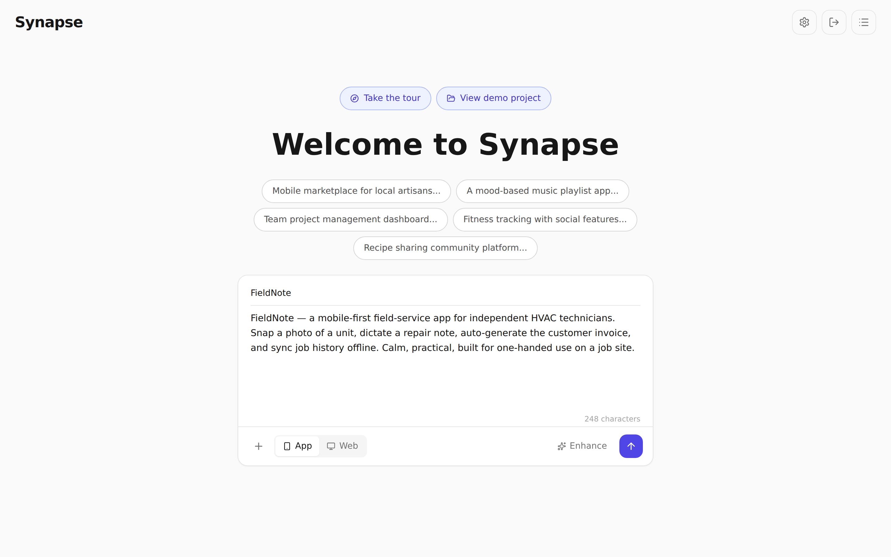
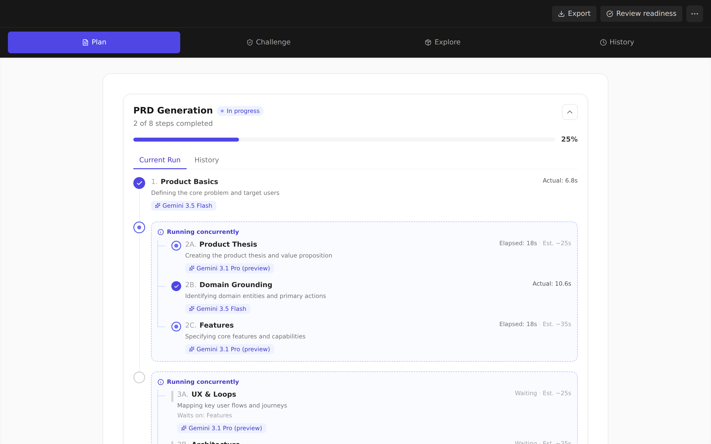
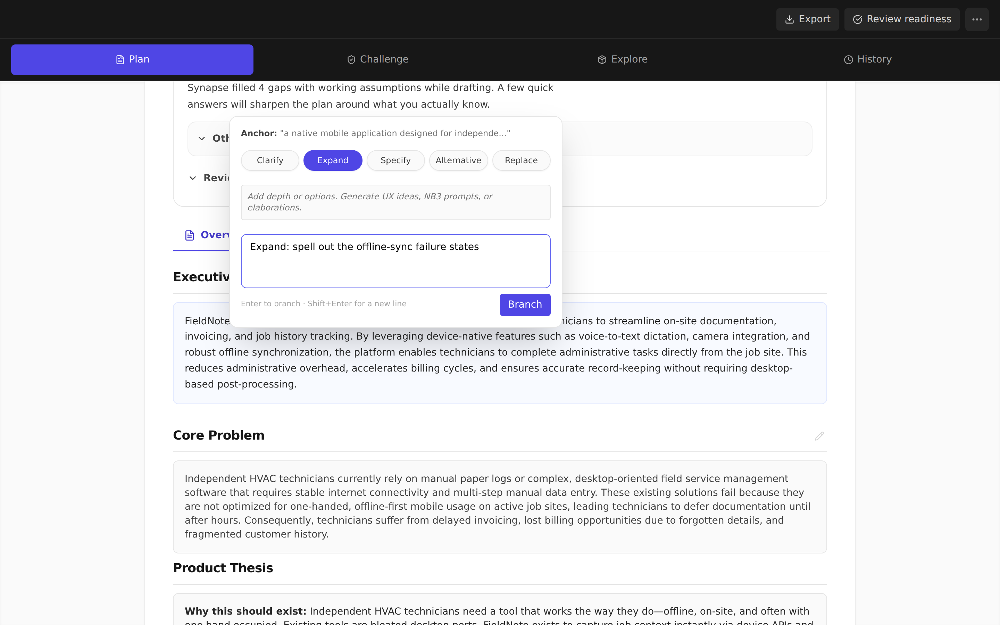
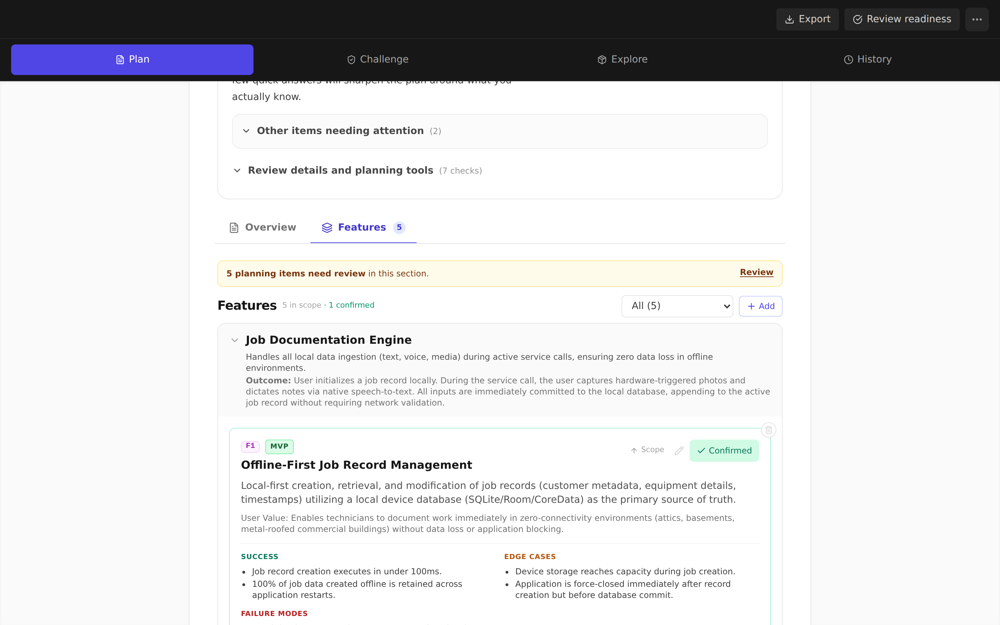
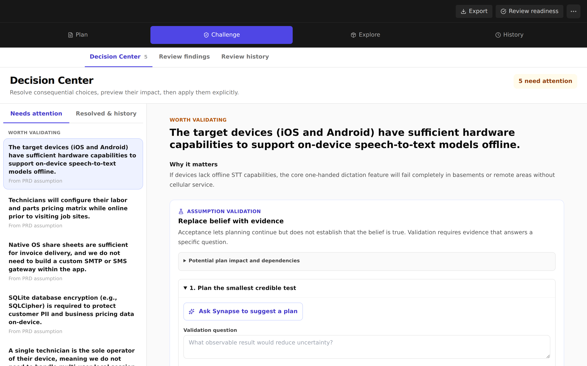
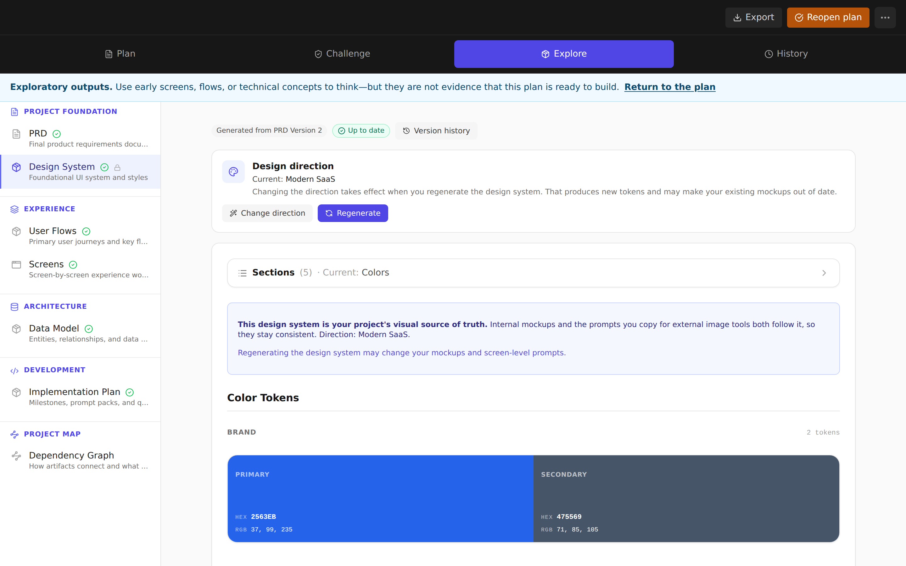

# ⚡ Synapse

### From plain-language to product blueprint.

**Synapse turns one sentence into a structured PRD — then into UI mockups, engineering artifacts, and annotated visual feedback, all from a single workspace.**

 

**[▶️ Try the live demo](https://synapse-prd.vercel.app)** · **[✨ Features](#-what-synapse-does)** · **[🎬 Walkthrough](#-see-it-in-action)** · **[🗺️ Roadmap](#️-roadmap)** · **[❓ FAQ](#-faq)**

---

> ### 🎯 The problem
>
> Turning a product idea into a real spec is slow and lossy: someone writes a PRD, someone else re-derives the screens and data model from it, and every downstream artifact drifts the moment the spec changes.
>
> **Synapse collapses that gap.** One plain-language prompt becomes a structured PRD — and *that same source of truth* fans out into UI mockups, a screen inventory, a data model, user flows, and an implementation plan. Every change is versioned, every artifact stays connected to the spec, and you decide what's ready to build.

---

## ✨ What Synapse does

| | Feature | What it gives you |
|---|---|---|
| 🧠 | **Spec in seconds, generated in parallel** | Describe your product in a sentence. Synapse writes a full, structured PRD — with sections generating concurrently so you watch it build in real time instead of waiting on one long stream. |
| ✍️ | **Refine by highlighting** | Select any passage and choose **Clarify · Expand · Specify · Alternative · Replace**. A focused AI thread reworks just that span and merges it back — no regenerating the whole document. |
| ✅ | **Feature-by-feature approval** | Features are broken into systems and individual cards with success criteria, edge cases, and failure modes. Confirm the ones you agree with; the plan tracks what's settled and what still needs a look. |
| ⚖️ | **A Decision Center for the choices that matter** | Synapse surfaces the assumptions and open decisions hiding in your spec, each with 2–3 concrete approaches and its recommended answer preselected — approve it in one click or record your own. Preview the exact impact on the plan and apply it explicitly — your call, never a silent rewrite. Open decisions never block your design assets. |
| 🎨 | **One plan → every asset** | When you're ready, generate the whole build foundation from the same source of truth: screen inventory, data model, user flows, a design system, an implementation plan, and mockups — all at once. |
| 🖌️ | **Consistent visual direction** | Pick a design direction (Modern SaaS, Enterprise, Creative Studio…) recommended from your idea. It steers the design system, mockups, and image prompts so every asset looks like one product. |
| 🕓 | **Nothing is ever lost** | Every regenerate, edit, decision, and merge appends a new version with a readable diff and one-click restore. History is append-only — you can always go back. |
| 🔌 | **Everything stays connected** | Each artifact remembers the spec it came from. When the PRD moves, Synapse shows you what's still aligned and what may need a refresh — honestly labeled, never auto-invalidated. |
| 🛡️ | **A safety gate up front** | Every idea is checked before a single word is generated, and the check fails closed — a blocked idea can't drive any downstream artifact. |
| 🤝 | **Hand off to a coding agent** | One click bundles the PRD and build artifacts into a package ready for Claude Code or Cursor — closing the loop from idea to implementation. |

Built to work everywhere: responsive layouts, touch-aware highlight-to-refine, and swipe navigation mean the full workflow runs on a phone, not just a desktop. Signed-in projects sync across devices; the interactive tour runs with no sign-up and no API key.

---

## 🎬 See it in action

> **[🌐 Open the live app →](https://synapse-prd.vercel.app)** — or take the interactive tour with **no sign-up and no API key**. The tour rebuilds the whole workflow on local demo data: it never calls an LLM and never touches a backend.

**1 · Start with an idea** 💡
Type one sentence — pick App or Web, optionally answer a few clarifying questions — and hit generate.

**2 · Watch the spec build in parallel** 🧠
Sections generate as a dependency graph — independent ones run concurrently, each with its own model tier and live timing, so you see the PRD assemble wave by wave.

**3 · Refine any passage, surgically** ✍️
Highlight a span → Clarify / Expand / Specify / Alternative / Replace → a threaded edit merges back into the spec.

**4 · Approve features one at a time** ✅
Each feature carries its outcome, success criteria, edge cases, and failure modes. Confirm what's right; the plan tracks what's settled.

**5 · Resolve the real decisions** ⚖️
The Decision Center queues the assumptions and choices that actually move the plan — each with a recommended answer ready to approve in one click, a preview of its impact, and an explicit apply step. Still deciding? Skip ahead — open items never block your assets, and a quick pre-build check resurfaces them right when you start generating.

**6 · Fan out into every asset** 🎨
From one aligned plan, generate the design system, user flows, screens, data model, and implementation plan — each tracked for freshness against the spec.

---

## 🔁 How it works

What happens after you press **one button** — *Generate PRD*:

A single prompt drives a concurrent generation pipeline: the safety check runs first, then the PRD's sections generate in dependency order — independent ones in parallel — streaming into the draft as they land. Marking the plan ready fans the same source of truth out into the downstream artifacts, and every step is recorded so a `/metrics` dashboard can show the real speedup, concurrency, and cost of each run.

**Tech stack:** React 19 · TypeScript · Vite · Tailwind · Zustand · Google Gemini (fast + strong tiers) · deployed on Vercel with serverless sync.

---

## 🗺️ Roadmap

- [x] Change-aware versioning — staleness tracking, per-asset update planning, export manifest
- [ ] Additional model providers (Anthropic / Azure OpenAI) via the routing layer
- [ ] Real-time collaborative editing on a shared spec
- [ ] Deeper build-plan tooling

---

## ❓ FAQ

<strong>Do I need to install or sign up to try it?</strong>

No. The interactive tour (at `/tour`) runs in any browser on local demo data — no sign-up, no API key. To generate real PRDs you add a Google Gemini key in Settings; it's stored on your device and sent directly to Gemini.

<strong>Where do my projects and keys live?</strong>

Your work is cached in the browser for speed and, when you're signed in, synced to your account so it follows you across devices. Keys are stored on your device for the direct-to-Gemini path, or encrypted server-side for signed-in users — never returned to the browser as plain text.

<strong>Is the parallel "multi-agent" generation real?</strong>

Yes. PRD sections run through a dependency-graph executor that launches independent sections concurrently, and a built-in metrics view records the actual speedup, concurrency, and cost of each run — measured, not claimed.

<strong>Does it work on mobile?</strong>

Yes — the full workflow, including highlight-to-refine, is built for touch, with responsive layouts, swipe navigation, and reduced-motion support.

<strong>What happens if generation is interrupted?</strong>

Streaming reconnects mid-run, and if you reload while a pipeline is in flight it settles into a retryable state instead of spinning forever. Individual failed sections can be re-run on their own without touching the rest of the document.

---

 

**[⬆ back to top](#-synapse)**

 
⭐ Star the repo if turning ideas into connected, versioned product specs sounds useful.

