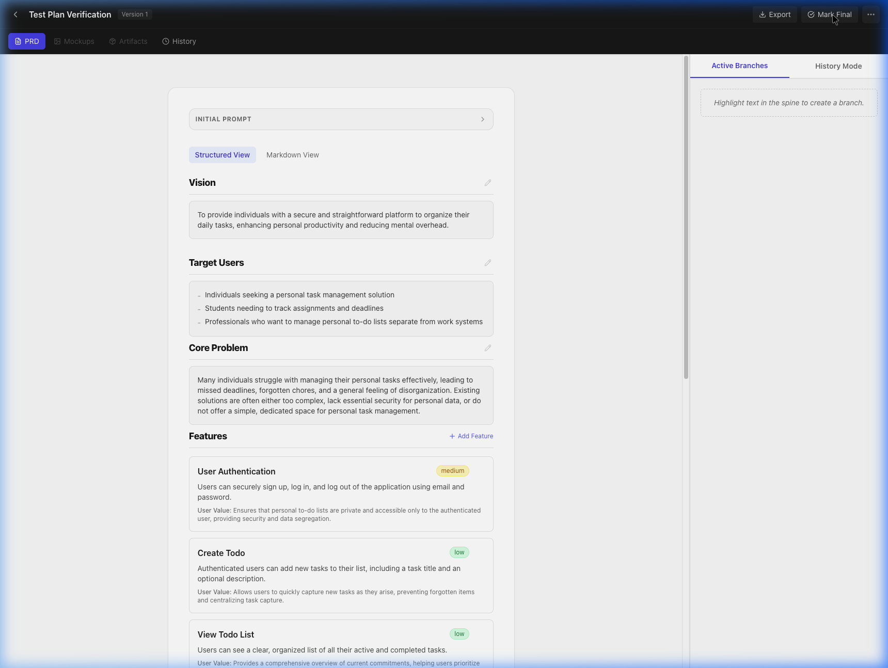
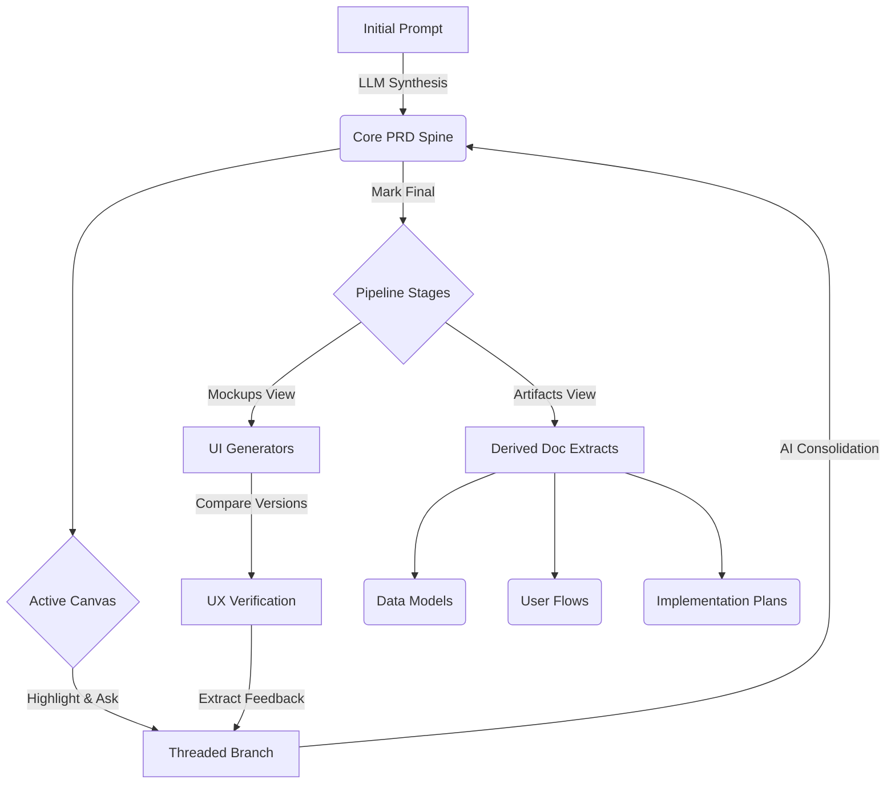
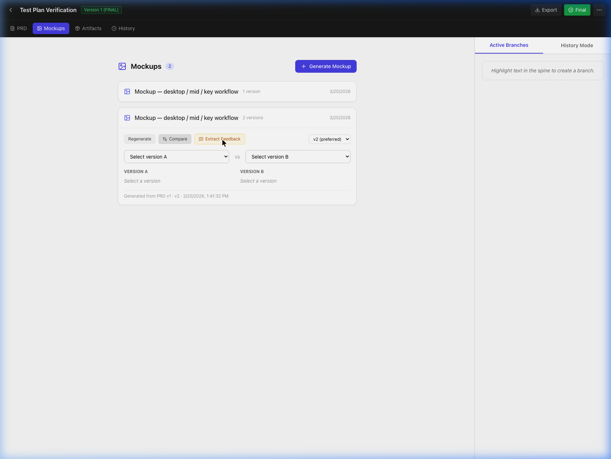
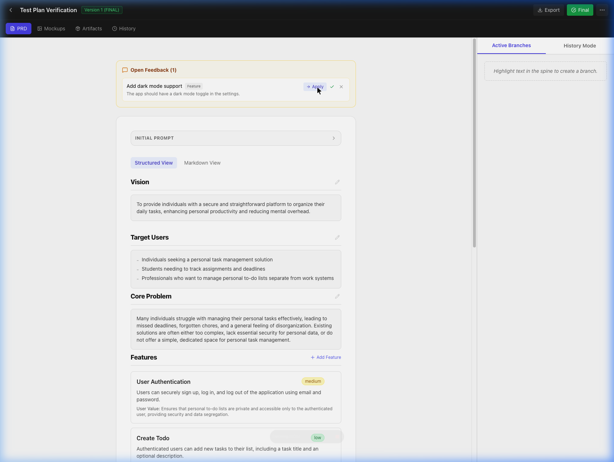
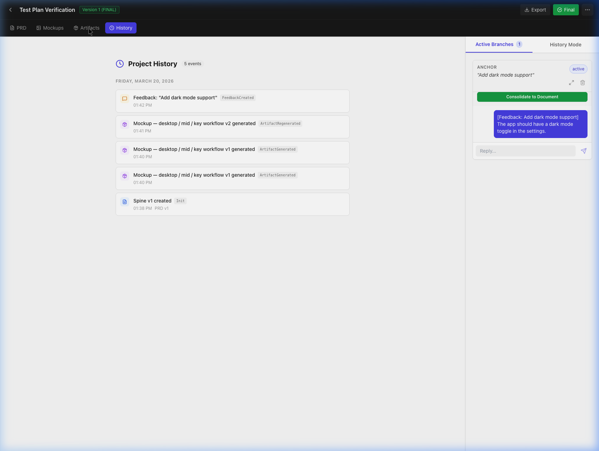
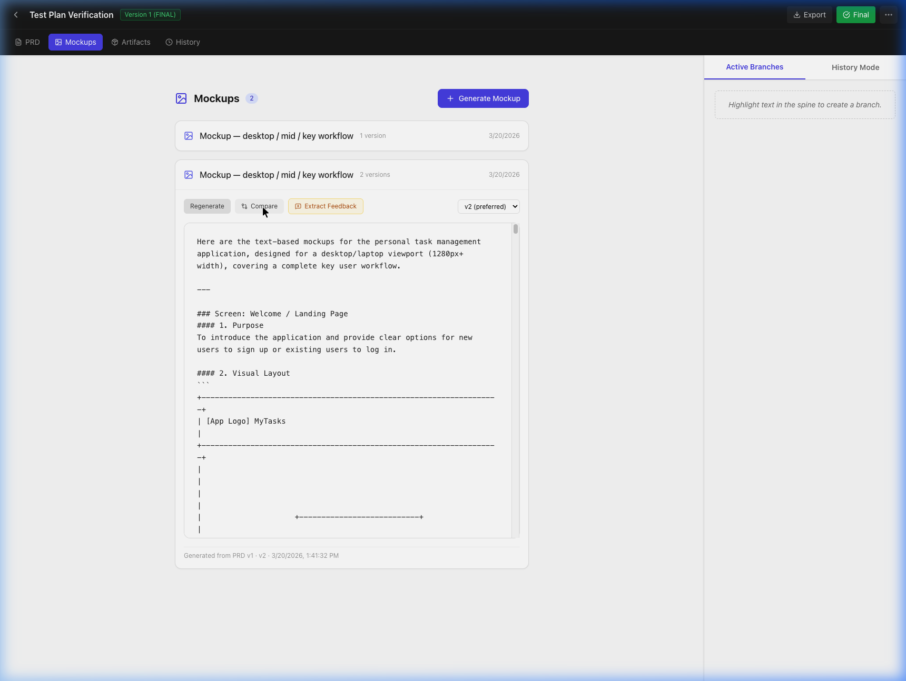
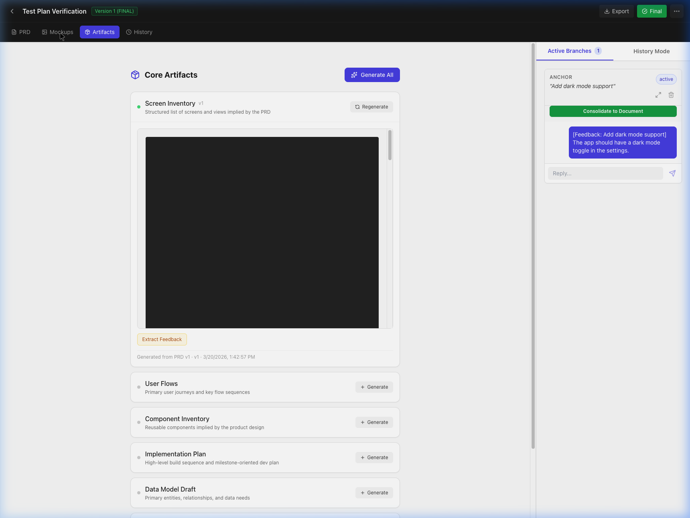

# Synapse

**Turn a brain-dump into a versioned PRD, UI mockups, and developer-ready artifacts — all from one prompt.**



<!-- TODO: Replace the static screenshot above with a short demo GIF showing: prompt → PRD generation → highlight-to-branch → mockups → artifacts. -->

---

## Why this project exists

PRDs are usually static Google Docs that go stale the moment engineering starts. Designers re-describe the same flows in Figma, engineers re-derive schemas in Notion, and feedback from mockup reviews rarely makes it back to the spec. Synapse collapses that loop: the PRD is the source of truth, and everything downstream (mockups, schemas, roadmaps, annotations) is generated and kept in sync from it.

## What it does

- Generates a structured PRD from a single prompt.
- Lets you **highlight any sentence** in the PRD to spawn a focused AI branch, then consolidates the decision back into a new spine version.
- Generates multi-fidelity UI mockups (wireframe / mid-fi / high-fi) and compares versions side-by-side.
- Derives 7 developer-ready artifacts from the PRD: screen inventory, user flows, component library, design system, data models, implementation roadmap, and prompt packs.
- Surfaces mockup feedback back into the PRD as actionable "apply" cards.
- Produces SVG markup images (critique boards, flow annotations, wireframe callouts) from PRD context.
- Tracks the whole evolution on a chronological history timeline.

## Why it is technically interesting

- **Two LLM call modes** — `callGemini()` for structured JSON responses (using Gemini's `responseMimeType: "application/json"` + `responseSchema`) and `callGeminiStream()` for streaming SSE output. Three artifact types use strict JSON-mode schemas and are then rendered back as typed card grids and entity tables.
- **Parallel artifact generation** — "Generate All" fires 7 concurrent LLM calls and streams per-card status (spinner → checkmark / red X), cutting bundle generation from ~21s to ~3–5s.
- **Spine versioning with branching** — PRDs evolve through `SpineVersion` records with `isLatest`/`isFinal` flags; highlighted text forks a `Branch` that runs its own AI conversation and merges back via `consolidateBranch()`.
- **Staleness tracking** — Every artifact stores source refs against the spine, so edits upstream visually flag downstream artifacts as stale and allow selective refresh.
- **Fully client-side** — No backend DB. All state (projects, versions, branches, artifacts, history) lives in a single Zustand store persisted to `localStorage` with debounced writes. Gemini is called directly from the browser.

## Architecture overview



Two files carry most of the weight:

- `src/lib/llmProvider.ts` (~950 lines) — every LLM call in the app, streaming + JSON modes, schemas for structured artifacts, markup image generation, branch consolidation.
- `src/store/projectStore.ts` (~820 lines) — single Zustand store for Projects, SpineVersions, Branches, Artifacts, ArtifactVersions, FeedbackItems, HistoryEvents, plus legacy-data migration.

See `ARCHITECTURE.md` for a deeper dive.

### Tech stack

- **Frontend:** React 19, Vite 7, Tailwind CSS 3 (tailwind-merge, clsx)
- **State management:** Zustand 5 with debounced `localStorage` persistence
- **AI / LLM backing:** Google Gemini 2.5 Pro/Flash pipeline (streaming + JSON mode)
- **Markdown processing:** React Markdown, Remark GFM, Rehype Raw
- **Routing:** React Router DOM v7
- **UI system:** Lucide React icons, @formkit/auto-animate

## Key features

### 1. Intelligent PRD canvas


Start with a raw brain-dump prompt and watch Synapse generate a structured product spec.
- **Spine versioning:** full history tracking of every structural change to the primary document (the "spine").
- **Branch-based refinement:** highlight any text to spawn an active workspace branch and debate specific approaches in an isolated thread.
- **Consolidation engine:** synthesizes individual branch decisions back into a new unified PRD iteration.


### 2. Multi-fidelity UI mockups
Bring your specs to life instantly without touching Figma.
- **Insta-mockups:** generate text and structural UI mockups directly from the finalized PRD.
- **Deep configuration:** platforms (mobile / desktop), fidelity levels (wireframe / mid-fi / high-fi), and scopes (single screen vs workflow).
- **A/B comparison:** evolve mockups over time and compare distinct iterations side-by-side in the built-in diff viewer.




### 3. Integrated feedback loop
Close the gap between design reviews and product specs.
- Extract structured feedback directly from generated mockups.
- Feedback surfaces into the core PRD stage as an actionable "apply" card.
- Automatically spin up a localized PRD branch to address the visual critique.




### 4. Downstream artifact generation


Don't write boilerplate. Synapse extracts PRD context into 7 developer-ready artifacts:
- **Screen inventory** & **user flows**
- **Component library** & **design system**
- **Data model schemas**
- **Implementation roadmaps** & **prompt packs**

Plus:
- **Staleness tracking** — visual indicators alert you when an artifact is out-of-sync with an updated PRD.
- **Artifact refinement** — refine any generated artifact with natural language instructions instead of regenerating from scratch.
- **Type-specific rendering** — screen inventories display as card grids, data models as entity tables, component inventories as categorized cards.
- **Output validation** — automatic quality checks flag truncated or malformed output with warning indicators.

### 5. Markup image artifacts
Generate visual annotation artifacts directly from PRD context.
- **5 annotation types:** screenshot annotations, critique boards, wireframe callouts, flow annotations, and design feedback boards.
- **SVG rendering:** annotations render as resolution-independent SVG with highlights, callouts, arrows, numbered markers, and text blocks.
- **Export:** download annotations as SVG files.

### 6. Architectural timeline (history)
Your product's evolution visualized chronologically — from initial spawn to branched decision-making to artifact derivations.



## Demo / live link

<!-- TODO: Add the Vercel deployment URL here, e.g. https://synapse-prd.vercel.app -->

## Local setup

```bash
git clone https://github.com/tgalloway1/synapse.git
cd synapse
npm install
npm run dev
```

Then open `http://localhost:5173`, click the Settings gear in the top-right, and paste a Gemini API key. Get a free key at [Google AI Studio](https://aistudio.google.com/apikey). All workspace sessions are cached locally so you can pick up where you left off.

### Other commands

```bash
npm run build       # tsc -b && vite build
npm run lint        # ESLint (flat config)
npm run preview     # preview the production build
npx tsc --noEmit    # type-check without emitting
```

No test script is wired up yet (Vitest and Playwright are installed but there are no test files).

## Environment variables

Synapse runs entirely in the browser and does **not** use `.env` files for the Gemini key. The key is entered via the in-app Settings panel and stored in `localStorage`.

| Where | Name | Purpose |
|---|---|---|
| Browser `localStorage` | `synapse-gemini-api-key` | Google Gemini API key, set via the Settings gear in the UI |

The `api/` directory contains three Vercel serverless functions (`generate-prd.ts`, `generate-milestones.ts`, `generate-agent-prompts.ts`) that are **legacy / unused** — the client calls Gemini directly.

## Deployment overview

- Deployed to **Vercel** as an SPA.
- `vercel.json` rewrites everything under `/api/*` to the (unused) serverless functions and all other routes to `index.html`.
- Build command: `npm run build` → output in `dist/`.
- Because state lives in the user's browser, there is no database to provision and no backend key management — each user brings their own Gemini key.

## Screenshots

### PRD canvas with highlight-to-branch


### Mockups view


### Mockup A/B comparison


### Feedback surfaced back into the PRD


### Downstream artifacts


### History timeline


<!-- TODO: Re-capture screenshots if the UI has drifted since the last snapshot. Consider adding a short GIF of the highlight-to-branch flow and one of parallel artifact generation. -->

## Limitations

- **Client-side only.** All data lives in `localStorage`. Clearing browser storage wipes every project; there's no multi-device sync or collaboration.
- **Bring your own key.** No managed Gemini proxy — the API key sits in the user's browser and requests go directly to Google.
- **No tests.** Vitest and Playwright are installed but no test files or CI checks exist yet.
- **Single LLM provider.** Gemini only; no abstraction for swapping models.
- **No auth.** Anyone with the URL can use their own key; projects aren't tied to accounts.
- **Artifact quality depends on PRD quality.** Garbage in, garbage out — structured output is enforced where possible but hallucinations still happen.

## Future work

- Replace `localStorage` persistence with a real backend (Postgres + row-level security) to unlock multi-device sync and sharing.
- Add a provider abstraction so Claude / GPT-4 / local models can slot in behind `llmProvider.ts`.
- Wire up the installed Playwright + Vitest into a real test suite and CI.
- Real-time multi-user editing on the PRD spine with branch merging.
- Export to Figma / Jira / Linear instead of just markdown + JSON.
- Proxy Gemini calls through the existing (currently unused) Vercel serverless functions so API keys don't live in the browser.

---

## Manual verification guide

After pulling the latest changes, use this checklist to verify everything works. Run `npm install`, `npx tsc --noEmit`, `npm run dev`, and add your Gemini API key before starting.

### Phase 1: performance & rendering
- [ ] **Parallel bundle generation:** Create a project, mark PRD as Final, go to Artifacts, click "Generate All". Verify all 7 artifacts generate concurrently (not sequentially) — should complete in ~3–5s, not ~21s.
- [ ] **Progress indicators:** During bundle generation, verify each artifact card shows a spinning loader icon while generating, a green checkmark when done, or a red X on error. The button should show "Generating 3 of 7…" progress.
- [ ] **Markdown rendering:** Expand any generated artifact — verify it renders with proper markdown formatting (headers, bold, lists, tables) instead of raw monospace text.
- [ ] **Mockup markdown:** Go to Mockups, generate a mockup — verify it renders with markdown formatting instead of monospace font.

### Phase 2: artifact quality
- [ ] **Enriched PRD:** Create a new project — verify the generated PRD includes priority levels (must/should/could), acceptance criteria per feature, and non-functional requirements sections.
- [ ] **Structured prompts:** Generate individual artifacts — verify screen inventories use the format `### [Screen Name]` with Purpose/Components/Navigation/Priority sections. Data models should include field tables.
- [ ] **Artifact refinement:** Expand a generated artifact, click "Refine", type an instruction (e.g., "Add error states to each screen"), click Apply. Verify a new version is created with the requested changes.
- [ ] **Validation warnings:** If an artifact appears truncated or poorly structured, verify an amber warning triangle icon appears next to the artifact title (hover to see details).

### Phase 3: speed & perceived performance
- [ ] **Skeleton loading:** Click Generate on an artifact that doesn't exist yet — verify a skeleton placeholder appears while loading.
- [ ] **Timing logs:** Open browser DevTools console — verify `[GEN]` log messages show timing for each LLM call and `[STORE]` messages show persistence timing.
- [ ] **No UI jank:** During bundle generation, verify the UI remains responsive (you can scroll, expand/collapse other sections).

### Phase 4: markup images
- [ ] **Markup image section:** Go to Artifacts stage — verify a "Markup Images" section appears below Core Artifacts.
- [ ] **Generate markup image:** Click any markup image type (e.g., "Critique Board") — verify it generates and displays an SVG annotation with highlights, callouts, and/or numbered markers.
- [ ] **Legend display:** If the annotation has numbered markers, verify a legend section appears below the SVG showing each number and its description.
- [ ] **SVG export:** Click "Export SVG" on a markup image — verify an SVG file downloads.

### Phase 5: polish features
- [ ] **Type-specific renderers:** Generate screen_inventory, data_model, or component_inventory artifacts. If the LLM returns structured JSON, verify they render as card grids / entity tables / categorized cards (not raw JSON or plain markdown).
- [ ] **Export modal:** Click the Export/Download button in the top bar — verify the export modal shows options for: Export PRD, individual artifact exports, Export Full Bundle, and Export Structured JSON.
- [ ] **Refresh stale:** After generating artifacts, go back to PRD stage, edit the PRD, return to Artifacts — verify a "Refresh N Stale" button appears. Click it and verify only stale artifacts regenerate.
