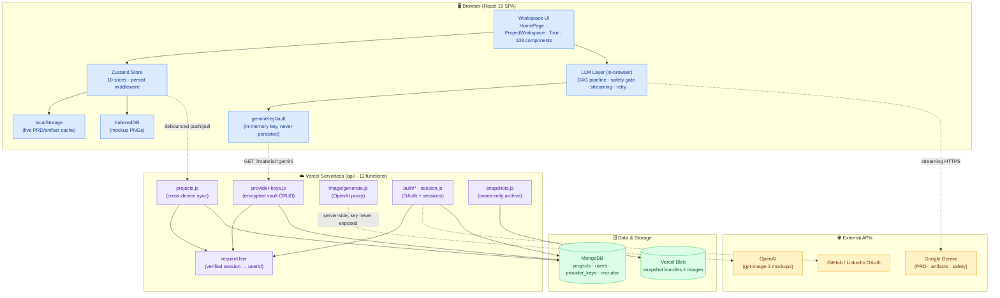
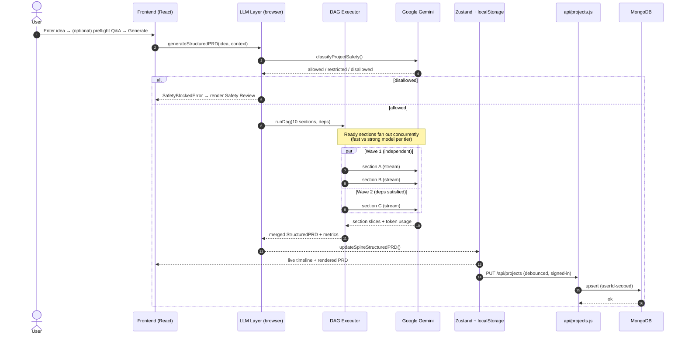

<div align="center">


# ⚡ Synapse

### From plain-language to product blueprint.

**Synapse is an AI-native product-definition web app that turns one sentence into a structured PRD — then into UI mockups, engineering artifacts, and annotated visual feedback, all from a single workspace.**

<br />


[](https://nodejs.org)
[](https://www.typescriptlang.org)
[](https://react.dev)
[](https://vitejs.dev)
[](#-why-this-project-is-technically-interesting)
[](https://vercel.com)

[](https://github.com/tgalloway1/synapse/actions)
[](https://github.com/tgalloway1/synapse/commits)
[](https://github.com/tgalloway1/synapse/stargazers)
[](https://github.com/tgalloway1/synapse/releases)

<br />

**[▶️ Live Interactive Tour](#-demo)** · **[🔬 Why It's Interesting](#-why-this-project-is-technically-interesting)** · **[🏗️ Architecture](#%EF%B8%8F-architecture)** · **[🗺️ Roadmap](#%EF%B8%8F-roadmap)** · **[❓ FAQ](#-faq)**

</div>

---

> ### 🎯 What problem does this solve?
>
> Turning a product idea into a real spec is slow, lossy, and manual: someone writes a PRD, someone else re-derives screens and a data model from it, and every downstream artifact drifts the moment the spec changes. **Synapse collapses that gap.** One plain-language prompt becomes a structured, schema-validated PRD generated by a concurrent multi-agent pipeline — then *that same source of truth* fans out into UI mockups, a screen inventory, a data model, a component library, an implementation plan, and a coding-agent hand-off. Every change is versioned, every artifact tracks staleness against the spec, and a code-level safety gate runs before a single word is written.

---

## ✨ Key Features

| | Feature | What it does | Why it matters |
|---|---|---|---|
| 🧠 | **Concurrent PRD pipeline** | A 10-section PRD is generated as a **dependency graph (DAG)** — sections run the moment their inputs are ready, not in document order. | Real parallelism cuts wall-clock time; the structure is graph-derived, not hardcoded. |
| 🛡️ | **Code-level safety gate** | Every generation path is classified `allowed` / `restricted` / `disallowed` **before** any section runs — and **fails closed**. | A guardrail in code, not just a prompt — a blocked idea can never drive downstream artifacts. |
| 🎨 | **One PRD → every asset** | Mark a PRD final and Synapse generates 7 core artifacts + multi-fidelity mockups + annotated SVGs in parallel. | A single source of truth replaces hand-copying the spec into seven documents. |
| ✍️ | **Highlight-to-refine** | Select any passage → Clarify / Expand / Specify / Alternative / Replace → a threaded branch merges back in. | Surgical edits on one span instead of regenerating the whole document. |
| 🕓 | **Everything is versioned** | Every regenerate, edit, branch-merge, and restore appends a new version with a section-aware diff. | Non-destructive history — nothing is ever overwritten or lost. |
| 📊 | **Orchestration metrics** | A `/metrics` dashboard records real telemetry: speedup, concurrency, critical path, token usage, cost estimates. | The concurrency is **measured, not claimed** — with per-run Gantt charts. |
| 🔌 | **Staleness tracking** | Artifacts carry source references to the spine and flag themselves when the PRD moves underneath them. | The whole workspace stays coherent as the product evolves. |
| ☁️ | **Cross-device web app** | A Vercel-hosted web app: signed-in users' projects sync to a per-account server collection and follow them across machines. | Access your work from any browser — nothing is trapped on one device. |
| 📱 | **Mobile-ready by design** | Responsive layouts, safe-area insets, touch-aware selection, swipe navigation, and reduced-motion support throughout. | The full workflow — including highlight-to-refine — works on a phone, not just desktop. |
| 🤝 | **Coding-agent hand-off** | One-click "Copy for coding agent" bundles PRD + build artifacts for Claude Code / Cursor. | Closes the loop from idea straight to implementation. |

---

## 🔬 Why This Project Is Technically Interesting

> Written for engineers, AI engineers, and hiring managers. This section explains the *engineering problems solved*, not the marketing surface.

| Engineering Capability | Why It's Interesting | Technologies Used |
|---|---|---|
| **Multi-agent orchestration over a DAG** | PRD sections declare *true data dependencies only*; a Kahn's-algorithm validator rejects cycles/unknown refs, then a scheduler runs every ready node concurrently. It's a dependency-resolving executor, not a sequential prompt chain. | TypeScript, custom DAG runner (`runDag`), topological waves |
| **Parallel + streaming inference** (performance) | Independent sections fan out across two concurrency pools with tiered model routing (fast vs. strong), while SSE streaming paints drafts as tokens arrive — wrapped in two-layer retry that reconnects a dropped mobile stream from byte zero. | Fetch + ReadableStream, SSE, per-tier concurrency caps, Gemini Flash + Pro |
| **Code-level safety gate (fail-closed)** | A single chokepoint classifies intent before generation; if classification can't be determined it's treated as *disallowed*, and genuine config errors are distinguished from safety failures. | Gemini JSON-mode classifier, typed `SafetyClassificationResult` |
| **Resumable / self-healing workflows** | A page reload kills any in-flight pipeline; on rehydrate, spines still marked `running` are converted into a settled, retryable error state instead of an eternal spinner. Single failed sections re-run in isolation. | Zustand `persist`, interrupted-generation reconciler |
| **Observability & cost telemetry** | Token usage is captured from `usageMetadata` and threaded into a metrics layer that computes speedup, max/avg concurrency (interval sweep), and critical path (memoized DFS) — rendered as per-run Gantt charts, no synthetic data. | Pure metric math, `/metrics` dashboard |
| **Non-destructive versioning + staleness** | Every edit *appends* a version with change-source attribution; restores append a clone rather than mutating history. Structural diffs are computed on the fly, and artifacts flag themselves stale when the PRD moves. | jsdiff, immutable version slices, source-ref tracking |
| **Schema-constrained generation** | Three artifacts use Gemini JSON mode with explicit schemas, round-trip through markdown, and degrade gracefully when older saved data lacks newer fields. | JSON-mode schemas, markdown round-trip parsers |
| **Type-safe end-to-end** | `tsc -b` is the authoritative gate (stricter than `--noEmit`); test files compile with the app, so a typing slip in a test fails the deploy exactly like app code. | TypeScript 5.9 project references |

<details>
<summary><strong>⚡ Engineering Highlights — the 30-second recruiter skim</strong></summary>

<br />

- 🧩 **Custom DAG executor** runs a 10-agent PRD pipeline concurrently — with cycle detection and tiered model routing.
- 📡 **Streaming inference** with two-layer retry that survives mid-stream mobile-network drops.
- 🛡️ **Fail-closed safety gate** in code, not prompt — blocks unsafe generation before it starts.
- 📊 **Real observability**: token usage, speedup, concurrency, and critical path rendered as per-run Gantt charts — no synthetic data.
- 🕓 **Non-destructive versioning** with section-aware diffs and self-healing interrupted-run recovery.
- 📱 **Mobile-ready web app** with touch-aware refine gestures, deployed on Vercel with cross-device sync.
- ✅ **~47K lines of TypeScript, 614 tests, 108 components** — `tsc -b` enforced on every deploy.

</details>

> **🔭 Not yet surfaced in the product UI (portfolio-worthy):** the [mockup evaluation harness](docs/mockup-evaluation-harness.md) (`npm run mockup:harness`) is a genuine **LLM-output eval framework** with retry/scoring runs and a GitHub Actions workflow — currently only documented, not shown in-app. Worth promoting as a first-class "AI evals" capability. The **token-usage capture** exists for PRD sections but artifact services don't yet forward it (documented TODO) — wiring it through would complete cost observability.

---

## 🎬 Demo

> **Take the interactive tour — no sign-up, no API key.** Synapse ships a fully interactive product tour at **`/tour`** (aliased `/about`) that rebuilds the entire workflow as native, clickable UI on local demo data. It never calls an LLM, never touches the backend, and exposes no user data — a portfolio-safe, deep-linkable demo.

### The end-to-end workflow, in six beats

<table>
<tr>
<td width="50%" valign="top">

**1 · Start with an idea** 💡
Type one sentence. Optionally answer a **Quick (5)** or **Deep (10)** clarification set to sharpen intent before generation.

</td>
<td width="50%" valign="top">

**2 · AI builds the spec** 🧠
A live timeline shows 10 sections generating in **dependency waves** — concurrent groups, per-section model, and elapsed/estimated timing.

</td>
</tr>
<tr>
<td colspan="2"></td>
</tr>
<tr>
<td width="50%" valign="top">

**3 · Refine surgically** ✍️
Highlight any passage → **Clarify / Expand / Specify / Alternative / Replace** → a threaded branch merges back in.

</td>
<td width="50%" valign="top">

**4 · Nothing gets lost** 🕓
Every change appends a new **version** with a section-aware diff, change-source badge, and one-click restore.

</td>
</tr>
<tr>
<td></td>
<td></td>
</tr>
<tr>
<td width="50%" valign="top">

**5 · One PRD → every asset** 🎨
Mark final → 7 artifacts + multi-fidelity mockups + annotated SVGs generate **in parallel** from one source of truth.

</td>
<td width="50%" valign="top">

**6 · Everything stays connected** 🔌
Artifacts carry source refs back to the spine; staleness is detected automatically as the PRD evolves.

</td>
</tr>
<tr>
<td></td>
<td></td>
</tr>
</table>

---

## 🏗️ Architecture

Synapse is a **Vercel-hosted React web app** (a mobile-friendly SPA) that calls Google Gemini directly from the browser for low-latency streaming, backed by **Vercel serverless functions** for durable cross-device sync, encrypted secrets, auth, and OpenAI-proxied image generation.



<details>
<summary><strong>Layer-by-layer breakdown</strong></summary>

<br />

| Layer | Responsibility | Key modules |
|---|---|---|
| **Frontend** | React 19 SPA — workspace, renderers, interactive tour | `src/components/` (108 components), `src/App.tsx` |
| **State** | Zustand store (10 slices) + debounced localStorage; mockup PNGs in IndexedDB | `src/store/slices/` |
| **LLM orchestration** | In-browser DAG pipeline, safety gate, streaming transport, retry | `src/lib/services/`, `src/lib/geminiClient.ts` |
| **API (serverless)** | 11 Vercel functions — project sync, vault, image proxy, auth, snapshots | `api/*.js`, shared helpers in `api/_lib/` |
| **Auth** | Session cookies (HMAC), OAuth (GitHub/LinkedIn), email/password, identity linking | `api/_lib/session.js`, `api/auth/`, `requireUser.js` |
| **Database** | MongoDB via official Node driver with cached pool — `projects`, `users`, `provider_keys`, recruiter collections | `api/_lib/db.js`, `projectsStore.js`, `users.js` |
| **Storage** | Vercel Blob for owner-only full-project snapshots (state + images) | `api/snapshots.js` |
| **External APIs** | Google Gemini (text/JSON, client-side), OpenAI `gpt-image-2` (server-proxied), GitHub/LinkedIn OAuth | `geminiClient.ts`, `api/image/generate.js` |

> ⚠️ **Note on "background workers":** Synapse uses **serverless functions** (stateless, request-scoped) rather than a long-running worker/queue tier. Parallelism is achieved via the in-browser concurrent DAG executor, not a job queue.

</details>

---

## 🔁 End-to-End Workflow

What happens after you press **one button** — "Generate PRD":



The same pattern drives artifact generation (the bundle controller fans the 7 core artifacts out concurrently) and is recorded as a `WorkflowRun` for the `/metrics` dashboard.

<!-- ====================================================================
## 🚀 Performance  (commented out — populate from real /metrics runs)

The `/metrics` dashboard already measures real per-run performance — these tables are the **template to populate** from representative runs (no synthetic data is shipped by design).

| Run | Sequential estimate | Actual (parallel) | Speedup | Max concurrency |
|---|---|---|---|---|
| PRD generation (10 sections) | _TODO_ | _TODO_ | _TODO ×_ | _TODO_ |
| Artifact bundle (7 artifacts) | _TODO_ | _TODO_ | _TODO ×_ | _TODO_ |

| Dimension | Sequential | Parallel (Synapse) |
|---|---|---|
| Wall-clock latency | _TODO_ | _TODO_ |
| Token usage (total) | _TODO_ | _TODO_ |
| Est. cost (USD) | _TODO_ | _TODO_ |

How to generate: run a few PRD + artifact bundles, open /metrics, and read the sequential-estimate / actual / speedup / concurrency / token / cost figures directly off each WorkflowRun.
==================================================================== -->

<!-- ====================================================================
## 🖼️ Screenshots  (commented out)

| | |
|---|---|
| **💡 Idea entry** | **🧠 Spec generation (live waves)** |
|  |  |
| **✍️ Refine a passage** | **🕓 Version history & diff** |
|  |  |
| **🎨 Generated assets** | **🔌 Connections graph** |
|  |  |

Screenshot gaps to fill: mobile layout, dark mode, the /metrics dashboard, and a generated artifact. Regenerate via npm run capture:screenshots.
==================================================================== -->

<!-- ====================================================================
## 🧭 Design Decisions  (commented out)

### Why a Vercel-hosted SPA (and why Gemini is called from the browser)?
PRD generation streams and can run for tens of seconds — longer than a Vercel Hobby serverless function's maxDuration. Calling Gemini directly from the browser keeps streaming responsive, with localStorage as a client cache and server sync for durability. The trade-off — a client-held key — is mitigated by the encrypted server vault (keys fetched into memory, never persisted) and a server proxy for OpenAI image generation where the key must stay secret.

### Why React 19 + Vite + Zustand (not Next.js / Redux)?
The product is a single rich workspace, not a content site — SSR/routing-heavy frameworks add cost without benefit. Vite gives fast HMR and a clean static build. Zustand's slice composition fits the store with persist middleware; selector-stability discipline avoids useSyncExternalStore update storms.

### Why a custom DAG executor instead of LangGraph / a workflow engine?
The orchestration runs in the browser alongside the UI and needs to emit fine-grained lifecycle events into a live timeline. A small, typed, dependency-resolving executor with explicit per-tier concurrency caps is lighter than a Python-side graph engine, has zero server round-trips, and keeps the whole pipeline type-checked end-to-end.

### Why MongoDB (not Postgres)?
A project is a nine-collection bundle serialized as one document keyed by a client UUID — a document model maps cleanly onto that transport unit. Access control is RLS-equivalent in the data layer (userId pinned into every filter), so relational guarantees aren't load-bearing here.

### Why Vercel serverless (not a container / worker tier)?
The backend's job is bursty and request-scoped — sync upserts, vault reads, OAuth, an image proxy — none of which needs a long-running process. Serverless keeps ops near-zero and scales to zero.
==================================================================== -->

---

## 🗺️ Roadmap

**✅ Current**
- [x] Concurrent DAG PRD pipeline with live timeline
- [x] Code-level fail-closed safety gate
- [x] 7 core artifacts + multi-fidelity mockups + markup SVGs
- [x] Append-only versioning with section-aware diffs & restore
- [x] Orchestration metrics dashboard (`/metrics`)
- [x] Encrypted provider-key vault + OAuth + identity linking
- [x] Cross-device project sync

**🔜 Next release**
- [ ] Wire `@vitest/coverage-v8` + publish a real coverage badge
- [ ] Forward token usage from artifact services (complete cost observability)
- [ ] Per-project server-newer reconciliation (currently local-always-wins)
- [ ] Migrate server-side data (snapshots / provider keys) on account merge
- [ ] Cross-device sync for mockup images (currently device-local)

**🔮 Future**
- [ ] Additional LLM providers (Anthropic / Azure OpenAI) via the routing layer
- [ ] Dockerfile + compose for one-command self-hosting
- [ ] Real-time collaborative editing on a shared spine

**🔬 Research**
- [ ] Promote the mockup eval harness into an in-app **AI evals** surface
- [ ] Automated PRD quality scoring against the rubric
- [ ] Cost-aware adaptive model routing per section difficulty

---

## 🤝 Contributing

Contributions are welcome — see **[`CONTRIBUTING.md`](CONTRIBUTING.md)** for the full guide.

| | |
|---|---|
| **Branch strategy** | Feature branches off `main`; never push directly to `main`. |
| **Commits** | Clear, descriptive, present-tense messages. |
| **Required gate** | `npm run build` **and** `npm run lint` must pass (Vercel runs the build). |
| **Testing** | Add/extend Vitest tests under `src/**/__tests__/`; keep test TS as strict as app TS. |
| **Docs rule** | A change to a user-visible feature updates `README.md` **and** `CLAUDE.md` in the same commit. |

```bash
# 1. Branch
git checkout -b feat/my-change
# 2. Develop + verify
npm run build && npm run lint && npm test
# 3. Push & open a PR
git push -u origin feat/my-change
```

---

## ❓ FAQ

<details>
<summary><strong>Do I need to install anything to try Synapse?</strong></summary>

No — the interactive `/tour` (aliased `/about`) runs in any browser on local demo data with no sign-up and no API key. To generate real PRDs you add a Google Gemini key in Settings; it's stored client-side and sent directly to Gemini.
</details>

<details>
<summary><strong>Where do my API keys and projects live?</strong></summary>

Keys are stored client-side (namespaced per user) for the direct-to-Gemini path, or AES-256-GCM encrypted in the server vault for signed-in users — never returned to the client as material. Projects are cached in the browser for responsiveness and, when signed in, synced to a `userId`-scoped MongoDB collection so they follow you across devices.
</details>

<details>
<summary><strong>Is the "multi-agent" concurrency real or just a label?</strong></summary>

Real. Sections run through a dependency-graph executor with cycle detection and per-tier concurrency caps, and the `/metrics` dashboard records actual speedup, max/avg concurrency, and critical path per run — no synthetic data.
</details>

<details>
<summary><strong>Why Gemini in the browser — isn't that a security risk?</strong></summary>

Streaming PRD generation exceeds serverless time limits, so Gemini is called client-side. The key stays in memory (vault) or per-user browser storage, and any provider whose key *must* be secret (OpenAI images) is proxied server-side where the key never reaches the client.
</details>

<details>
<summary><strong>Does it work on mobile?</strong></summary>

Yes — responsive layouts, safe-area insets, touch-aware text selection, swipe navigation, and reduced-motion support are built in. The highlight-to-refine gesture has a dedicated mobile flow so it doesn't fight the native selection toolbar.
</details>

<details>
<summary><strong>What happens if generation is interrupted (refresh / network drop)?</strong></summary>

Streaming retries reconnect mid-stream; on reload, any pipeline still marked `running` is converted into a settled, retryable error state (not an eternal spinner), and individual failed sections can be re-run without touching the rest of the document.
</details>

---

## 📚 Documentation

| Doc | What's inside |
|---|---|
| [`CLAUDE.md`](CLAUDE.md) | Architecture, state slices, LLM pipeline, cross-cutting patterns (kept in sync with code) |
| [`docs/architecture.md`](docs/architecture.md) | Runtime stack, state layer, LLM services, UI composition |
| [`docs/artifact-flow.md`](docs/artifact-flow.md) | File-by-file trace of one end-to-end pipeline run |
| [`docs/ORCHESTRATION_AND_METRICS.md`](docs/ORCHESTRATION_AND_METRICS.md) | Concurrent workflows, the `/metrics` dashboard, each metric explained |
| [`docs/AUTH_AND_PROVIDER_KEYS.md`](docs/AUTH_AND_PROVIDER_KEYS.md) | Per-user projects, encrypted vault, server-side model routing |
| [`docs/auth.md`](docs/auth.md) · [`docs/linkedin-auth.md`](docs/linkedin-auth.md) | Multi-provider auth, user schema, OAuth setup |
| [`docs/SERVER_PROJECT_STORAGE.md`](docs/SERVER_PROJECT_STORAGE.md) | Cross-device sync design |
| [`docs/VERSIONING_AUDIT.md`](docs/VERSIONING_AUDIT.md) | Versioning & revert design (Phase 1) |
| [`docs/deployment.md`](docs/deployment.md) | Commands, Vercel setup, self-hosting |
| [`docs/mockup-evaluation-harness.md`](docs/mockup-evaluation-harness.md) | LLM-output eval framework |
| [`.env.example`](.env.example) | Backend environment variables (workspace needs none) |

<!-- ====================================================================
## 🙏 Acknowledgements  (commented out)

Built with the open-source ecosystem:

Core — React 19 · TypeScript · Vite · Tailwind CSS · Zustand
UI/UX — framer-motion · lucide-react · react-markdown + remark-gfm · @formkit/auto-animate
Data/diff — jsdiff · date-fns · MongoDB Node driver
Platform — Vercel (hosting · serverless · Blob) · Vitest · Playwright
AI — Google Gemini (PRD, artifacts, safety) · OpenAI (image generation)
==================================================================== -->

<!-- ====================================================================
## 📄 License  (commented out)

TODO: no LICENSE file is present yet. Add one (MIT is the conventional choice for a portfolio project) and the License badge above will resolve.
==================================================================== -->

<div align="center">

<br />

**[⬆ back to top](#-synapse)**

<br />

*Built to turn one sentence into a buildable product blueprint.*
⭐ **Star the repo if the concurrent-pipeline + versioned-artifact architecture is useful to you.**

</div>
