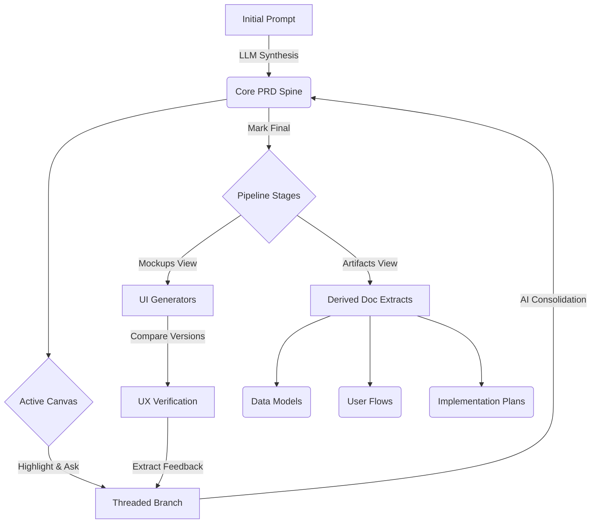

# Synapse PRD 🧠

Synapse is an AI-native product definition environment. It transforms the traditional Product Requirements Document (PRD) from a static text file into a **dynamic, spec-driven pipeline** spanning mockups, architecture, artifact extraction, and branching feedback loops.


## 🌟 Core Features

### 1. Intelligent PRD Canvas
Start with a raw brain-dump prompt and watch Synapse generate a highly structured, comprehensive product specification.
- **Spine Versioning:** Full history tracking of every structural change to your primary document (the "Spine").
- **Branch-based Refinement:** Highlight any text to spawn an active workspace branch. Discuss and debate specific approaches within isolated threads.
- **Consolidation Engine:** Ready to merge? The engine synthesizes individual branch decisions back into a new unified PRD iteration.

### 2. Multi-Fidelity UI Mockups
Bring your specs to life instantly without touching Figma.
- **Insta-Mockups:** Generate text and structural-based UI mockups directly from the finalized PRD.
- **Deep Configuration:** Tweak platforms (Mobile/Desktop), fidelity levels (Wireframe, Mid-Fi, High-Fi), and scopes (Single Screen vs Workflow).
- **A/B Comparison:** Evolve mockups over time and compare distinct iterations side-by-side using the built-in diff viewer.


### 3. Integrated Feedback Loop
Close the gap between design reviews and product specs.
- Extract structured feedback directly from generated Mockups.
- Feedback surfaces into the core PRD stage as an actionable "Apply" card.
- Automatically spin up a localized PRD branch to address the visual critique.


### 4. Downstream Artifact Generation
Don't write boilerplates. Synapse extracts the exact context into developer-ready output files. 
- Automatically spool up 7 dynamic derivatives from the PRD:
  - 🎨 **Screen Inventory** & **User Flows**
  - 🧩 **Component Library** & **Design System**
  - 🗄️ **Data Model Schemas**
  - 🚀 **Implementation Roadmaps** & **Prompt Packs**
- **Staleness Tracking:** Visual indicators alert you when an Artifact is out-of-sync with an updated PRD.

### 5. Architectural Timeline (History)
Your product's evolution, visualized chronologically. From initial spawn, to branched decision-making, to artifact derivations.


---

## 🛠️ Data Architecture & UX Flow



### Tech Stack
- **Frontend:** React 19, Vite, Tailwind CSS (Tailwind Merge, CLSX)
- **State Management:** Zustand (with fast LocalStorage persistence)
- **AI/LLM Backing:** Google Gemini 2.5 Pro Pipeline
- **Markdown Processing:** React-Markdown, Remark GFM, Rehype-Raw
- **Routing:** React Router DOM v7
- **UI System:** Lucide React Icons, Auto-animate

---

## 🚀 Getting Started

### Prerequisites

To execute language modeling loops, you'll need an active **Gemini API Key**. 
1. Get a key at [Google AI Studio](https://aistudio.google.com/apikey).
2. Pass it into the UI via the top-right Settings wheel inside Synapse.

### Quick Run

```bash
# Install specific package locks
npm install

# Start the local Vite server
npm run dev
```

Navigate to `http://localhost:5173` to initialize your first project. All workspace sessions are cached locally allowing you to pick up exactly where you left off. 

### Build for Production
```bash
npm run build
```
