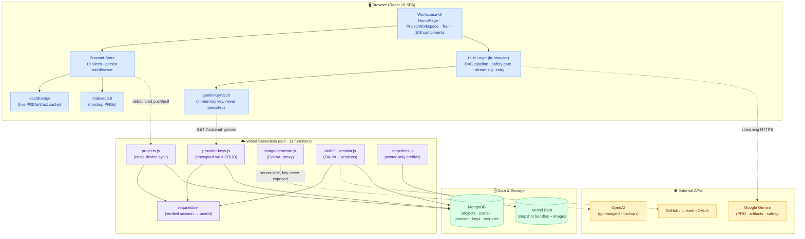
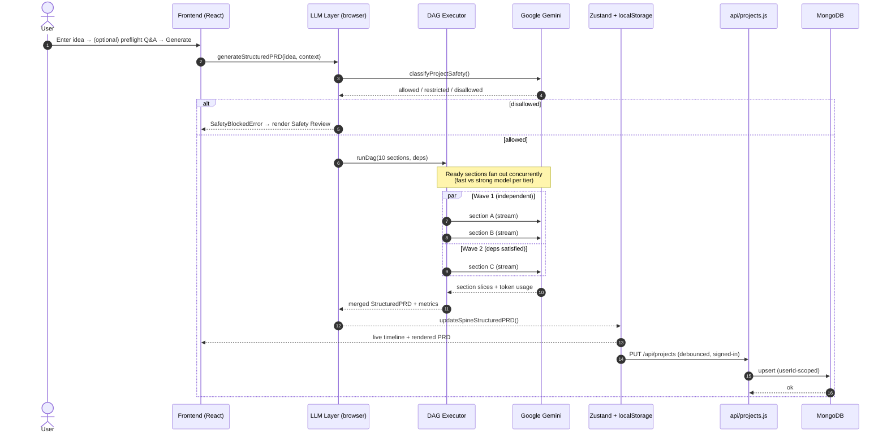

<div align="center">


# ⚡ Synapse

### From plain-language to product blueprint.

**Synapse is an AI-native product-definition environment that turns one sentence into a structured PRD — then into UI mockups, engineering artifacts, and annotated visual feedback, all from a single workspace.**

<br />

[](#-license)
[](https://nodejs.org)
[](https://www.typescriptlang.org)
[](https://react.dev)
[](https://vitejs.dev)
[](#-project-metrics)
[](https://vercel.com)

[](https://github.com/tgalloway1/synapse/actions)
[](https://github.com/tgalloway1/synapse/commits)
[](https://github.com/tgalloway1/synapse/stargazers)
[](https://github.com/tgalloway1/synapse/releases)

<br />

**[▶️ Live Interactive Tour](#-demo)** · **[🏗️ Architecture](#%EF%B8%8F-architecture)** · **[⚙️ Quick Start](#-installation)** · **[📊 Metrics](#-project-metrics)** · **[🗺️ Roadmap](#%EF%B8%8F-roadmap)**

</div>

---

> ### 🎯 What problem does this solve?
>
> Turning a product idea into a real spec is slow, lossy, and manual: someone writes a PRD, someone else re-derives screens and a data model from it, and every downstream artifact drifts the moment the spec changes. **Synapse collapses that gap.** One plain-language prompt becomes a structured, schema-validated PRD generated by a concurrent multi-agent pipeline — then *that same source of truth* fans out into UI mockups, a screen inventory, a data model, a component library, an implementation plan, and a coding-agent hand-off. Every change is versioned, every artifact tracks staleness against the spec, and a code-level safety gate runs before a single word is written.

---

## ✨ Key Features

| | Feature | What it does | Why it matters |
|---|---|---|---|
| 🧠 | **Concurrent PRD pipeline** | A 10-section PRD is generated as a **dependency graph (DAG)** — sections run the moment their inputs are ready, not in document order. | Real parallelism cuts wall-clock time; the structure is graph-derived, not hardcoded. |
| 🛡️ | **Code-level safety gate** | Every generation path is classified `allowed` / `restricted` / `disallowed` **before** any section runs — and **fails closed**. | A guardrail in code, not just a prompt — a blocked idea can never drive downstream artifacts. |
| 🎨 | **One PRD → every asset** | Mark a PRD final and Synapse generates 7 core artifacts + multi-fidelity mockups + annotated SVGs in parallel. | A single source of truth replaces hand-copying the spec into seven documents. |
| ✍️ | **Highlight-to-refine** | Select any passage → Clarify / Expand / Specify / Alternative / Replace → a threaded branch merges back in. | Surgical edits on one span instead of regenerating the whole document. |
| 🕓 | **Everything is versioned** | Every regenerate, edit, branch-merge, and restore appends a new version with a section-aware diff. | Non-destructive history — nothing is ever overwritten or lost. |
| 📊 | **Orchestration metrics** | A `/metrics` dashboard records real telemetry: speedup, concurrency, critical path, token usage, cost estimates. | The concurrency is **measured, not claimed** — with per-run Gantt charts. |
| 🔌 | **Staleness tracking** | Artifacts carry source references to the spine and flag themselves when the PRD moves underneath them. | The whole workspace stays coherent as the product evolves. |
| 🔐 | **Encrypted BYO key vault** | Provider keys are stored AES-256-GCM encrypted, bound per-user, never returned to the client. | Production-grade secret handling, not keys-in-localStorage. |
| 📱 | **Local-first + cross-device sync** | localStorage/IndexedDB is the live offline cache; signed-in users sync to a per-account server collection. | Works offline, follows you across devices, survives a browser wipe. |
| 🤝 | **Coding-agent hand-off** | One-click "Copy for coding agent" bundles PRD + build artifacts for Claude Code / Cursor. | Closes the loop from idea straight to implementation. |

---

## 🔬 Why This Project Is Technically Interesting

> Written for engineers, AI engineers, and hiring managers. This section explains the *engineering problems solved*, not the marketing surface.

| Engineering Capability | Why It's Interesting | Technologies Used |
|---|---|---|
| **Multi-agent orchestration over a DAG** | PRD sections declare *true data dependencies only*; a Kahn's-algorithm validator rejects cycles/unknown refs, then a scheduler runs every ready node concurrently under per-tier caps. It's a dependency-resolving executor, not a sequential prompt chain. | TypeScript, custom DAG runner (`runDag`), topological waves |
| **Parallel execution with tiered model routing** | Independent sections fan out across two concurrency pools; low-risk sections use a fast model, high-risk sections a strong model — balancing latency against quality per node. | `maxFastConcurrency` / `maxStrongConcurrency`, Gemini Flash + Pro |
| **Streaming inference with mid-stream recovery** | SSE streaming paints a draft as tokens arrive, wrapped in *two* retry layers — connection-level and stream-level — so a dropped mobile connection reconnects from byte zero and resets chunk-derived state via an `onRestart` callback. | Fetch + ReadableStream, SSE, exponential backoff |
| **Code-level safety gate (fail-closed)** | A single chokepoint classifies intent before generation; if classification can't be determined it's treated as *disallowed*. Genuine config errors are distinguished from safety failures and re-thrown. | Gemini JSON-mode classifier, typed `SafetyClassificationResult` |
| **Resumable / self-healing workflows** | A page reload kills any in-flight pipeline; on rehydrate, spines still marked `running` are converted into a settled, retryable error state instead of an eternal spinner. Single failed sections re-run in isolation. | Zustand `persist`, interrupted-generation reconciler |
| **Observability & cost telemetry** | Token usage is captured from `usageMetadata` and threaded through the pipeline into a metrics layer that computes speedup, max/avg concurrency (interval sweep), and critical path (memoized DFS) — rendered as Gantt charts. | Pure metric math, `/metrics` dashboard |
| **Non-destructive versioning** | Every edit *appends* a version with change-source attribution; restores append a clone rather than mutating history. Section-aware structural diffs are computed on the fly from snapshots. | jsdiff, immutable version slices |
| **Local-first sync with conflict policy** | localStorage is the live cache; a sync orchestrator reconciles a server collection additively (local always wins on id collision) so a failed save never drops local data. | Zustand, MongoDB, debounced per-project push |
| **Encrypted secret vault** | Per-user provider keys are AES-256-GCM encrypted at rest, bound with AAD (`userId:provider`), and the API returns masked status only — key material never round-trips to the client. | Node `crypto`, AES-256-GCM, MongoDB |
| **RLS-equivalent access control** | Every data-layer function takes `userId` first and pins it into the Mongo filter; identity comes only from a verified session cookie, never the request body. | `requireUser`, HMAC-signed sessions |
| **Account identity merging** | One human signing in via multiple providers resolves to one stable `userId` (auto-link on verified-email match, explicit link via signed intent cookie), with namespace merging to recover split projects. | OAuth, HMAC link-intent, tombstoned merges |
| **Type-safe end-to-end** | `tsc -b` is the authoritative gate (stricter than `--noEmit`); test files compile with the app, so a typing slip in a test fails the deploy exactly like app code. | TypeScript 5.9 project references |
| **Schema-constrained generation** | Three artifacts use Gemini JSON mode with explicit schemas, round-trip through markdown, and degrade gracefully when older saved data lacks newer fields. | JSON-mode schemas, markdown round-trip parsers |

<details>
<summary><strong>⚡ Engineering Highlights — the 30-second recruiter skim</strong></summary>

<br />

- 🧩 **Custom DAG executor** runs a 10-agent PRD pipeline concurrently — with cycle detection and tiered model routing.
- 📡 **Streaming inference** with two-layer retry that survives mid-stream mobile-network drops.
- 🛡️ **Fail-closed safety gate** in code, not prompt — blocks unsafe generation before it starts.
- 📊 **Real observability**: token usage, speedup, concurrency, and critical path rendered as per-run Gantt charts — no synthetic data.
- 🔐 **AES-256-GCM key vault** + RLS-equivalent, session-only access control across 11 serverless functions.
- 🕓 **Non-destructive versioning** with section-aware diffs and self-healing interrupted-run recovery.
- 📱 **Local-first architecture** with additive cross-device sync that never drops local work.
- ✅ **~47K lines of TypeScript, 614 tests, 108 components** — `tsc -b` enforced on every deploy.

</details>

> **🔭 Not yet surfaced in the product UI (portfolio-worthy):** the [mockup evaluation harness](docs/mockup-evaluation-harness.md) (`npm run mockup:harness`) is a genuine **LLM-output eval framework** with retry/scoring runs and a GitHub Actions workflow — currently only documented, not shown in-app. Worth promoting as a first-class "AI evals" capability. The **token-usage capture** exists for PRD sections but artifact services don't yet forward it (documented TODO) — wiring it through would complete cost observability.

---

## 🎬 Demo

> **Take the interactive tour — no sign-up, no API key.** Synapse ships a fully interactive product tour at **`/tour`** (aliased `/about`) that rebuilds the entire workflow as native, clickable UI on local demo data. It never calls an LLM, never touches the backend, and exposes no user data — a portfolio-safe, deep-linkable demo.

### The end-to-end workflow, in six beats

<table>
<tr>
<td width="50%" valign="top">

**1 · Start with an idea** 💡
Type one sentence. Optionally answer a **Quick (5)** or **Deep (10)** clarification set to sharpen intent before generation.

</td>
<td width="50%" valign="top">

**2 · AI builds the spec** 🧠
A live timeline shows 10 sections generating in **dependency waves** — concurrent groups, per-section model, and elapsed/estimated timing.

</td>
</tr>
<tr>
<td colspan="2"></td>
</tr>
<tr>
<td width="50%" valign="top">

**3 · Refine surgically** ✍️
Highlight any passage → **Clarify / Expand / Specify / Alternative / Replace** → a threaded branch merges back in.

</td>
<td width="50%" valign="top">

**4 · Nothing gets lost** 🕓
Every change appends a new **version** with a section-aware diff, change-source badge, and one-click restore.

</td>
</tr>
<tr>
<td></td>
<td></td>
</tr>
<tr>
<td width="50%" valign="top">

**5 · One PRD → every asset** 🎨
Mark final → 7 artifacts + multi-fidelity mockups + annotated SVGs generate **in parallel** from one source of truth.

</td>
<td width="50%" valign="top">

**6 · Everything stays connected** 🔌
Artifacts carry source refs back to the spine; staleness is detected automatically as the PRD evolves.

</td>
</tr>
<tr>
<td></td>
<td></td>
</tr>
</table>

> 🖼️ **Asset suggestion:** replace these static PNGs with **animated GIFs** of the live timeline and the highlight→refine gesture — they're the most demo-able moments and a GIF of the parallel pipeline filling in is the single strongest portfolio asset. (See [Suggested assets](#-suggested-assets-to-add).)

---

## 🏗️ Architecture

Synapse is a **local-first React SPA** that calls Google Gemini directly from the browser for low-latency streaming, with a **Vercel serverless backend** for durable cross-device sync, encrypted secrets, auth, and the OpenAI-proxied image generation.



<details>
<summary><strong>Layer-by-layer breakdown</strong></summary>

<br />

| Layer | Responsibility | Key modules |
|---|---|---|
| **Frontend** | React 19 SPA — workspace, renderers, interactive tour | `src/components/` (108 components), `src/App.tsx` |
| **State** | Zustand store (10 slices) + debounced localStorage; mockup PNGs in IndexedDB | `src/store/slices/` |
| **LLM orchestration** | In-browser DAG pipeline, safety gate, streaming transport, retry | `src/lib/services/`, `src/lib/geminiClient.ts` |
| **API (serverless)** | 11 Vercel functions — project sync, vault, image proxy, auth, snapshots | `api/*.js`, shared helpers in `api/_lib/` |
| **Auth** | Session cookies (HMAC), OAuth (GitHub/LinkedIn), email/password, identity linking | `api/_lib/session.js`, `api/auth/`, `requireUser.js` |
| **Database** | MongoDB via official Node driver with cached pool — `projects`, `users`, `provider_keys`, recruiter collections | `api/_lib/db.js`, `projectsStore.js`, `users.js` |
| **Storage** | Vercel Blob for owner-only full-project snapshots (state + images) | `api/snapshots.js` |
| **External APIs** | Google Gemini (text/JSON, client-side), OpenAI `gpt-image-2` (server-proxied), GitHub/LinkedIn OAuth | `geminiClient.ts`, `api/image/generate.js` |

> ⚠️ **Note on "background workers":** Synapse uses **serverless functions** (stateless, request-scoped) rather than a long-running worker/queue tier. Parallelism is achieved via the in-browser concurrent DAG executor, not a job queue. There is no Postgres, Redis, or container orchestration — see [Design Decisions](#-design-decisions) for why.

</details>

---

## 🔁 End-to-End Workflow

What happens after you press **one button** — "Generate PRD":



The same pattern drives artifact generation (the bundle controller fans the 7 core artifacts out concurrently) and is recorded as a `WorkflowRun` for the `/metrics` dashboard.

---

## 🛠️ Technical Highlights

<table>
<tr>
<td width="33%" valign="top">

#### 🧠 Multi-agent orchestration
A custom DAG executor resolves true data dependencies, validates against cycles (Kahn's), and runs ready nodes concurrently — not a linear chain.

</td>
<td width="33%" valign="top">

#### ⚡ Parallel execution
Two per-tier concurrency pools fan independent PRD sections (and the 7 artifacts) out simultaneously, measured live in `/metrics`.

</td>
<td width="33%" valign="top">

#### 📡 Streaming inference
SSE streaming paints drafts as tokens arrive, with two-layer retry that reconnects mid-stream from byte zero.

</td>
</tr>
<tr>
<td valign="top">

#### 🔀 LLM routing
Low-risk sections → fast Flash model; high-risk → strong Pro model. Model ids are read live, never hardcoded in the UI.

</td>
<td valign="top">

#### 🔐 Auth & secrets
HMAC session cookies, OAuth (GitHub/LinkedIn), email/password, identity merging, and an AES-256-GCM provider-key vault.

</td>
<td valign="top">

#### 🧾 Type-safe end-to-end
`tsc -b` project references gate every deploy; tests compile with the app, so test typing slips fail the build too.

</td>
</tr>
<tr>
<td valign="top">

#### 📊 Observability & cost
`usageMetadata` token capture → speedup, concurrency, critical-path, and cost-estimate telemetry with Gantt charts.

</td>
<td valign="top">

#### 🔁 Retry & recovery
Connection + stream retries, fail-closed safety, single-section re-runs, and self-healing interrupted-run reconciliation.

</td>
<td valign="top">

#### 🕓 Versioning
Append-only spine + artifact versions, change-source attribution, section-aware diffs, non-destructive restore.

</td>
</tr>
</table>

---

## 📂 Repository Structure

```
synapse/
├── src/
│   ├── components/            # 108 React components
│   │   ├── tour/              #   Interactive product tour (/tour, /about)
│   │   ├── renderers/         #   Artifact renderers (screen/data/component...)
│   │   ├── versions/          #   Version history, compare, revert UI
│   │   ├── progress/          #   PRD generation timeline (dependency waves)
│   │   ├── metrics/           #   /metrics orchestration dashboard
│   │   ├── settings/          #   Provider keys, connected accounts
│   │   ├── preflight/         #   Optional pre-PRD clarification
│   │   ├── sync/ · tasks/     #   Sync status · implementation task tracking
│   │   ├── HomePage.tsx       #   Idea entry + project list
│   │   └── ProjectWorkspace.tsx  # The core workspace shell
│   ├── lib/
│   │   ├── services/          # AI feature services (one per capability)
│   │   │   ├── progressivePrdGeneration.ts  # DAG sections + executor
│   │   │   ├── progressivePrdPipeline.ts     # Pipeline orchestration
│   │   │   ├── coreArtifactService.ts        # 7 core artifacts
│   │   │   ├── mockupService.ts · mockupImageService.ts
│   │   │   └── preflightService.ts · prdSectionRetry.ts
│   │   ├── safety/            # Code-level safety classifier (fail-closed)
│   │   ├── metrics/           # Pure metric math (speedup, concurrency, cost)
│   │   ├── schemas/           # Gemini JSON-mode schemas
│   │   ├── prompts/           # PRD system instructions + rubric
│   │   ├── geminiClient.ts    # Streaming + retry transport
│   │   └── versionDiff.ts     # jsdiff-backed structural diffs
│   ├── store/
│   │   ├── slices/            # 10 Zustand slices (project, spine, artifact...)
│   │   ├── projectServerSync.ts   # Local-first sync orchestrator
│   │   └── interruptedGeneration.ts  # Self-healing run recovery
│   └── types/index.ts        # Single source of truth for the domain model
├── api/                      # Vercel serverless functions (11, cap 12)
│   ├── projects.js           #   Cross-device project sync (userId-scoped)
│   ├── provider-keys.js      #   Encrypted key vault CRUD + connection test
│   ├── image/generate.js     #   OpenAI image proxy (key never exposed)
│   ├── auth/                  #   OAuth + email/password + identity linking
│   ├── snapshots.js          #   Owner-only full-project archive (Blob)
│   └── _lib/                  #   db · cryptoVault · requireUser · session...
├── docs/                     # Architecture, auth, orchestration, deployment
├── scripts/                  # Mockup eval harness, screenshot capture
└── .github/workflows/        # CI (mockup evaluation harness)
```

---

## ⚙️ Installation

> **Prerequisites:** Node.js **20+** and npm. A [Google Gemini API key](https://aistudio.google.com/apikey) is needed to generate PRDs (the app and `/tour` browse fine without one).

### 🚀 Quick start (PRD workspace — no backend, no `.env`)

```bash
git clone https://github.com/tgalloway1/synapse.git
cd synapse
npm install
npm run dev          # → http://localhost:5173
```

Open the app, click the **Settings** gear, and paste your Gemini key (stored in `localStorage`, sent directly to Gemini — never to a Synapse server). Prefer to look first? Visit **`/tour`** — it runs entirely on demo data.

### 🏗️ Build for production

```bash
npm run build        # tsc -b && vite build  → static SPA in dist/
npm run preview      # serve the production build locally
```

### 🔧 Backend / full-stack (recruiter portal, sync, vault)

The serverless backend deploys on **Vercel**. Copy `.env.example` → `.env` and fill in what each feature needs:

| Variable | Enables |
|---|---|
| `SESSION_SECRET` | Signed session cookies (required for any auth route) |
| `MONGODB_URI` (+ `MONGODB_DB_NAME`) | MongoDB — projects, users, provider keys |
| `SYNAPSE_KEY_ENCRYPTION_SECRET` | AES-256-GCM provider-key vault + image proxy |
| `GITHUB_*` / `LINKEDIN_*` | OAuth providers (omit to disable) |
| `SYNAPSE_OWNER_TOKEN` + `BLOB_READ_WRITE_TOKEN` | Owner-only Cloud Snapshots |
| `ADMIN_DASHBOARD_KEY` | Recruiter admin dashboard |

> 🐳 **Docker:** _TODO — no Dockerfile ships today (the app deploys as a static SPA + Vercel functions). A `Dockerfile` + `docker-compose.yml` bundling the Vite build with a local MongoDB would make self-hosting one command. See [Suggested assets](#-suggested-assets-to-add)._

<details>
<summary><strong>Verifying your change (the required pre-push gate)</strong></summary>

```bash
npm run build        # tsc -b && vite build — the authoritative type check (NOT tsc --noEmit)
npm run lint         # ESLint flat config
npm test             # vitest run (614 tests)
```

Vercel runs `npm run build`, so a type error *anywhere* under `src/` — including test files — fails the deploy. Both `build` and `lint` must pass before pushing.

</details>

---

## 💻 Usage

```bash
npm run dev                    # Vite dev server (workspace + tour)
npm test                       # Run the full Vitest suite
npx vitest <file>              # Single test file in watch mode
npm run mockup:harness         # LLM-output evaluation harness (scoring runs)
npm run capture:screenshots    # Regenerate tour screenshots via Playwright
```

**Typical workflow**

1. Enter an idea on the HomePage → choose **Generate Immediately** or a **Quick/Deep** preflight.
2. Watch the **live timeline** render 10 sections in dependency waves.
3. **Highlight** any passage to Clarify/Expand/Specify/Alternative/Replace.
4. **Mark Final** → 7 artifacts + mockups generate in parallel.
5. Open **Export → Copy for coding agent** to hand off to Claude Code / Cursor.
6. Check **`/metrics`** for the speedup, concurrency, and cost of that run.

---

## 📊 Project Metrics

> Auto-derived from the codebase on `claude/readme-landing-page-redesign-hvo37y`.

| Metric | Value | Metric | Value |
|---|---|---|---|
| **Lines of TypeScript** (`src/`) | ~47,200 | **Serverless functions** (`api/`) | 11 (cap 12) |
| **TS/TSX files** | 303 | **API backend** (JS) | ~4,750 LOC |
| **React components** | 108 | **Zustand store slices** | 10 |
| **Routes / pages** | 7 | **Concurrent PRD agents** (sections) | 10 |
| **Core artifact types** | 7 (+ mockups + markup) | **Markup image types** | 5 |
| **LLM providers** | 2 (Gemini · OpenAI) | **Default model** | `gemini-3.5-flash` |
| **Image model** | `gpt-image-2` | **Test files** | 74 |
| **Tests** (`it`/`test` cases) | **614** | **Test coverage** | _TODO ¹_ |

> ¹ **Coverage TODO:** no coverage tooling is wired yet. Add `@vitest/coverage-v8` and `vitest run --coverage`, then surface a real coverage badge. _Average generation time / runtime / estimated manual effort saved_ are computed **live per-run** in the `/metrics` dashboard (not static repo values) — pull representative numbers from a few real runs to publish here.

---

## 🚀 Performance

The `/metrics` dashboard already measures real per-run performance — these tables are the **template to populate** from representative runs (no synthetic data is shipped by design).

| Run | Sequential estimate | Actual (parallel) | Speedup | Max concurrency |
|---|---|---|---|---|
| PRD generation (10 sections) | _TODO_ | _TODO_ | _TODO ×_ | _TODO_ |
| Artifact bundle (7 artifacts) | _TODO_ | _TODO_ | _TODO ×_ | _TODO_ |

| Dimension | Sequential | Parallel (Synapse) |
|---|---|---|
| Wall-clock latency | _TODO_ | _TODO_ |
| Token usage (total) | _TODO_ | _TODO_ |
| Est. cost (USD) | _TODO_ | _TODO_ |

> **How to generate these:** run a few PRD + artifact bundles, open `/metrics`, and read the sequential-estimate / actual / speedup / concurrency / token / cost figures directly off each `WorkflowRun` (and its Gantt). A **benchmark chart** (speedup vs. concurrency) would be a strong portfolio asset — see [Suggested assets](#-suggested-assets-to-add).

---

## 🖼️ Screenshots

| | |
|---|---|
| **💡 Idea entry** | **🧠 Spec generation (live waves)** |
|  |  |
| **✍️ Refine a passage** | **🕓 Version history & diff** |
|  |  |
| **🎨 Generated assets** | **🔌 Connections graph** |
|  |  |

> 📸 **Screenshot gaps to fill (clearly marked TODO):** the README currently reuses the six tour PNGs. Add dedicated captures of: **mobile layout** (responsive bottom-sheet refine flow), **dark mode**, the **`/metrics` dashboard** (Gantt + run table), and a **generated artifact** (component-inventory card grid / data-model entity tables). Regenerate via `npm run capture:screenshots`.

---

## 🧭 Design Decisions

<details>
<summary><strong>Why a local-first SPA (and why Gemini is called from the browser)?</strong></summary>

<br />

PRD generation **streams** and can run for tens of seconds — longer than a Vercel Hobby serverless function's `maxDuration`. Calling Gemini directly from the browser keeps streaming responsive and the architecture offline-capable, with localStorage as the live cache. The trade-off — a client-held key — is mitigated by the encrypted server vault (keys fetched into memory, never persisted) and a server proxy for OpenAI image generation where the key *must* stay secret.
</details>

<details>
<summary><strong>Why React 19 + Vite + Zustand (not Next.js / Redux)?</strong></summary>

<br />

The product is a single rich workspace, not a content site — SSR/routing-heavy frameworks add cost without benefit. Vite gives fast HMR and a clean static build. Zustand's slice composition fits a local-first store with `persist` middleware; the **selector-stability** discipline (module-level stable empty constants) avoids `useSyncExternalStore` update storms that a heavier store would hide rather than solve.
</details>

<details>
<summary><strong>Why a custom DAG executor instead of LangGraph / a workflow engine?</strong></summary>

<br />

The orchestration runs **in the browser** alongside the UI and needs to emit fine-grained lifecycle events (`section_ready`, `section_completed` with token usage) into a live timeline. A small, typed, dependency-resolving executor with explicit per-tier concurrency caps is lighter than a Python-side graph engine, has zero server round-trips, and keeps the whole pipeline type-checked end-to-end. (No Python runtime exists in this project — adding LangGraph would mean a second language and a server tier the local-first design deliberately avoids.)
</details>

<details>
<summary><strong>Why MongoDB (not Postgres)?</strong></summary>

<br />

A project is a **nine-collection bundle** serialized as one document keyed by a client UUID — a document model maps cleanly onto that transport unit, and denormalized fields (`title`/`status`/`updatedAt`) cover the list/index queries. Access control is RLS-equivalent in the data layer (`userId` pinned into every filter), so the relational guarantees Postgres would add aren't load-bearing here. The official Node driver with a cached pool replaced the retired Atlas Data API gateway.
</details>

<details>
<summary><strong>Why Vercel serverless (not a container / worker tier)?</strong></summary>

<br />

The backend's job is bursty and request-scoped — sync upserts, vault reads, OAuth, an image proxy — none of which needs a long-running process. Serverless keeps ops near-zero and scales to zero. The hard 12-function Hobby cap is treated as a design constraint: cohesive routes (e.g. the email-auth trio) are consolidated behind one handler with `vercel.json` rewrites preserving public URLs.
</details>

---

## 🗺️ Roadmap

**✅ Current**
- [x] Concurrent DAG PRD pipeline with live timeline
- [x] Code-level fail-closed safety gate
- [x] 7 core artifacts + multi-fidelity mockups + markup SVGs
- [x] Append-only versioning with section-aware diffs & restore
- [x] Orchestration metrics dashboard (`/metrics`)
- [x] Encrypted provider-key vault + OAuth + identity linking
- [x] Local-first cross-device project sync

**🔜 Next release**
- [ ] Wire `@vitest/coverage-v8` + publish a real coverage badge
- [ ] Forward token usage from artifact services (complete cost observability)
- [ ] Per-project server-newer reconciliation (currently local-always-wins)
- [ ] Migrate server-side data (snapshots / provider keys) on account merge
- [ ] Cross-device sync for mockup images (currently device-local)

**🔮 Future**
- [ ] Additional LLM providers (Anthropic / Azure OpenAI) via the routing layer
- [ ] Dockerfile + compose for one-command self-hosting
- [ ] Real-time collaborative editing on a shared spine

**🔬 Research**
- [ ] Promote the mockup eval harness into an in-app **AI evals** surface
- [ ] Automated PRD quality scoring against the rubric
- [ ] Cost-aware adaptive model routing per section difficulty

---

## 🤝 Contributing

Contributions are welcome — see **[`CONTRIBUTING.md`](CONTRIBUTING.md)** for the full guide.

| | |
|---|---|
| **Branch strategy** | Feature branches off `main`; never push directly to `main`. |
| **Commits** | Clear, descriptive, present-tense messages. |
| **Required gate** | `npm run build` **and** `npm run lint` must pass (Vercel runs the build). |
| **Testing** | Add/extend Vitest tests under `src/**/__tests__/`; keep test TS as strict as app TS. |
| **Docs rule** | A change to a user-visible feature updates `README.md` **and** `CLAUDE.md` in the same commit. |

```bash
# 1. Branch
git checkout -b feat/my-change
# 2. Develop + verify
npm run build && npm run lint && npm test
# 3. Push & open a PR
git push -u origin feat/my-change
```

---

## ❓ FAQ

<details>
<summary><strong>Do I need a backend or a database to run Synapse?</strong></summary>

No. The PRD workspace is 100% client-side — `npm install && npm run dev`, add a Gemini key in Settings, done. The backend (`api/` + MongoDB) only powers cross-device sync, the encrypted vault, auth, and snapshots.
</details>

<details>
<summary><strong>Where do my API keys and projects live?</strong></summary>

Keys are stored in `localStorage` (namespaced per user) for the client-side path, or AES-256-GCM encrypted in the server vault for signed-in users — never returned to the client as material. Projects live in localStorage (live cache) and, when signed in, in a `userId`-scoped MongoDB collection.
</details>

<details>
<summary><strong>Is the "multi-agent" concurrency real or just a label?</strong></summary>

Real. Sections run through a dependency-graph executor with cycle detection and per-tier concurrency caps, and the `/metrics` dashboard records actual speedup, max/avg concurrency, and critical path per run — no synthetic data.
</details>

<details>
<summary><strong>Why Gemini in the browser — isn't that a security risk?</strong></summary>

Streaming PRD generation exceeds serverless time limits, so Gemini is called client-side. The key stays in memory (vault) or per-user localStorage, and any provider whose key *must* be secret (OpenAI images) is proxied server-side where the key never reaches the client.
</details>

<details>
<summary><strong>What happens if generation is interrupted (refresh / network drop)?</strong></summary>

Streaming retries reconnect mid-stream; on reload, any pipeline still marked `running` is converted into a settled, retryable error state (not an eternal spinner), and individual failed sections can be re-run without touching the rest of the document.
</details>

<details>
<summary><strong>Is there a hosted demo?</strong></summary>

The `/tour` route (aliased `/about`) is a portfolio-safe, public, deep-linkable interactive demo on local data — no sign-up, no key, no backend calls.
</details>

---

## 📚 Documentation

| Doc | What's inside |
|---|---|
| [`CLAUDE.md`](CLAUDE.md) | Architecture, state slices, LLM pipeline, cross-cutting patterns (kept in sync with code) |
| [`docs/architecture.md`](docs/architecture.md) | Runtime stack, state layer, LLM services, UI composition |
| [`docs/artifact-flow.md`](docs/artifact-flow.md) | File-by-file trace of one end-to-end pipeline run |
| [`docs/ORCHESTRATION_AND_METRICS.md`](docs/ORCHESTRATION_AND_METRICS.md) | Concurrent workflows, the `/metrics` dashboard, each metric explained |
| [`docs/AUTH_AND_PROVIDER_KEYS.md`](docs/AUTH_AND_PROVIDER_KEYS.md) | Per-user projects, encrypted vault, server-side model routing |
| [`docs/auth.md`](docs/auth.md) · [`docs/linkedin-auth.md`](docs/linkedin-auth.md) | Multi-provider auth, user schema, OAuth setup |
| [`docs/SERVER_PROJECT_STORAGE.md`](docs/SERVER_PROJECT_STORAGE.md) | Local-first cross-device sync design |
| [`docs/VERSIONING_AUDIT.md`](docs/VERSIONING_AUDIT.md) | Versioning & revert design (Phase 1) |
| [`docs/deployment.md`](docs/deployment.md) | Commands, Vercel setup, self-hosting |
| [`docs/mockup-evaluation-harness.md`](docs/mockup-evaluation-harness.md) | LLM-output eval framework |
| [`.env.example`](.env.example) | Backend environment variables (workspace needs none) |

> 📖 **Troubleshooting / API reference TODO:** there's no consolidated `docs/troubleshooting.md` or generated API reference for the `api/` endpoints yet — both would round out the docs set.

---

## 🙏 Acknowledgements

Built with the open-source ecosystem:

**Core** — [React 19](https://react.dev) · [TypeScript](https://www.typescriptlang.org) · [Vite](https://vitejs.dev) · [Tailwind CSS](https://tailwindcss.com) · [Zustand](https://github.com/pmndrs/zustand)
**UI/UX** — [framer-motion](https://www.framer.com/motion/) · [lucide-react](https://lucide.dev) · [react-markdown](https://github.com/remarkjs/react-markdown) + [remark-gfm](https://github.com/remarkjs/remark-gfm) · [@formkit/auto-animate](https://auto-animate.formkit.com)
**Data/diff** — [jsdiff](https://github.com/kpdecker/jsdiff) · [date-fns](https://date-fns.org) · [MongoDB Node driver](https://www.mongodb.com/docs/drivers/node/)
**Platform** — [Vercel](https://vercel.com) (hosting · serverless · Blob) · [Vitest](https://vitest.dev) · [Playwright](https://playwright.dev)
**AI** — [Google Gemini](https://ai.google.dev) (PRD, artifacts, safety) · [OpenAI](https://openai.com) (image generation)

---

## 📄 License

> **TODO:** no `LICENSE` file is present yet. Add one (MIT is the conventional choice for a portfolio project) and the License badge above will resolve.

---

## 🎨 Suggested Assets to Add

To push this repository toward "10K-star" polish, the highest-leverage additions:

- 🎞️ **Animated GIF demos** — the live dependency-wave timeline filling in, and the highlight→refine gesture. Highest-impact, most demo-able moments.
- 🖼️ **Architecture illustration** — a designed (non-Mermaid) hero diagram for the top of the README / social card.
- 📈 **Benchmark charts** — speedup-vs-concurrency and token/cost plots generated from real `/metrics` runs.
- 📸 **Missing screenshots** — mobile, dark mode, the `/metrics` Gantt dashboard, and a generated artifact (component grid / data-model tables).
- 📊 **Coverage + CI badges** — wire `@vitest/coverage-v8` and a `build/test` GitHub Actions workflow so the badges go live.
- 📑 **Generated API reference** — document the 11 `api/` endpoints (request/response shapes).
- 🐳 **Dockerfile + compose** — one-command self-host bundling the SPA with a local MongoDB.
- 🎥 **2-minute demo video** — idea → PRD → assets → coding-agent hand-off, embedded at the top.
- 👥 **Contributor graph / release notes** — once the repo has history and tagged releases.
- 📊 **Feature comparison table** — Synapse vs. manual PRD writing vs. generic chat-to-doc tools.

<div align="center">

<br />

**[⬆ back to top](#-synapse)**

<br />

*Built to turn one sentence into a buildable product blueprint.*
⭐ **Star the repo if the concurrent-pipeline + versioned-artifact architecture is useful to you.**

</div>
