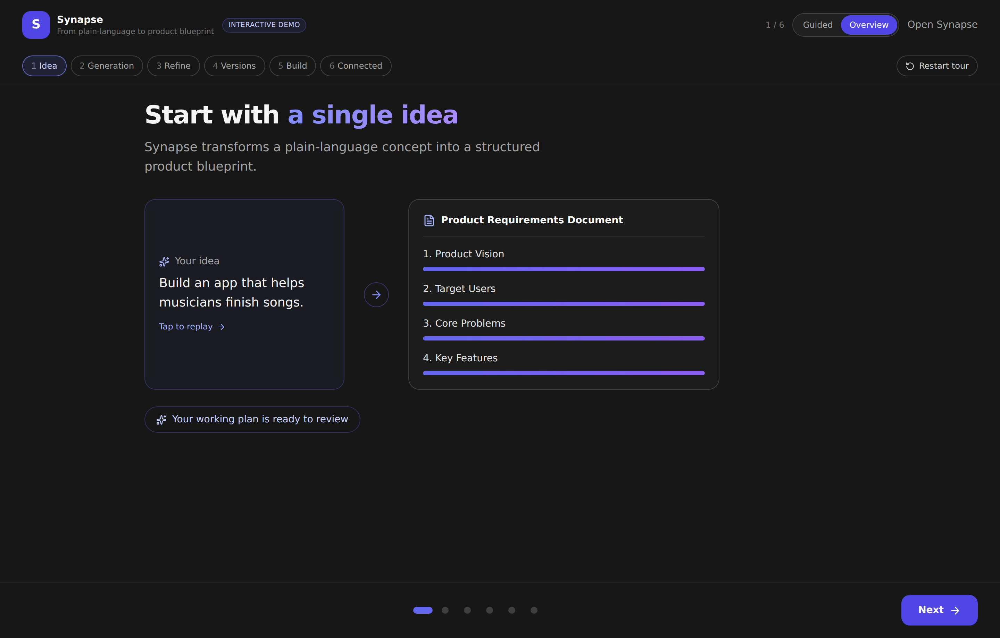
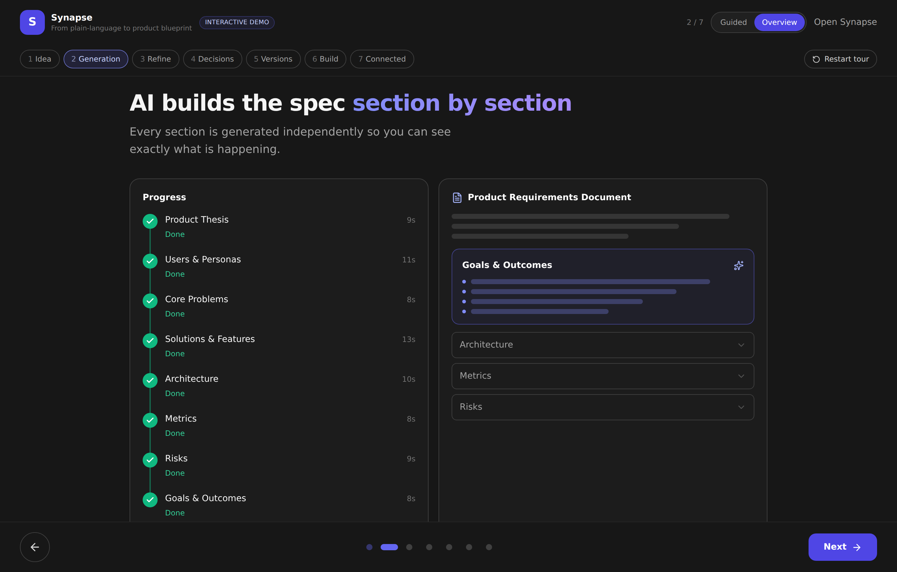
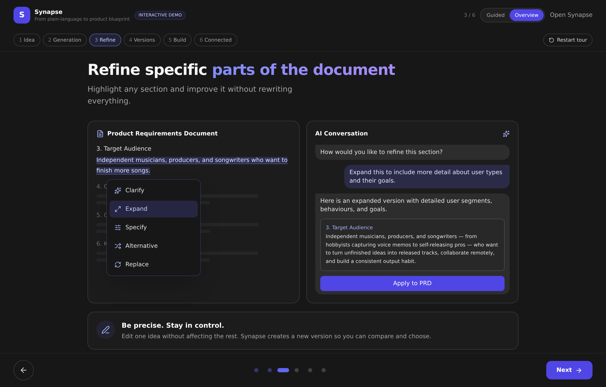
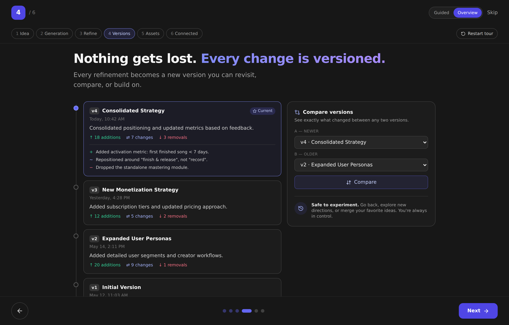
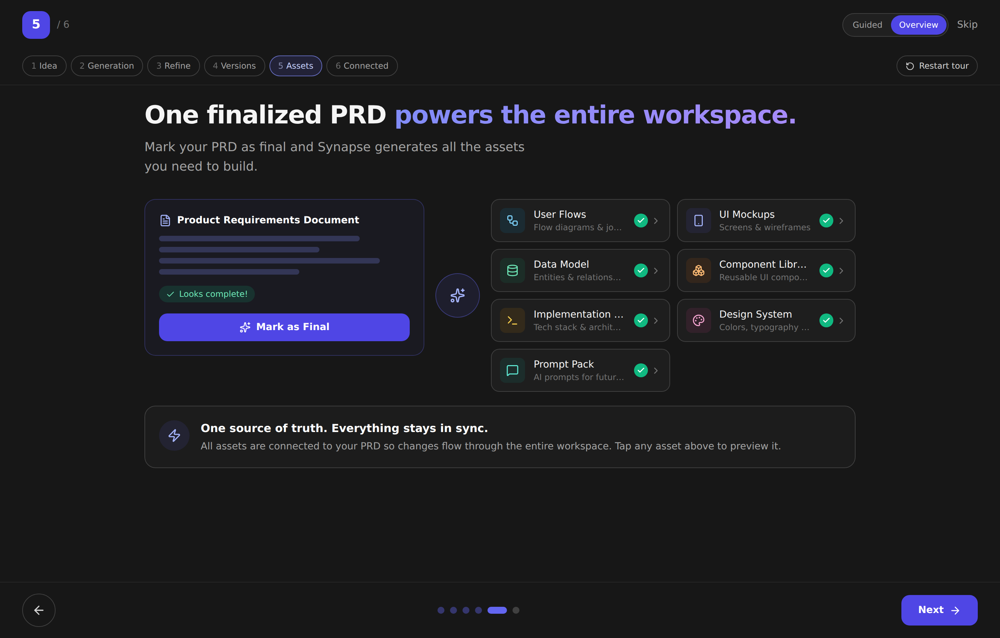
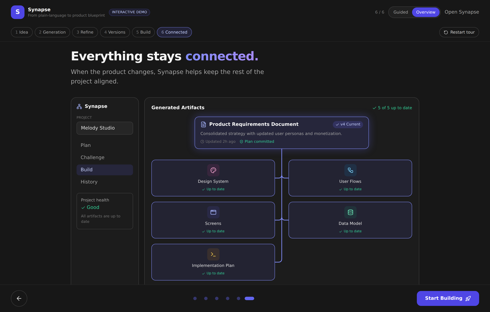
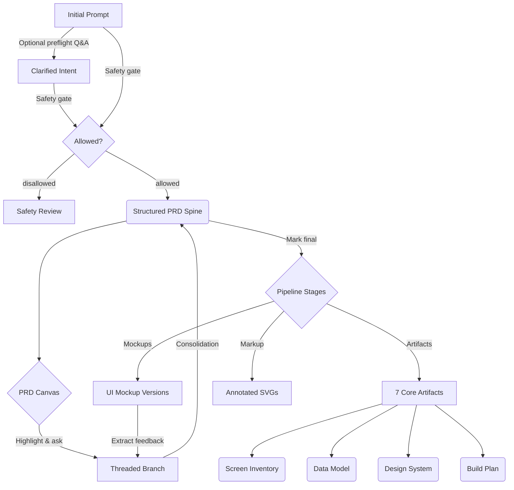

# Synapse

**Synapse is an AI-native product definition environment.** It turns a
plain-language idea into a structured PRD, then carries that PRD forward into
UI mockups, downstream engineering artifacts, and annotated visual feedback —
all from a single client-side workspace.



> **Take the interactive tour.** Synapse ships a fully interactive product
> tour at **`/tour`** (aliased at `/about`) that rebuilds the whole workflow
> as native, clickable UI — no sign-up, no API key. The walkthrough below
> follows the same six beats as that tour.

---

## Live demo (portfolio-safe)

The interactive product tour is a **public, standalone demo** you can link to
directly from a portfolio or résumé:

- **Public URL:** `https://<your-deployment>/tour` (alias: `/about`)
- **No authentication** — the route is not behind the auth gate.
- **Demo data only** — every screen renders local fixtures
  (`src/components/tour/tourData.ts`). It never calls Gemini, never touches the
  `api/` backend or the project store, and never reads or exposes an API key or
  any user data.
- **Deep-linkable** — open or refresh `/tour` directly; the SPA rewrite (see
  [Deploying the tour](#deploying-the-tour-static-hosting)) serves
  `index.html`, so there is no 404.
- **Mobile-first** — responsive layout with swipe navigation and reduced-motion
  support.

### Paste-into-your-portfolio markdown

```markdown
### Synapse — AI-native product definition environment

From a plain-language idea to a structured PRD, UI mockups, and downstream
engineering artifacts — all in one client-side workspace.

▶️ **[Try the interactive demo](https://<your-deployment>/tour)** ·
📂 **[Source on GitHub](https://github.com/<you>/synapse)**

*The demo runs entirely on local sample data — no sign-up, no API key, no
backend calls.*
```

> Replace `<your-deployment>` with your live host (e.g. your Vercel URL) and
> `<you>` with your GitHub username before publishing.

---

## What it does

A single prompt flows from a plain-language idea to a finalized blueprint and
every downstream asset:

```
idea → (optional clarification) → PRD canvas → refine & version → mark final → assets
```

Each stage is backed by Google Gemini, structured JSON schemas where they
matter, a code-level safety gate, and a versioned store so nothing you
generate is lost.

## Feature tour

### 1. Start with a single idea

Synapse transforms a plain-language concept into a structured product
blueprint. Type one sentence — *"Build an app that helps musicians finish
songs."* — and you're off.

Before generation, an **optional preflight clarification** step can ask you a
**Quick** (5) or **Deep** (10) set of questions to sharpen intent, or you can
**Generate Immediately**. Answers (and anything you skip) feed straight into
the PRD prompt as authoritative intent.

The moment your answers are in, **PRD generation starts in the background** —
and while it runs, Synapse asks you to **choose a visual direction** for the
project from a set of design presets, each with a static token-driven preview
(colors, type, buttons, layout shapes). Synapse **recommends** one based on
what you're building — a music app suggests *Creative Studio*, a CRM suggests
*Enterprise Professional* — but any preset can be chosen, and you can save one
as your **default for future projects** (defaults are preselected next time).
You can also skip and decide later, at the latest when marking the PRD final.

### 2. AI builds the spec, section by section



The PRD is generated as structured JSON by a **dependency-graph pipeline**:
the ten sections run concurrently the moment their inputs are ready — they are
never sequenced just because they appear later in the document. A live
**progress timeline** shows exactly what's happening: sections are grouped into
dependency *waves*, with independent sections rendered as "running
concurrently" groups, and each step shows whether it's waiting on dependencies,
queued for a free slot, or running — alongside the actual Gemini model in use
and elapsed/estimated timing. A failed section can be re-run on its own without
touching the rest of the document.

You get back a structured PRD with vision, target users, core problems,
features (with priority, acceptance criteria, and dependencies), architecture,
metrics, risks, and non-functional requirements.

That concurrency is **measured, not just claimed**. An **Orchestration
Metrics** dashboard (`/metrics`, linked from Settings and the workspace menu)
records each PRD generation and artifact-bundle run and shows real telemetry:
sequential estimate vs. actual runtime, **parallel speedup** and time saved,
max/average concurrency, critical path, per-section token usage, and estimated
AI cost — with a per-run Gantt timeline that visualizes which agents ran in
parallel. Cost figures are clearly labeled estimates; there's no synthetic
data, so a fresh account shows an empty state until the first real run.

### 3. Refine specific parts of the document

Highlight any passage and improve it without rewriting everything. A
contextual action dialog offers **Clarify / Expand / Specify / Alternative /
Replace**, spawning a threaded branch scoped to just that passage.

- **Branch-based refinement** — iterate on a single span in a focused thread.
- **Consolidation engine** — merge a branch's decisions back into a new
  unified PRD iteration (local or document-wide scope).
- **Touch-first** — the same highlight → action pipeline works with mouse,
  pen, and mobile long-press; the dialog is a floating popover on desktop and
  a safe-area bottom sheet on mobile. On phones, an explicit **Select text to
  edit** mode lets you adjust the native selection to a full phrase before
  tapping **Edit selection** — so the action sheet never fights the iOS
  selection toolbar.



### 4. Nothing gets lost — every change is versioned



Every regeneration, consolidation, **and inline edit** becomes a new **spine
version** you can revisit, compare, or build on — edits never overwrite the
previous version in place. Open **Version History** to see each version's change
source (edit, regenerate, section retry, branch merge, restore), **compare** any
version against the current one with a section-aware diff, and **restore** an
earlier version (which appends a new version — history is never deleted, and any
downstream artifacts that fall out of date are flagged). Artifacts carry their
own version history and restore too, and show which PRD version they were
generated from. The History stage is a chronological audit log of every spine
regeneration, edit, restore, branch consolidation, artifact derivation, and
feedback event — with diffs where it matters.

### 5. One finalized PRD powers the entire workspace



Mark your PRD as final and Synapse generates all the assets you need to build —
in parallel, from that single source of truth. The **Design System Preset**
(Modern SaaS, Enterprise Professional, AI Workspace, Minimal Editorial,
Developer / Technical, Consumer Mobile, Creative Studio, or *Custom / Generate
for me*) you picked during project setup sets the project's visual direction;
if you skipped that step, Synapse asks just before generation. The choice is
stored on the project and steers the **Design System** artifact — and through
it, both the internal mockups and the prompts you copy for external image
tools, so everything stays visually consistent. You can change the visual
direction later from the **Design System** artifact and regenerate it; when its
tokens change, Synapse flags the affected mockups and offers to regenerate them
so they pick up the new direction.

- **Screen Inventory** and **User Flows**
- **Design System**
- **Data Model** schemas with entities, fields, and relationships
- **Build Plan** and **Developer Prompts**

Two of them (`screen_inventory`, `data_model`) use Gemini JSON mode with explicit
schemas and render as card grids and entity tables rather than raw markdown. Every artifact tracks
**staleness** against the current spine, supports **natural-language
refinement** ("add error states to each screen"), and surfaces **quality
warnings** if the output looks truncated or malformed.

The workspace presents the experience artifacts screen-first: an **Experience**
section holds **User Flows** and **Screens** — a consolidated, screen-centric
view where each screen from the Screen Inventory gets its own detail page with
**Overview / Flow / Mockups** tabs (its inventory spec, every user-flow step
that touches it with the screen highlighted in the journey diagram, and its
mockup). Clicking a screen node in a User Flow jumps straight to that screen's
page, so the working mental model is "I'm working on this screen."

Screens are joined across artifacts by **stable ids**, so you can safely
**edit a screen's name, purpose, intent, priority, and notes** without
detaching its mockups, flow references, or uploaded images — edits are an
overlay; the generated artifact is never rewritten and one click restores it.
The Screens list shows **mockup coverage** ("Mockups: 3 of 12 screens
covered"); uncovered screens get an **Add to mockups** action (generation
stays explicit and cost-labeled — nothing is billed without confirmation), and
a **Generate missing mockups** batch sits behind a confirm. Every screen page
is **deep-linkable** (`?screen=…`), with working browser back/forward. A
lightweight validation panel flags broken or ambiguous references (a flow step
naming a missing screen, a mockup that lost its match, duplicate screen names)
with one-click **relink / pin / ignore** repairs — warnings never block
rendering.

Each artifact is routed to the right model by complexity — Flash for simpler
artifacts, Pro for complex reasoning — and you can override the model **per
artifact** in Settings → **Artifact Generation Models** (the PRD itself routes
per-section). Sensible defaults mean you never have to touch it.

#### Multi-fidelity UI mockups


Generate UI mockups directly from the finalized PRD with configurable platform
(mobile / desktop), fidelity (wireframe / mid-fi / high-fi), and scope (single
screen / multi-screen / key workflow). Every run is saved as a new version so
you can diff iterations side-by-side. Per-screen images come from one of two
sources (chosen in Settings → **Artifact Generation Models → Mockups**): OpenAI
`gpt-image-2`, or **your own uploads** — the latter shows a generated prompt for
each screen (goal, layout, visual style, expected format) to guide what you
create and upload. If GPT Image is selected without an OpenAI key, Synapse falls
back to the upload sheet rather than failing silently.

The Screen Inventory page also offers a **Copy image prompt** action per screen
for generating a mockup in any external tool. That copied prompt embeds the
**same** Design System Brief the internal mockups use (palette, typography,
spacing, radius, component conventions, accessibility) alongside the screen's
specifics, so externally generated mockups match your project's visual
language instead of drifting.

#### Integrated feedback loop


Extract structured feedback items from generated mockups. Feedback surfaces as
actionable cards on the PRD stage — applying one spawns a localized branch to
address the critique without regenerating the whole document.

#### Track implementation progress

The Build Plan converts into a tracked task checklist — no LLM call,
derived deterministically from the plan. Review and edit the extracted tasks,
**save them to the project**, and a progress checklist appears on the
Build Plan: a `done / total` progress bar, a per-task status toggle
(to do → in progress → done), and expandable acceptance criteria. Export the
tasks to **Markdown** or **GitHub issues**; created GitHub issues are linked
back to each task so you can jump straight to them. Progress persists across
refreshes, so Synapse answers "how far along am I?" — not just "what should I
build?".

#### Hand off to a coding agent

Export isn't just a download. The **Export** dialog includes a one-click
**"Copy for coding agent"** preset — an instruction preamble plus the PRD and
the build-relevant artifacts (implementation plan, prompt pack, data model,
design system), ready to paste straight into Claude Code, Cursor, or another
agent. Copy-to-clipboard is available for the PRD and the full bundle too, and
you can still download Markdown, a combined bundle, or structured JSON.

#### Markup image artifacts

Five annotation types — screenshot annotations, critique boards, wireframe
callouts, flow annotations, and design feedback boards — are generated from
PRD context as `MarkupImageSpec` JSON and rendered as resolution-independent
SVG with highlights, arrows, numbered markers, and text blocks. Exportable as
SVG.

### 6. Everything stays connected

When the product changes, Synapse helps keep the rest of the project aligned.
Artifacts carry source references back to the spine, so staleness is detected
automatically when the PRD moves underneath them — and the History timeline
records the ripple of every change across the workspace.



---

## Safety gate

Every PRD generation path runs through one code-level chokepoint that
classifies the project **before** any section is written (`allowed` /
`allowed_with_restrictions` / `disallowed`). A disallowed idea never runs the
pipeline; it renders a Safety Review and is excluded from all downstream
artifact, mockup, and workspace generation. Classification **fails closed** —
if safety can't be determined, the request is treated as disallowed (genuine
API-key/billing/permission errors still surface on the normal error path).

## Cloud snapshots (owner-only)

Save the entire current project — spine versions, branches, artifacts,
feedback, history, **and** the AI-generated mockup images — to Vercel Blob
behind a single owner token. Reload from any browser or device, or delete a
snapshot when you're done.

- Demo viewers never see this panel: it gates on owner-token presence.
- Images bundle along with the project, so a restored snapshot looks identical
  to the moment it was saved (no re-generation, no missing PNGs).
- Token is stored in your browser's `localStorage`; the server side validates
  with constant-time comparison against `SYNAPSE_OWNER_TOKEN`.

Open via the workspace overflow menu &rarr; **Cloud Snapshots**.

---

## Data flow



## Tech stack

- **Frontend:** React 19, TypeScript, Vite 7, Tailwind CSS 3
- **Backend:** Vercel serverless API routes + MongoDB (for recruiter auth analytics) + Vercel Blob (for owner-only project snapshots)
- **State:** Zustand 5 with debounced `localStorage` persistence; mockup PNGs in IndexedDB
- **LLM:** Google Gemini (default `gemini-3.5-flash`) via direct browser calls with streaming + connection/stream-level retry; OpenAI `gpt-image-2` for mockup image previews
- **Markdown:** `react-markdown` + `remark-gfm` + `rehype-raw`
- **Routing:** React Router v7 (workspace, recruiter portal, admin, the interactive product tour at `/tour` + `/about`, `/privacy`)
- **Icons & animation:** `lucide-react`, `framer-motion`, `@formkit/auto-animate`

The product workspace remains browser-first, while recruiter authentication
and tracking run through API routes backed by MongoDB.

---

## Getting started

You'll need a Gemini API key. Get one at
[Google AI Studio](https://aistudio.google.com/apikey).

```bash
npm install
npm run dev
```

Open `http://localhost:5173`, click the Settings gear, and paste your key.
Workspace state (projects, spines, artifacts) persists to `localStorage` as the
live cache; **for signed-in users projects also sync to the server** (a MongoDB
`projects` collection scoped to your account) so they follow you across web and
mobile and survive a browser-data clear. AI-generated mockup PNGs persist to
**IndexedDB** (typically gigabytes of headroom, so high-quality images don't
blow the localStorage 5-10 MB cap) as the local cache, and for signed-in users
**now also sync across devices** via Vercel Blob (image bytes go to Blob, only
small references travel with the project) so mockups appear on your other
devices too — hydrated lazily on view.

Prefer to look before you build? Visit `http://localhost:5173/tour` for the
interactive product tour — it runs entirely on demo data with no API key.

### Owner-only cloud snapshots (optional)

To enable the **Cloud Snapshots** panel for archiving / restoring whole
projects (state + images) across devices, set two Vercel environment
variables:

| Variable | Where it comes from |
| --- | --- |
| `SYNAPSE_OWNER_TOKEN` | Any random string &geq; 24 chars. The server compares with `crypto.timingSafeEqual`; the client stores it in `localStorage`. |
| `BLOB_READ_WRITE_TOKEN` | Created automatically when you provision Vercel Blob for the project. No manual setup needed. Also powers per-user **cross-device mockup image sync** (independent of snapshots). |

The owner-token gate is single-tenant: there is no signup, no per-user
isolation, no demo access. It exists so the project owner can persist real work
without exposing an unauthenticated write endpoint to the public demo. Snapshot
bundles are subject to Vercel's serverless body limit (~4.5 MB on Hobby), so
very large projects with many high-quality images may need to be split or saved
at lower image quality.

### Build for production

```bash
npm run build
```

The build emits a fully static SPA to `dist/` — no server is required to serve
the tour.

### Deploying the tour (static hosting)

Because Synapse is a client-side SPA, every host must fall back to
`index.html` for unknown paths, or a direct load / refresh of `/tour` (or
`/about`, `/p/:id`, `/privacy`) returns a 404. The repo ships the config for
the common hosts:

| Host | Config (already in repo) | Notes |
| --- | --- | --- |
| **Vercel** (recommended) | `vercel.json` → `rewrites` | The full app, including the recruiter-portal `api/` functions, deploys as-is. The negative-lookahead rewrite (`/((?!api/).*)`) keeps API routes server-side while sending everything else to `index.html`. |
| **Netlify** | `public/_redirects` → `/*  /index.html  200` | Copied verbatim into `dist/` on build. Serves the static tour; the `api/` serverless functions are Vercel-specific. |
| **GitHub Pages** | — | Static-only (no `api/`). Pages has no rewrite engine, so use the SPA fallback trick — copy `dist/index.html` to `dist/404.html` after build. If serving from a project subpath (`/<repo>/`), also set Vite's `base` accordingly. |

**Recommendation:** deploy to **Vercel** — it's the configured target, supports
the SPA rewrite and the backend functions, and serves `/tour` directly. For a
**tour-only** portfolio link, Netlify or GitHub Pages also work since the tour
needs no backend.

---

## Documentation

- [`CONTRIBUTING.md`](CONTRIBUTING.md) — local setup (workspace and recruiter
  portal), commands, testing, and PR expectations
- [`.env.example`](.env.example) — backend environment variables (the PRD
  workspace needs none)
- [`CLAUDE.md`](CLAUDE.md) — architecture, state slices, the LLM pipeline, and
  cross-cutting patterns (kept in sync with the code)
- [`docs/architecture.md`](docs/architecture.md) — runtime stack, state layer,
  LLM services, UI composition
- [`docs/artifact-flow.md`](docs/artifact-flow.md) — file-by-file trace of one
  end-to-end pipeline run
- [`docs/deployment.md`](docs/deployment.md) — commands, Vercel setup,
  self-hosting
- [`docs/auth.md`](docs/auth.md) — multi-provider auth (email/password,
  GitHub, LinkedIn), user record schema, env vars, error codes
- [`docs/AUTH_AND_PROVIDER_KEYS.md`](docs/AUTH_AND_PROVIDER_KEYS.md) — per-user
  projects, the encrypted BYO provider-key vault, server-side model routing,
  and the demo/recruiter mode
- [`docs/ORCHESTRATION_AND_METRICS.md`](docs/ORCHESTRATION_AND_METRICS.md) —
  how the concurrent multi-agent workflows run, the `/metrics` dashboard, and
  what each metric means (sequential estimate vs. actual runtime, speedup,
  concurrency, critical path, cost estimates)
- [`docs/linkedin-auth.md`](docs/linkedin-auth.md) — LinkedIn OAuth setup,
  recruiter capture fields, and compliance note
- [`docs/archive/`](docs/archive/) — historical design notes and audits
  retained for context

## Project status

Portfolio project. Demo visitors (and the public `/tour`) run the workspace
fully in-browser &mdash; spine + artifact state in `localStorage`, mockup PNGs in
IndexedDB, no telemetry. **Signed-in users get cross-device project sync**:
projects persist to a per-account server collection and reconcile onto any device
on sign-in, with localStorage kept as the offline cache. **AI-generated mockup
images sync across devices too** — bytes live in Vercel Blob, only small refs
travel with the project, and they hydrate lazily on view (user-uploaded mockup
images and Screen Inventory uploads are not synced yet — see `tasks/TODO.md`).
The owner can additionally opt-in to Vercel-Blob-backed Cloud Snapshots (gated by
`SYNAPSE_OWNER_TOKEN`).
