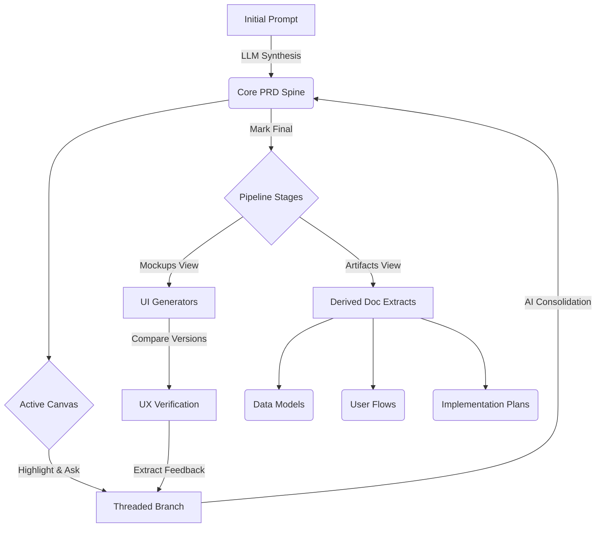

# Synapse PRD 🧠

Synapse is an AI-native product definition environment. It transforms the traditional Product Requirements Document (PRD) from a static text file into a **dynamic, spec-driven pipeline** spanning mockups, architecture, artifact extraction, and branching feedback loops.


## 🌟 Core Features

### 1. Intelligent PRD Canvas
 

Start with a raw brain-dump prompt and watch Synapse generate a highly structured, comprehensive product specification.
- **Spine Versioning:** Full history tracking of every structural change to your primary document (the "Spine").
- **Branch-based Refinement:** Highlight any text to spawn an active workspace branch. Discuss and debate specific approaches within isolated threads.
- **Consolidation Engine:** Ready to merge? The engine synthesizes individual branch decisions back into a new unified PRD iteration.


### 2. Multi-Fidelity UI Mockups
Bring your specs to life instantly without touching Figma.
- **Insta-Mockups:** Generate text and structural-based UI mockups directly from the finalized PRD.
- **Deep Configuration:** Tweak platforms (Mobile/Desktop), fidelity levels (Wireframe, Mid-Fi, High-Fi), and scopes (Single Screen vs Workflow).
- **A/B Comparison:** Evolve mockups over time and compare distinct iterations side-by-side using the built-in diff viewer.


### 3. Integrated Feedback Loop
Close the gap between design reviews and product specs.
- Extract structured feedback directly from generated Mockups.
- Feedback surfaces into the core PRD stage as an actionable "Apply" card.
- Automatically spin up a localized PRD branch to address the visual critique.


### 4. Downstream Artifact Generation


Don't write boilerplates. Synapse extracts the exact context into developer-ready output files.
- Automatically spool up 7 dynamic derivatives from the PRD:
  - 🎨 **Screen Inventory** & **User Flows**
  - 🧩 **Component Library** & **Design System**
  - 🗄️ **Data Model Schemas**
  - 🚀 **Implementation Roadmaps** & **Prompt Packs**
- **Staleness Tracking:** Visual indicators alert you when an Artifact is out-of-sync with an updated PRD.
- **Artifact Refinement:** Refine any generated artifact with natural language instructions instead of regenerating from scratch.
- **Type-Specific Rendering:** Screen inventories display as card grids, data models as entity tables, component inventories as categorized cards.
- **Output Validation:** Automatic quality checks flag truncated or malformed output with warning indicators.

### 5. Markup Image Artifacts
Generate visual annotation artifacts directly from your PRD context.
- **5 Annotation Types:** Screenshot annotations, critique boards, wireframe callouts, flow annotations, and design feedback boards.
- **SVG Rendering:** Annotations render as resolution-independent SVG with highlights, callouts, arrows, numbered markers, and text blocks.
- **Export:** Download annotations as SVG files.

### 6. Architectural Timeline (History)
Your product's evolution, visualized chronologically. From initial spawn, to branched decision-making, to artifact derivations.


---

## 🛠️ Data Architecture & UX Flow



### Tech Stack
- **Frontend:** React 19, Vite, Tailwind CSS (Tailwind Merge, CLSX)
- **State Management:** Zustand (with debounced LocalStorage persistence)
- **AI/LLM Backing:** Google Gemini 2.5 Pro/Flash Pipeline (with streaming support)
- **Markdown Processing:** React-Markdown, Remark GFM, Rehype-Raw
- **Routing:** React Router DOM v7
- **UI System:** Lucide React Icons, Auto-animate

---

## 🚀 Getting Started

### Prerequisites

To execute language modeling loops, you'll need an active **Gemini API Key**. 
1. Get a key at [Google AI Studio](https://aistudio.google.com/apikey).
2. Pass it into the UI via the top-right Settings wheel inside Synapse.

### Quick Run

```bash
# Install specific package locks
npm install

# Start the local Vite server
npm run dev
```

Navigate to `http://localhost:5173` to initialize your first project. All workspace sessions are cached locally allowing you to pick up exactly where you left off. 

### Build for Production
```bash
npm run build
```

---

## ✅ Manual Verification Guide

After pulling the latest changes, use this checklist to verify that everything works correctly.

### Prerequisites
1. Run `npm install` to ensure all dependencies are installed
2. Run `npx tsc --noEmit` to verify TypeScript compiles cleanly (should produce no errors)
3. Run `npm run dev` and open `http://localhost:5173`
4. Add your Gemini API key via the Settings gear icon

### Phase 1: Performance & Rendering
- [ ] **Parallel bundle generation:** Create a project, mark PRD as Final, go to Artifacts, click "Generate All". Verify all 7 artifacts generate concurrently (not sequentially) — should complete in ~3-5s, not ~21s.
- [ ] **Progress indicators:** During bundle generation, verify each artifact card shows a spinning loader icon while generating, a green checkmark when done, or a red X on error. The button should show "Generating 3 of 7..." progress.
- [ ] **Markdown rendering:** Expand any generated artifact — verify it renders with proper markdown formatting (headers, bold, lists, tables) instead of raw monospace text.
- [ ] **Mockup markdown:** Go to Mockups, generate a mockup — verify it renders with markdown formatting instead of monospace font.

### Phase 2: Artifact Quality
- [ ] **Enriched PRD:** Create a new project — verify the generated PRD includes priority levels (must/should/could), acceptance criteria per feature, and non-functional requirements sections.
- [ ] **Structured prompts:** Generate individual artifacts — verify screen inventories use the format `### [Screen Name]` with Purpose/Components/Navigation/Priority sections. Data models should include field tables.
- [ ] **Artifact refinement:** Expand a generated artifact, click "Refine", type an instruction (e.g., "Add error states to each screen"), click Apply. Verify a new version is created with the requested changes.
- [ ] **Validation warnings:** If an artifact appears truncated or poorly structured, verify an amber warning triangle icon appears next to the artifact title (hover to see details).

### Phase 3: Speed & Perceived Performance
- [ ] **Skeleton loading:** Click Generate on an artifact that doesn't exist yet — verify a skeleton placeholder appears while loading.
- [ ] **Timing logs:** Open browser DevTools console — verify `[GEN]` log messages show timing for each LLM call and `[STORE]` messages show persistence timing.
- [ ] **No UI jank:** During bundle generation, verify the UI remains responsive (you can scroll, expand/collapse other sections).

### Phase 4: Markup Images
- [ ] **Markup image section:** Go to Artifacts stage — verify a "Markup Images" section appears below Core Artifacts.
- [ ] **Generate markup image:** Click any markup image type (e.g., "Critique Board") — verify it generates and displays an SVG annotation with highlights, callouts, and/or numbered markers.
- [ ] **Legend display:** If the annotation has numbered markers, verify a legend section appears below the SVG showing each number and its description.
- [ ] **SVG export:** Click "Export SVG" on a markup image — verify an SVG file downloads.

### Phase 5: Polish Features
- [ ] **Type-specific renderers:** Generate screen_inventory, data_model, or component_inventory artifacts. If the LLM returns structured JSON, verify they render as card grids / entity tables / categorized cards (not raw JSON or plain markdown).
- [ ] **Export modal:** Click the Export/Download button in the top bar — verify the export modal shows options for: Export PRD, individual artifact exports, Export Full Bundle, and Export Structured JSON.
- [ ] **Refresh Stale:** After generating artifacts, go back to PRD stage, edit the PRD, return to Artifacts — verify a "Refresh N Stale" button appears. Click it and verify only stale artifacts regenerate.

### Dead Code Removal
- [ ] **No generatePRD:** Search the codebase — `generatePRD` should not exist in `llmProvider.ts` (only `generateStructuredPRD`).
- [ ] **No useNavigate in BranchList:** `BranchList.tsx` should not import `useNavigate` from react-router-dom.
- [ ] **Shared intentHelper:** `SelectableSpine.tsx` and `BranchList.tsx` should both import from `../lib/intentHelper` instead of defining inline `getIntentHelper` functions.
