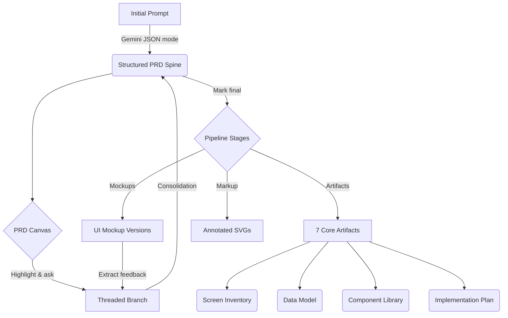

# Synapse

**Synapse is an AI-native product definition environment.** It turns a raw
product idea into a structured PRD, then carries that PRD forward into
mockups, downstream engineering artifacts, and annotated visual feedback —
all from a single client-side workspace.


---

## What it does

A single prompt flows through a four-stage pipeline:

```
prompt → PRD canvas → Mockups → Artifacts → History
```

Each stage is backed by Google Gemini, structured JSON schemas where they
matter, and a versioned store so nothing you generate is lost.

## Feature tour

### 1. Intelligent PRD canvas

Start from a rough idea and get back a structured PRD with vision, target
users, features (with priority, acceptance criteria, and dependencies),
architecture, risks, and non-functional requirements.

- **Spine versioning** — every regeneration creates a new version;
  history is preserved.
- **Branch-based refinement** — highlight any text to spawn a threaded
  branch and iterate on just that passage.
- **Consolidation engine** — merge branch decisions back into a new
  unified PRD iteration.

### 2. Multi-fidelity UI mockups


Generate text-based UI mockups directly from the finalized PRD.
Configurable platform (mobile / desktop), fidelity (wireframe / mid-fi /
high-fi), and scope (single screen / multi-screen / key workflow).


Every mockup run is saved as a new version so you can diff iterations
side-by-side.

### 3. Integrated feedback loop


Extract structured feedback items directly from generated mockups.
Feedback surfaces as actionable cards on the PRD stage — applying one
spawns a localized branch to address the critique without regenerating
the whole document.

### 4. Downstream artifact generation


Seven developer-ready artifact types generate in parallel from a single
finalized PRD:

- **Screen Inventory** and **User Flows**
- **Component Inventory** and **Design System**
- **Data Model** schemas with entities, fields, and relationships
- **Implementation Plan** and **Prompt Pack**

Three of them (`screen_inventory`, `data_model`, `component_inventory`)
use Gemini JSON mode with explicit schemas and render as card grids,
entity tables, and categorized component cards rather than raw markdown.

Every artifact tracks **staleness** against the current spine, supports
**natural-language refinement** ("add error states to each screen"), and
surfaces **quality warnings** if the output looks truncated or malformed.

### 5. Markup image artifacts

Five annotation types — screenshot annotations, critique boards,
wireframe callouts, flow annotations, and design feedback boards — all
generated from PRD context as `MarkupImageSpec` JSON and rendered as
resolution-independent SVG with highlights, arrows, numbered markers, and
text blocks. Exportable as SVG.

### 6. History timeline


Chronological audit log of every spine regeneration, branch
consolidation, artifact derivation, and feedback event — with diffs where
it matters.

---

## Data flow



## Tech stack

- **Frontend:** React 19, TypeScript, Vite 7, Tailwind CSS 3
- **Backend:** Vercel serverless API routes + MongoDB (for recruiter auth analytics)
- **State:** Zustand 5 with debounced `localStorage` persistence
- **LLM:** Google Gemini 2.5 Pro / Flash (direct browser calls, streaming support)
- **Markdown:** `react-markdown` + `remark-gfm` + `rehype-raw`
- **Routing:** React Router v7
- **Icons & animation:** `lucide-react`, `@formkit/auto-animate`

The product workspace remains browser-first, while recruiter authentication
and tracking run through API routes backed by MongoDB.

---

## Getting started

You'll need a Gemini API key. Get one at
[Google AI Studio](https://aistudio.google.com/apikey).

```bash
npm install
npm run dev
```

Open `http://localhost:5173`, click the Settings gear, and paste your
key. All workspace state persists to `localStorage`.

### Build for production

```bash
npm run build
```

---

## Documentation

- [`docs/architecture.md`](docs/architecture.md) — runtime stack, state
  layer, LLM services, UI composition
- [`docs/artifact-flow.md`](docs/artifact-flow.md) — file-by-file trace
  of one end-to-end pipeline run
- [`docs/deployment.md`](docs/deployment.md) — commands, Vercel setup,
  self-hosting
- [`docs/auth.md`](docs/auth.md) — multi-provider auth (email/password,
  Google, GitHub, LinkedIn), user record schema, env vars, error codes
- [`docs/linkedin-auth.md`](docs/linkedin-auth.md) — LinkedIn OAuth setup,
  recruiter capture fields, and compliance note
- [`docs/archive/`](docs/archive/) — historical design notes and audits
  retained for context

## Project status

Portfolio project. Single-user, fully client-side, no telemetry. Every
project you create lives in your browser's `localStorage` and nowhere
else.
