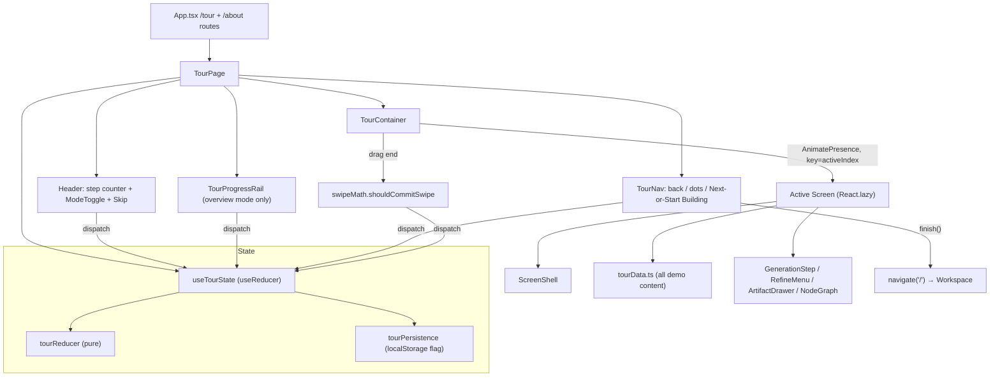

# Tour Implementation Breakdown

A reusable technical breakdown of Synapse's interactive product tour ("Meet
Synapse"), written so the same pattern can be recreated in another repository —
specifically the **MCTS Laboratory** project. This document audits the *real*
Synapse code as of this commit; every file path and symbol below is live.

> **Scope note.** This is documentation only. It does not change the tour, and
> it does not touch the MCTS Laboratory repo. Section 10 explains how to *map*
> the pattern onto MCTS, but stops short of implementing anything there.

The tour lives at the routes `/tour` and `/about` (alias). It is a fully
interactive, six-screen product walkthrough — **not** a static marketing page.
It never touches the Gemini pipeline, the `api/` backend, or the Zustand project
store; all of its content is local demo data.

---

## 1. File and Component Inventory

All paths are relative to the repo root. The tour is split across
`src/components/tour/` (UI) and `src/lib/` (framework-free logic + hooks).

### Routing / entry

**File:** `src/App.tsx`
**Purpose:** Top-level router. Mounts the tour.
**Key exports:** `App`
**Important dependencies:** `react-router-dom`, `./components/tour/TourPage`
**Notes:** Two routes resolve to the same component —
`<Route path="/about" element={<TourPage />} />` and
`<Route path="/tour" element={<TourPage />} />`. `/about` is a
backward-compatible alias. App also sweeps the retired `synapse-meet-dismissed`
localStorage key in its migration block; tour completion state is owned by the
tour itself, not the project store.

---

### Tour container & chrome (`src/components/tour/`)

**File:** `TourPage.tsx`
**Purpose:** The page shell and orchestrator. Owns the header (step counter,
mode toggle, Skip), the sr-only live region, the overview rail, the animated
screen host, and the footer nav. Wires keyboard navigation.
**Key exports:** `TourPage`
**Important dependencies:** `useTourState`, `useIsMobile`,
`usePrefersReducedMotion`, `TourContainer`, `TourNav`, `TourProgressRail`,
`ModeToggle`, `react-router-dom` (`useNavigate`), `lucide-react`.
**Notes:** Lazy-loads each of the six screens (`React.lazy` + `Suspense`) so all
six never load in one chunk. `finish()` navigates to `/`. Arrow-key listener is
attached to `window` and ignored while typing in inputs/textareas/contenteditable.
Layout is a `flex h-[100dvh] flex-col` column: header → live region → (overview
rail) → `TourContainer` (flex-1) → `TourNav`.

**File:** `TourContainer.tsx`
**Purpose:** Animated, swipe-aware host for the single active screen.
**Key exports:** `TourContainer`
**Important dependencies:** `framer-motion` (`AnimatePresence`, `motion`,
`PanInfo`), `shouldCommitSwipe` (`src/lib/swipeMath.ts`).
**Notes:** Only the active screen is mounted; `AnimatePresence mode="popLayout"`
keeps the outgoing screen alive just long enough to slide it out. `key` is the
`activeIndex`. Direction-aware slide variants (`slideVariants`) or a plain
`fadeVariants` under reduced motion. Drag (`drag="x"`) is enabled only when
`drag` is true (mobile + motion allowed); `dragDirectionLock` + `touch-pan-y`
preserve vertical scroll. On drag end it calls `shouldCommitSwipe` and fires
`onCommit('next' | 'prev')`.

**File:** `TourNav.tsx`
**Purpose:** Footer navigation — back arrow, animated step dots, and the primary
Next / "Start Building" CTA.
**Key exports:** `TourNav`
**Important dependencies:** `framer-motion` (`motion`), `lucide-react`
(`ArrowLeft`, `ArrowRight`, `Rocket`), `TOTAL_STEPS`.
**Notes:** Back button is `opacity-0 pointer-events-none` on step 0 (occupies
space but invisible). Dots are `role="tab"` buttons that `onGoto(i)`; the active
dot animates `width: 28` vs `10` and uses three colors (active / visited /
upcoming). On the last step the CTA becomes "Start Building" with a `Rocket`
icon and calls `onFinish`.

**File:** `TourProgressRail.tsx`
**Purpose:** Overview-mode-only horizontal strip of every section ("stage
chips") for jump navigation, plus a "Restart tour" button.
**Key exports:** `TourProgressRail`
**Important dependencies:** `lucide-react` (`RotateCcw`), `TOUR_SCREENS`.
**Notes:** `overflow-x-auto` horizontal scroll; each chip is a pill button with
`aria-current` and a numbered prefix. Restart is pushed right with `ml-auto`.

**File:** `ModeToggle.tsx`
**Purpose:** Segmented Guided / Overview switch in the header.
**Key exports:** `ModeToggle`
**Important dependencies:** none beyond `TourMode` type.
**Notes:** `role="radiogroup"` with two `role="radio"` buttons; the active mode
gets a filled indigo pill.

---

### Tour types & content (`src/components/tour/`)

**File:** `tourTypes.ts`
**Purpose:** Shared types + the authoritative screen list/metadata.
**Key exports:** `TourMode`, `TourDirection`, `TourState`, `TourAction`,
`TourScreenMeta`, `TOUR_SCREENS`, `TOTAL_STEPS`, `ScreenProps`.
**Notes:** `TOUR_SCREENS` is the single source of truth for "which screen" —
the array index is the active-screen key for the reducer, rail, counter, and
container. `ScreenProps` is the contract every screen implements
(`{ isActive, reducedMotion }`).

**File:** `tourData.ts`
**Purpose:** *All* demo content for the screens. No backend, no live generation.
**Key exports:** `IDEA_SEED`, `IDEA_PRD_SECTIONS`, `PrdSectionPreview`,
`SPEC_STEPS`, `SpecStep`, `REFINE_ACTIONS`, `RefineAction`, `RefineScript`,
`REFINE_DEMO`, `VERSIONS`, `VersionEntry`, `TOUR_ASSETS`, `TourAsset`,
`AssetPreviewKind`, `TOUR_PROJECT`, `WORKSPACE_NAV`, `RECENT_ACTIVITY`,
`ActivityEntry`.
**Important dependencies:** `lucide-react` icons (stored *as* data on each asset).
**Notes:** This is the content-config layer. Each screen renders this data and
fakes timing client-side. Icons are imported as `LucideIcon` and stored on the
asset objects so screens render `<asset.icon />`.

---

### Screens (`src/components/tour/screens/`)

Each screen is a default export (for `React.lazy`) implementing `ScreenProps`.
They remount fresh whenever they become active (only the active screen is
mounted), so animated sequences replay on every visit and are reset by
remounting — **not** by `isActive`-based reset effects.

| File | Default export | Purpose |
|---|---|---|
| `ScreenIdea.tsx` | `ScreenIdea` | Screen 1 — tap an idea card; PRD section bars fill in one by one. |
| `ScreenSpecGeneration.tsx` | `ScreenSpecGeneration` | Screen 2 — vertical generation timeline (queued → generating → done) + a document preview and progress bar. |
| `ScreenRefine.tsx` | `ScreenRefine` | Screen 3 — highlighted span + always-visible Clarify/Expand/Specify/Alternative/Replace menu; pick an action → AI-conversation panel → "Apply to PRD" swaps the span. |
| `ScreenVersions.tsx` | `ScreenVersions` | Screen 4 — interactive version timeline + a compare panel with diff badges. |
| `ScreenAssets.tsx` | `ScreenAssets` | Screen 5 (hero) — "Mark as Final" → seven assets generate one at a time; each finished asset opens a preview drawer. |
| `ScreenConnections.tsx` | `ScreenConnections` | Screen 6 — the connected workspace: project rail + PRD→assets `NodeGraph` + tappable recent-activity timeline. |

---

### Shared screen components (`src/components/tour/components/`)

**File:** `ScreenShell.tsx`
**Purpose:** Shared screen header (two-tone gradient headline + subtitle) and a
`SkeletonLine` helper.
**Key exports:** `ScreenShell`, `SkeletonLine`
**Notes:** `ScreenShell({ title, accent, subtitle, children })` renders the
headline as `{title} <gradient>{accent}</gradient>` inside a
`max-w-5xl` centered column. Every screen uses it for visual consistency.

**File:** `GenerationStep.tsx`
**Purpose:** Shared status glyph + one timeline row, used by the spec timeline
(screen 2) and the asset generation list (screen 5).
**Key exports:** `StatusIcon`, `StepStatus` (`'queued' | 'generating' | 'done'`),
`GenerationStep`.
**Notes:** `StatusIcon` switches glyph by status (emerald check / spinning
`Loader2` / empty ring); spin is suppressed under reduced motion.
`GenerationStep` draws the vertical connector line to the next step unless
`isLast`.

**File:** `RefineMenu.tsx`
**Purpose:** The five refinement actions menu (screen 3), mirroring the real
product's `SELECTION_ACTIONS`.
**Key exports:** `RefineMenu`
**Important dependencies:** `lucide-react` (`Sparkles`, `Maximize2`,
`SlidersHorizontal`, `Shuffle`, `RefreshCw`), `REFINE_ACTIONS`.
**Notes:** `role="menu"` with `role="menuitem"` buttons, ≥40px tap targets.

**File:** `ArtifactDrawer.tsx`
**Purpose:** Per-asset preview — bottom sheet on mobile, right-hand drawer on
desktop (screen 5).
**Key exports:** `ArtifactDrawer`
**Important dependencies:** `framer-motion`, `useIsMobile`, `lucide-react` (`X`).
**Notes:** Mirrors the real product's `SelectionActionDialog` responsive
pattern: backdrop dismiss, Escape to close, `env(safe-area-inset-bottom)` insets,
a drag-handle pill on mobile. `AssetPreviewBody` renders a different layout per
`previewKind` (`flow`/`roadmap`/`screens`/`table`/`grid`/`palette`/`prompt`).

**File:** `NodeGraph.tsx`
**Purpose:** Interactive PRD → assets dependency graph (screen 6).
**Key exports:** `NodeGraph`, `GraphSelection` (`'prd' | string | null`)
**Important dependencies:** `framer-motion`, `lucide-react`, `ResizeObserver`.
**Notes:** HTML nodes in a fixed two-column grid with an SVG edge overlay whose
coordinates are *measured from the live DOM* (`getBoundingClientRect`) and
re-measured via `ResizeObserver` + `window resize`. Selecting the PRD highlights
every edge; selecting an asset highlights just its edge back to the PRD.
framer-motion animates the path draw (`pathLength`), skipped under reduced
motion. This is the most DOM-coupled component in the tour (see §11).

---

### Hooks & framework-free logic (`src/lib/`)

**File:** `useTourState.ts`
**Purpose:** The single source of truth for the tour — a `useReducer` store.
**Key exports:** `tourReducer` (pure, exported for tests), `initialTourState`,
`useTourState`, `UseTourStateResult`.
**Important dependencies:** `tourTypes`, `tourPersistence`.
**Notes:** Decides starting mode once at mount from the persisted completion
flag (`overview` if completed, else `guided`). An effect marks the tour
completed when `activeIndex` reaches the last index, by *any* route.

**File:** `tourPersistence.ts`
**Purpose:** Completion flag persistence, deliberately kept *out* of the Zustand
store.
**Key exports:** `TOUR_COMPLETED_KEY` (`'synapse-tour-completed'`),
`hasCompletedTour`, `markCompleted`, `resetTour`.
**Notes:** Direct-localStorage with defensive try/catch for private mode /
disabled storage. `markCompleted` is idempotent. `resetTour` is test-only.

**File:** `swipeMath.ts`
**Purpose:** Pure, DOM-free swipe-commit decision for the drag gesture.
**Key exports:** `shouldCommitSwipe`, `SwipeDecision` (`'next' | 'prev' |
'none'`), `SwipeDecisionInput`.
**Notes:** Given `{ offset, velocity, width }` decides next/prev/none. Commits
when `|offset|` exceeds `distanceRatio` (default 0.25) × width OR `|velocity|`
exceeds `velocityThreshold` (default 500 px/s). Left = next, right = prev.
Unit-tested without a DOM.

**File:** `useIsMobile.ts`
**Purpose:** `matchMedia` hook at the Tailwind `md` breakpoint (≤767px).
**Key exports:** `useIsMobile(maxWidth = 767)`
**Notes:** jsdom/SSR-safe (guards `window`/`matchMedia`); subscribes to viewport
changes. Shared with the rest of the app, not tour-specific.

**File:** `usePrefersReducedMotion.ts`
**Purpose:** `(prefers-reduced-motion: reduce)` hook.
**Key exports:** `usePrefersReducedMotion()`
**Notes:** Mirrors `useIsMobile`. Lets non-framer-motion components branch on
the same signal. The tour also relies on framer-motion's own reduced-motion
handling.

---

### Tests (`src/**/__tests__/`)

| File | Covers |
|---|---|
| `src/components/__tests__/TourPage.test.tsx` | First-timer starts guided at step 1; Arrow keys advance/retreat; returning user (completed flag set) starts in overview with the section rail. Stubs `matchMedia`. |
| `src/lib/__tests__/tourState.test.ts` | `tourReducer` + `initialTourState` (pure reducer logic). |
| `src/lib/__tests__/tourPersistence.test.ts` | `hasCompletedTour` / `markCompleted` / `resetTour`. |
| `src/lib/__tests__/swipeMath.test.ts` | `shouldCommitSwipe` thresholds. |

The pure modules (`tourReducer`, `swipeMath`, `tourPersistence`) are tested in
isolation precisely because they are framework-free — a pattern worth copying.

---

## 2. Tour Architecture

**1. Where are tour steps defined?**
In `src/components/tour/tourTypes.ts` as `TOUR_SCREENS: TourScreenMeta[]`
(id + full title + short label). The array order *is* the guided order, and the
array index is the active-screen key everywhere. The screen *components* are
listed in a parallel `SCREENS` array in `TourPage.tsx` (same order), each
`React.lazy`-imported.

**2. Is the tour content data-driven or hardcoded?**
Hybrid. **Navigation/structure is data-driven** (`TOUR_SCREENS` metadata drives
counter, rail, dots, container). **Per-screen demo content is data-driven**
(everything in `tourData.ts`). **Screen layout is hardcoded** — each screen is a
bespoke React component that *consumes* its slice of `tourData.ts`. There is no
single "render a step from a schema" abstraction; each screen is its own
hand-built mini-app.

**3. How does the app know which step is active?**
`TourState.activeIndex` (0-based) in the `useReducer` store. `TourContainer`
keys the animated `motion.div` on it, `TourPage` indexes `SCREENS[activeIndex]`,
and the counter/rail/dots all read it.

**4. How does guided mode differ from overview mode?**
`TourState.mode` (`'guided' | 'overview'`). Guided is a linear first-timer
story — no section rail. Overview (returning users) additionally renders
`TourProgressRail` (the stage-chip strip) so users can jump anywhere and
restart. The footer nav, screens, and animations are identical between modes;
mode only toggles the rail and the default starting mode. Mode is chosen once at
mount from the completion flag and can be flipped live via `ModeToggle`.

**5. How does step navigation work?**
Every input funnels through `dispatch` to `tourReducer`:
- `TourNav` back/next buttons → `PREV` / `NEXT`
- `TourNav` dots → `GOTO { index }`
- `TourProgressRail` chips → `GOTO { index }`
- Arrow keys (`TourPage` window listener) → `PREV` / `NEXT`
- Mobile swipe (`TourContainer` → `shouldCommitSwipe`) → `NEXT` / `PREV`
- `ModeToggle` → `SET_MODE`
- Restart → `RESTART`

`NEXT`/`PREV` clamp to `[0, lastIndex]`; `GOTO` clamps and infers direction.

**6. How does skip/restart work?**
**Skip** is the header button → `finish()` → `navigate('/')`. It does *not* mark
the tour complete (only reaching the last screen does). **Restart** is the
overview-rail button → `RESTART` → resets to `{ activeIndex: 0, mode: 'guided',
direction: 'back' }`, replaying the guided story.

**7. How does the tour transition into the main app?**
Both Skip (header) and "Start Building" (final-screen CTA) call `finish()`,
which is `navigate('/')` — the workspace home. There is no special handoff
payload; the tour is decoupled from project state.

**8. Is tour completion persisted?**
Yes — `localStorage['synapse-tour-completed'] = 'true'`, written by
`markCompleted()` when `activeIndex` first reaches the last index. It is read
once at mount to choose the default mode. It is intentionally *not* part of the
Zustand project store.

**9. Is the tour tied to a project/session/user?**
No. It is entirely standalone: no project, session, auth, or backend. All
content is local demo data in `tourData.ts`. The only persisted state is the
single completion boolean.

### Architecture diagram



---

## 3. Data Model / Content Structure

### Navigation metadata — the "step" shape

There is no monolithic `Step` object that bundles copy + visuals together.
Instead a step is split into:

```ts
// tourTypes.ts — structural metadata (one per screen)
interface TourScreenMeta {
    id: string;        // stable key for React keys / aria
    title: string;     // full title (screen readers + overview rail)
    shortLabel: string;// compact label for the stage-chip rail
}

// Every screen component receives:
interface ScreenProps {
    isActive: boolean;      // gates auto-play animations
    reducedMotion: boolean; // render final state instantly
}
```

The reducer state itself:

```ts
interface TourState {
    activeIndex: number;          // which screen
    mode: 'guided' | 'overview';
    direction: 'forward' | 'back';// drives slide direction
}
```

### How copy and visuals associate with a step

Three-layer association, with the **array index** as the join key:

1. **`TOUR_SCREENS[i]`** (tourTypes.ts) — id, title, short label.
2. **`SCREENS[i]`** (TourPage.tsx) — the lazy-loaded component for that index.
3. **The screen component** imports its *own* slice of `tourData.ts` and hard-codes
   its title/accent/subtitle via `ScreenShell` props.

So the title shown in the header live-region comes from `TOUR_SCREENS`, but the
big on-screen headline comes from each screen's `ScreenShell` call. (A minor
duplication — see §11.)

### Per-screen content shapes (tourData.ts)

These are the *content* types, each consumed by exactly one screen:

```ts
// Screen 1
const IDEA_SEED = { label: string; prompt: string };
interface PrdSectionPreview { id: string; heading: string; lines: number }

// Screen 2
interface SpecStep { id: string; label: string; durationMs: number; concurrent?: boolean }

// Screen 3
type RefineAction = 'Clarify' | 'Expand' | 'Specify' | 'Alternative' | 'Replace';
interface RefineScript { request: string; reply: string; refined: string }
const REFINE_DEMO = { sectionHeading; original; scripts: Record<RefineAction, RefineScript> };

// Screen 4
interface VersionEntry {
  id; title; date; summary;
  additions: number; changes: number; removals: number;
  diff: { type: 'add'|'change'|'remove'; text: string }[];
}

// Screens 5 & 6
type AssetPreviewKind = 'flow'|'screens'|'table'|'grid'|'roadmap'|'palette'|'prompt';
interface TourAsset {
  id; name; tagline;
  icon: LucideIcon;     // icon stored AS data
  accent: string;       // tailwind classes for the icon tile
  previewKind: AssetPreviewKind;
  preview: string[];    // demo lines for the drawer
}

// Screen 6
const TOUR_PROJECT = { name; prdVersion; updated; summary };
const WORKSPACE_NAV: string[];
interface ActivityEntry { id; version; when; title; detail; impact }
```

### Recommended generalized step type (for porting)

The Synapse model intentionally avoids a generic schema because each screen is a
custom interactive demo. If you want a *lighter* port (mostly-static cards with
one animation each), this generalized shape captures everything Synapse encodes:

```ts
interface TourStepConfig<TContent = unknown> {
  id: string;
  index: number;                 // 0-based; the join key
  title: string;                 // headline (plain part)
  accent: string;                // headline (gradient part)
  subtitle: string;
  shortLabel: string;            // stage-chip label
  mode?: 'guided' | 'overview';  // optional per-step availability
  Visual: React.ComponentType<{ isActive: boolean; reducedMotion: boolean }>;
  content: TContent;             // screen-specific demo data
  cta?: { label: string; kind: 'next' | 'finish' };
}
```

---

## 4. Navigation and State

All in `src/lib/useTourState.ts` + the chrome components.

- **Previous / Next logic** — `tourReducer` `NEXT`/`PREV` with
  `clamp(n) = max(0, min(n, lastIndex))`. Direction is stamped (`'forward'` /
  `'back'`) to drive the slide.
- **Disabled states** — there is no "Next disabled" concept; clamping makes the
  edges no-ops. The **back** button on step 0 is visually hidden
  (`opacity-0 pointer-events-none`) rather than disabled, so layout doesn't
  jump (`TourNav.tsx`). The final CTA swaps to "Start Building".
- **Progress dots** — `TourNav.tsx`, `Array.from({ length: TOTAL_STEPS })`. Each
  is a `role="tab"` button → `onGoto(i)`. Active dot animates width 10→28; three
  color states (active indigo / visited indigo-40% / upcoming neutral).
- **Step chips / active stage indicator** — `TourProgressRail.tsx` (overview
  mode). Numbered pills with `aria-current`, horizontally scrollable. Active pill
  gets an indigo border/background/text.
- **Restart** — `RESTART` action → `{ activeIndex: 0, mode: 'guided', direction:
  'back' }` (`tourReducer`). Triggered by the rail's "Restart tour" button.
- **Skip** — header button in `TourPage.tsx` → `finish()` → `navigate('/')`. Does
  not mark complete.
- **Completion** — `useTourState` effect: when `state.activeIndex === lastIndex`,
  call `markCompleted()` (idempotent localStorage write). Reached by any route.
- **URL / routing** — Two static routes (`/tour`, `/about`) both render
  `TourPage`. **The active step is *not* reflected in the URL** — there are no
  per-step routes or query params; step state is purely in-memory. `finish()` is
  the only navigation away (to `/`).

Key references: `tourReducer` (`src/lib/useTourState.ts:14`), `useTourState`
(`:54`), arrow-key handler (`src/components/tour/TourPage.tsx:50`), dots
(`TourNav.tsx:37`), chips (`TourProgressRail.tsx:21`), swipe commit
(`TourContainer.tsx:42` → `swipeMath.ts:28`).

---

## 5. Visual Design System

The tour's polish comes from a small, consistent set of Tailwind conventions.
These are the *reusable rules*, not adjectives.

**Layout structure**
- Full-height app column: `flex h-[100dvh] flex-col bg-neutral-900 text-neutral-100`
  (`TourPage`). `100dvh` (dynamic viewport height) avoids mobile URL-bar jump.
- Header (fixed top) → optional rail → scrollable screen host (`flex-1
  overflow-hidden`, inner `overflow-y-auto`) → fixed footer nav. The screen area
  is the only scroller.
- Screens center content in `mx-auto w-full max-w-5xl` (`ScreenShell`).
- Within screens, two/three-column CSS grids that collapse to one column on
  mobile, e.g. `grid gap-4 lg:grid-cols-2`,
  `lg:grid-cols-[200px_minmax(0,1fr)]`,
  `lg:grid-cols-[minmax(0,1fr)_auto_minmax(0,1.3fr)]`.

**Dark theme palette**
- Surface ladder: page `neutral-900`; cards `neutral-800/40` (semi-transparent);
  inner chips `neutral-800/60`; borders `neutral-700` (subtle) → `neutral-600`
  on hover.
- Text ladder: primary `neutral-100`/`white`; secondary `neutral-400`; muted
  `neutral-500`; faint `neutral-600`.

**Accent colors**
- **Indigo is the brand accent** throughout: `indigo-600` for primary buttons,
  `indigo-500/15`–`/20` for active fills, `indigo-300`/`indigo-200` for accent
  text, `indigo-400`/`indigo-500` for active rings/dots.
- Semantic accents: emerald (done/success), rose (removals), amber (warnings),
  violet (paired with indigo in gradients).
- Per-asset accents are stored as data (`TourAsset.accent`, e.g.
  `text-sky-300 bg-sky-500/10`) so each artifact has a distinct hue.

**Typography**
- Headlines: `text-3xl font-bold leading-[1.1] tracking-tight sm:text-4xl`
  (`ScreenShell`), with a **two-tone treatment** — the plain `title` then a
  gradient `accent` span:
  `bg-gradient-to-r from-indigo-400 to-violet-400 bg-clip-text text-transparent`.
- Subtitles: `text-base text-neutral-400 sm:text-lg`.
- Section headings inside cards: `text-sm font-semibold text-white`.
- Numeric chips use `tabular-nums`.

**Gradients / glows**
- Headline gradient (above).
- Progress fills: `bg-gradient-to-r from-indigo-500 to-violet-500`.
- Selection glow on the PRD node: `shadow-[0_0_24px_rgba(99,102,241,0.35)]`
  (`NodeGraph`).

**Border & card treatments**
- Cards: `rounded-2xl border border-neutral-700 bg-neutral-800/40 p-5`.
- Inner/idea cards: `rounded-xl`/`rounded-2xl` with a tinted accent border
  (`border-indigo-500/30 bg-indigo-500/[0.06]`).
- Pills/chips: `rounded-full border ... px-3 py-1.5 text-xs`.
- Active/selected cards: indigo border + faint indigo bg; deselected siblings
  often dimmed to `opacity-40`.

**Icon usage**
- All icons are `lucide-react`, typically `size={16–20}`, accent color
  `text-indigo-300`. Asset/category icons sit in a rounded tile
  (`flex h-9 w-9 items-center justify-center rounded-lg <accent>`).

**Progress indicators**
- Step dots (footer), stage chips (rail), and the per-screen progress bars all
  share the indigo language. Status glyphs (`StatusIcon`) encode
  queued/generating/done as ring / spinner / emerald check.

**Mobile-specific adjustments**
- Grids collapse to single column; some desktop-only chrome is hidden
  (`hidden lg:block` project rail; `hidden sm:inline` impact labels).
- Safe-area insets on header (`pt-[calc(env(safe-area-inset-top)+1rem)]`) and
  bottom sheets (`pb-[calc(env(safe-area-inset-bottom)+1.25rem)]`).
- Tap targets ≥40–44px (back/next buttons are `h-12 w-12`; menu items
  `min-h-[40px]`).

**Bottom navigation bar behavior**
- `TourNav` is a persistent footer: `border-t border-neutral-800 px-5 py-4`,
  `justify-between` with back / dots / primary CTA. It never scrolls away (it's a
  flex sibling of the scrollable screen host, not inside it).

---

## 6. Animation / Interaction Patterns

Driven by **framer-motion 12**, gated everywhere by `reducedMotion`.

- **Page (screen) transitions** — `TourContainer` `AnimatePresence
  mode="popLayout"` with direction-aware `slideVariants`
  (enter from ±100%, exit to ∓100%, opacity fade), `transition` duration `0.32`,
  custom easing `[0.32, 0.72, 0, 1]`. Under reduced motion it swaps to
  `fadeVariants` with duration `0`.
- **Card / content animations** — per-screen `motion` usage: idea PRD bars
  animate `width 0→100%` (`ScreenIdea`); spec progress bar animates `width`
  (`ScreenSpecGeneration`); activity/diff rows expand `height: 0 → auto`
  (`AnimatePresence`); the assets orb pulses `scale: [1,1.08,1]` on a loop while
  generating; `NodeGraph` edges animate SVG `pathLength: [0,1]` on selection.
- **Progress animations** — step dots animate width (`TourNav`); generation
  timelines step through statuses on `setTimeout` chains (fake timing from
  `durationMs` / fixed deltas).
- **Hover / tap states** — Tailwind `transition` + `hover:` (border/bg/text
  shifts). Buttons brighten borders to indigo on hover; nav buttons
  `hover:border-indigo-500/60 hover:text-white`.
- **Mobile gesture handling** — `drag="x"` on the screen host (mobile + motion
  only), `dragDirectionLock`, `dragElastic={0.18}`,
  `dragConstraints={{ left: 0, right: 0 }}`; commit decided by the pure
  `shouldCommitSwipe` (distance ≥25% width OR velocity ≥500px/s). `touch-pan-y`
  keeps vertical scroll working.
- **Reduced-motion handling** — first-class. `usePrefersReducedMotion` +
  framer-motion's own handling: screens initialize to their *final* state
  (`reducedMotion ? allDone() : queued`), auto-play effects early-return, drag is
  disabled, slide collapses to a 0-duration fade, spinners stop spinning. **Every
  interaction stays usable without animation.**

Animations are present but lightweight — short durations, no heavy
choreography, all interruptible/skippable.

---

## 7. Responsiveness / Mobile Implementation

- **Viewport assumptions** — `index.html` carries `viewport-fit=cover` so
  `env(safe-area-inset-*)` resolves on notched devices. The mobile breakpoint is
  Tailwind `md` (`useIsMobile` ≤767px); most layout shifts use `sm:`/`lg:`
  prefixes.
- **Fixed footer behavior** — `TourNav` is a flex sibling of the scroll area, so
  it's always pinned without `position: fixed`. The whole app is `h-[100dvh]
  flex-col`, so header + footer stay put and only the middle scrolls.
- **Horizontal scroll for stage chips** — `TourProgressRail` is
  `flex ... overflow-x-auto`; chips are `shrink-0` so they scroll horizontally
  rather than wrap.
- **Card sizing** — cards are fluid (`w-full`, `max-w-*`, `flex-1`, `min-w-0`
  with `truncate`). Multi-column grids collapse to one column below `lg`/`md`.
- **Safe-area handling** — header top inset, bottom-sheet bottom inset (see §5).
  `ArtifactDrawer` switches between a bottom sheet (`inset-x-0 bottom-0
  rounded-t-2xl`, drag-handle pill, `max-h-[80vh]`) and a desktop right drawer
  (`inset-y-0 right-0 w-[420px]`).
- **Touch targets** — ≥44px primary nav (`h-12 w-12`), ≥40px menu rows; dot
  buttons add `py-2` padding around the visual 2.5px dot to enlarge the hit area.
- **Overflow management** — `overflow-hidden` on the screen host (clips sliding
  screens), `overflow-y-auto` inside the active screen, `min-w-0` + `truncate`
  to prevent text from blowing out flex/grid tracks.

**Porting flags for MCTS** — the responsive layer is robust and portable, with
two caveats: (1) the mobile **swipe** path depends on framer-motion `drag`; if
you drop framer-motion you must reimplement pointer-based swipe (the *decision*
logic in `swipeMath.ts` is already DOM-free and reusable). (2) `NodeGraph`
measures live DOM rects for its SVG edges — it works responsively but is the
component most sensitive to layout/CSS differences when ported (see §11).

---

## 8. Dependencies

| Dependency | Used for | Required to recreate? |
|---|---|---|
| **react** (^19) + **react-dom** | Everything | Required (or another component framework — the *logic* in `swipeMath`/`tourReducer`/`tourPersistence` is framework-free). |
| **framer-motion** (^12) | Screen slide transitions, drag/swipe, all content micro-animations | **Optional but recommended.** The architecture works without it (CSS transitions + a manual swipe handler), but you'd reimplement transitions and gestures. The swipe *decision* is already independent. |
| **react-router-dom** (^7) | `/tour` + `/about` routes, `navigate('/')` to exit | Optional. Any routing (or even conditional render) works; the tour only needs "mount me" + "leave to home". |
| **lucide-react** (^0.575) | All icons (including icons stored as data on assets) | Optional — swap for any icon set. Note assets store icon *components* as data, so the data shape assumes a component-icon library. |
| **tailwindcss** (^3) (+ `tailwind-merge`/`clsx` elsewhere) | All styling (utility classes inline) | Optional but the entire visual system is expressed as Tailwind utilities; porting to plain CSS means translating §5's rules. |
| **zustand** | **Not used by the tour.** State is local `useReducer`; completion is raw localStorage. | Not required. |
| Browser APIs: `localStorage`, `matchMedia`, `ResizeObserver` | Persistence, breakpoint/motion hooks, NodeGraph edge measurement | Required (all guarded for SSR/jsdom). |
| **vitest** + **@testing-library/react** | Tests for reducer, swipe math, persistence, page | Optional (recommended — the pure modules are trivially testable). |

The tour deliberately uses **no global state library and no backend**. That
isolation is its most portable property.

---

## 9. Reusable Tour Blueprint

A framework-aware (React-leaning) but Synapse-agnostic distillation.

### 1. Recommended component structure

```
TourPage              // shell: header (counter, mode toggle, skip), rail, host, footer
├── useTourState      // useReducer single source of truth + completion effect
├── ModeToggle        // guided / overview switch (optional)
├── TourProgressRail  // overview-mode stage chips + restart (optional)
├── TourContainer     // AnimatePresence host; mounts ONLY the active screen
│   └── <ActiveScreen/>   // React.lazy per screen, props { isActive, reducedMotion }
│       └── ScreenShell   // shared two-tone headline + subtitle wrapper
│           └── <screen-specific interactive demo + shared widgets>
└── TourNav           // back / dots / primary CTA (Next ↔ Finish on last step)
```

Supporting framework-free modules: `tourReducer`, `swipeMath`,
`tourPersistence`, `useIsMobile`, `usePrefersReducedMotion`.

### 2. Recommended data structure

- A `SCREENS_META` array (id, title, shortLabel) as the **single ordering
  source**; index = active key.
- A parallel lazy-component array in the same order.
- A `tourData`/content module holding all demo content, one typed slice per
  screen, with icons stored as data where useful.
- Reducer state: `{ activeIndex, mode, direction }`.
- One persisted boolean: `*-tour-completed`.

### 3. Required UI states

- Active step (0..n-1), clamped at the edges.
- Mode: guided vs overview.
- Direction: forward/back (for transition direction).
- Per-screen demo states (queued/generating/done, selected node, applied edit…).
- Reduced-motion and mobile flags (derived, not stored).
- Completion (persisted).

### 4. Required navigation behavior

- All inputs (buttons, dots, chips, keys, swipe) → one `dispatch`.
- Clamp at edges; hide (don't reflow) the back button on step 0.
- Last step CTA becomes "finish" and exits to the app.
- Skip exits without marking complete; reaching the end marks complete; restart
  resets to step 0 / guided.
- Step is **not** in the URL (optional design choice — add it if deep-linking to
  a step matters).

### 5. Required styling patterns

- Full-height `flex` column with fixed header/footer and a single scroll area
  (`100dvh`).
- Dark surface ladder + one brand accent + semantic accents.
- Two-tone gradient headline via a shared shell.
- `rounded-2xl border bg-*/40` card system; active = accent border + faint fill,
  inactive siblings dimmed.
- Safe-area insets; ≥44px touch targets; `min-w-0`/`truncate` everywhere.

### 6. Optional enhancements

- framer-motion slide/drag (vs CSS transitions + manual swipe).
- Overview mode + stage-chip rail (drop for a purely linear tour).
- Live-measured connection graph (high-effort; static SVG is a fine substitute).
- sr-only live region announcing the current step (accessibility win, cheap).
- Per-step URLs / query param for deep-linking.

---

## 10. Applying This Pattern to MCTS Laboratory

> This section is a *mapping plan only*. It does not implement anything in the
> MCTS Laboratory repo.

MCTS Laboratory is a game-AI research project (Blokus + MCTS agents). The tour
pattern maps cleanly: keep the **same chrome** (TourPage / useTourState /
TourNav / rail / container / ScreenShell) verbatim, and replace the six Synapse
*screens* and `tourData.ts` content with MCTS-flavored ones. Below, each
candidate MCTS stage maps to a Synapse tour concept, the visual component it
needs, the data it needs, and whether it should be static, dynamic (client-faked
animation), or backed by **real metrics** from the lab.

| MCTS stage | Maps to Synapse concept | Visual component needed | Data needed | Static / dynamic / real metrics |
|---|---|---|---|---|
| **Rules of Blokus** | Screen 1 *Idea* (set the premise) | Board grid that fills with a few demo piece placements (reuse the "reveal one by one" auto-play) | A small board state + ordered list of demo moves | **Dynamic** (scripted reveal); no live engine needed |
| **Why Blokus is hard** | Screen 1/2 framing + callout cards | `ScreenShell` + stat/callout cards (branching factor, state space) | A few headline numbers + short copy | **Static** (or a single counter animation) |
| **Agents under test** | Screen 6 *Connections* node set / Screen 5 asset grid | Card grid of agents (reuse `TOUR_ASSETS` grid + `accent` per agent) | Per-agent: name, tagline, icon/accent, short description | **Static** content; could surface **real** version/config |
| **MCTS techniques** | Screen 3 *Refine* (pick an option → see the effect) | `RefineMenu`-style selector (UCT / RAVE / progressive widening / priors) → explanation panel | Per-technique: label, one-line "what it does", before/after blurb | **Static/dynamic** (scripted, like `REFINE_DEMO`) |
| **Evaluation harness** | Screen 2 *Spec Generation* (observable pipeline) | `GenerationStep` vertical timeline (load configs → schedule matches → run games → aggregate) | Ordered steps with labels + durations (fake) or live progress | **Dynamic** demo; **real metrics** if wired to a running harness |
| **TrueSkill / statistical validation** | Screen 4 *Versions* (compare + diff) | Compare panel + leaderboard rows with ± intervals (reuse the compare/diff badge layout) | Per-agent rating, sigma, sample count; pairwise win-rates | **Real metrics** (this is the stage that most wants live data) |
| **Champion progression** | Screen 4 *Versions* timeline | Vertical timeline of champion generations (reuse `VERSIONS` timeline + `CountBadges`) | Per-generation: id, date, summary, rating delta, sample diff of changes | **Real metrics** (rating history) or **dynamic** demo |
| **Overnight training loop** | Screen 5 *Assets* hero ("Mark as Final" → things generate) | "Start run" button → sequential stage generation + an orb/progress (reuse `ScreenAssets`) | Loop stages (self-play → train → evaluate → promote), counts | **Dynamic** demo; **real metrics** if reading job status |
| **Play the champion** | Final screen + "Start Building" CTA | Interactive mini board or a "Launch match" CTA that exits to the play UI | Champion handle/route to the play surface | **Dynamic**; CTA = the tour's `finish()` equivalent |

**Suggested six-beat MCTS narrative** (to mirror Synapse's six screens):
*Blokus & why it's hard → Agents under test → MCTS techniques → Evaluation
harness → TrueSkill validation & champion progression → Overnight loop & play
the champion.* Keep guided/overview modes; the overview rail's short labels map
naturally to these stage names.

**What stays identical:** `useTourState`, `tourReducer`, `swipeMath`,
`tourPersistence` (rename the key to `mcts-tour-completed`), `TourNav`,
`TourProgressRail`, `ModeToggle`, `TourContainer`, `ScreenShell`,
`GenerationStep`, `ArtifactDrawer`, `useIsMobile`, `usePrefersReducedMotion`.
Only `TOUR_SCREENS`, the `SCREENS` lazy array, the six screen components, and
`tourData.ts` need MCTS-specific rewrites.

**Where real metrics enter:** keep the screen components' `ScreenProps`
contract, but for the metric-backed stages (TrueSkill, champion progression,
maybe the harness/loop) inject data via props or a small read-only hook instead
of importing static `tourData`. Guard for "no data yet" so the tour still runs
offline with fallback demo numbers — preserving Synapse's "works with no
backend" property.

---

## 11. Gaps / Risks

Things that make the Synapse tour harder to lift-and-shift, with mitigations.

- **Each screen is a bespoke, hand-built component** — there is no
  data-driven "render a step from config" engine. Reusing the *chrome* is
  trivial; the *screens* are full rewrites for any new product. (This is by
  design — the interactivity is the point — but budget for it.)
- **Title duplication** — the header live-region title comes from `TOUR_SCREENS`
  while the on-screen headline is hard-coded in each screen's `ScreenShell`
  call. Two sources can drift. Mitigation: pass title/accent/subtitle through
  the metadata.
- **`NodeGraph` is DOM-measurement-coupled** — it reads live
  `getBoundingClientRect` and uses `ResizeObserver` to draw SVG edges. It's the
  most fragile component to port: sensitive to CSS/layout changes and needs
  `ResizeObserver`. For MCTS, a static/precomputed SVG graph is a lower-risk
  substitute unless live edges are essential.
- **framer-motion coupling for transitions + swipe** — screen transitions and
  the mobile swipe gesture depend on framer-motion. Dropping it means
  reimplementing both (the swipe *decision* in `swipeMath.ts` survives; the
  gesture *plumbing* does not).
- **Hardcoded six-step assumptions are mostly avoided** — counts derive from
  `TOTAL_STEPS`/`TOUR_SCREENS.length`, so the chrome scales to any N. But each
  screen's internal layout (column ratios, copy) is tuned to its content.
- **Fake timing via `setTimeout` chains** — generation demos (`ScreenSpec`,
  `ScreenAssets`) script timing with `setTimeout`. Fine for demos; if you wire
  **real** metrics/jobs you must replace these with real progress sources and
  handle interruption/cleanup (the existing unmount cleanup is a good template).
- **Remount-to-reset convention** — screens reset by remounting (only the active
  one is mounted) and must **not** use `isActive`-based reset effects (it trips
  the `react-hooks/set-state-in-effect` lint rule). Porters must preserve this
  convention or animations won't replay correctly.
- **Styling assumes Tailwind + a dark theme** — there is no light theme and no CSS
  abstraction; everything is inline utilities. Porting to a different styling
  system means translating §5 by hand.
- **Test coverage is logic-only** — `tourReducer`, `swipeMath`,
  `tourPersistence`, and a light `TourPage` smoke test are covered; the
  individual screen components and `NodeGraph` are **not** unit-tested. New MCTS
  screens would start with no test coverage.
- **No URL-level step state** — you can't deep-link to step 4 or restore a step
  on refresh. If MCTS wants shareable "start at the TrueSkill stage" links, add
  step routing (not present today).

---

### Quick-start checklist for the port

1. Copy `src/components/tour/{TourPage,TourContainer,TourNav,TourProgressRail,ModeToggle,tourTypes}` and `src/components/tour/components/{ScreenShell,GenerationStep,ArtifactDrawer}`.
2. Copy `src/lib/{useTourState,tourPersistence,swipeMath,useIsMobile,usePrefersReducedMotion}` (rename the localStorage key).
3. Rewrite `tourTypes.TOUR_SCREENS` + the `SCREENS` lazy array for the MCTS narrative.
4. Rewrite `tourData.ts` with MCTS content (static), leaving hooks for real metrics on the validation/progression stages.
5. Build six MCTS screen components against the `ScreenProps` contract, reusing `ScreenShell`/`GenerationStep`/`ArtifactDrawer`; decide whether to port `NodeGraph` or use a static graph.
6. Add the route(s), keep `viewport-fit=cover` in the host HTML, and port the four logic tests.
