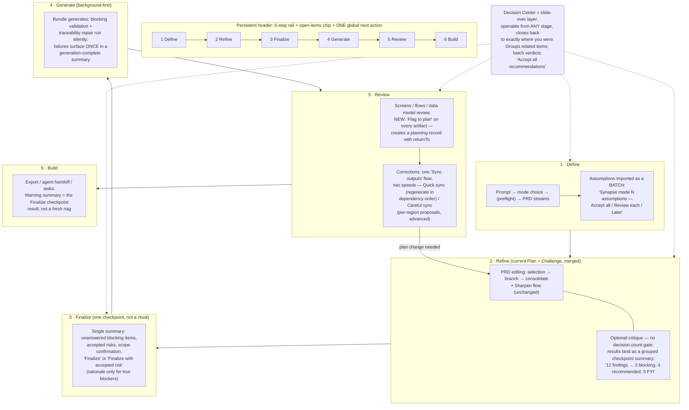

# End-to-End Workflow Audit — Current Journey & Simplification Proposal

Date: 2026-07-23
Method: code audit of the implemented behavior (five parallel traces over entry/PRD
flow, the Decision Center, the critique & downstream loops, the build stage, and the
Screens/versioning experience). Every load-bearing claim cites `file:line`.
Claims that are inferred rather than directly observed are marked **(assumption)**.

This audit lands *after* the Phase 6 Decision Center simplification
(`docs/DECISION_CENTER_SIMPLIFICATION_PLAN.md`, approved 2026-07-16): the
`planningLanguage` / `planningAttention` / `planningNavigation` layer is shipped, the
Decision Center is answer-first with terminal answers, and open decisions no longer
block Explore/Build. The findings below describe what is *still* fragmented after
that work, and what should change next.

---

## 0. Executive summary

**The good news, confirmed in code:** the forward path is already almost entirely
ungated. Only five things hard-block progress toward outputs: a missing Gemini key
(`HomePage.tsx:204-207`), a safety-blocked spine (`artifactGenerationGate.ts:44-45`),
the absence of a structured PRD (`:47-48`), an unacknowledged incomplete PRD
(`:56-57`), and — conditionally, when no design-system preset was ever chosen
(setup skipped or legacy project) — the visual-direction picker, which intercepts
asset generation until a preset is picked and aborts it on cancel
(`ProjectWorkspace.tsx:1004-1015,984-992`). Open decisions never block Explore/Build
(`ProjectWorkspace.tsx:881-883`), export is never blocked
(`ExportModal.tsx:330,344,357,370`), and the Decision Center itself says "Open items
never block your design assets" (`DecisionCenter.tsx:334-341`).

**The real problem is not gating — it is echo, multiplication, and asymmetry:**

1. **Echo.** One open decision is re-surfaced on at least eight surfaces
   (PlanningStateBar, per-PRD-section banners, deferred-features link,
   Challenge tab badge, Decision Center chip, PreBuildCheckModal, exploratory
   banner, export warning). The user experiences one unresolved item as eight
   nags, which *feels* like eight tasks and eight redirections even though none
   of them block.
2. **Multiplication.** The correction loops multiply one user intent into many
   micro-approvals. Fully propagating a single decision can require: verdict →
   per-proposal alignment review → apply → per-artifact update plan → per-item
   disposition (rationale required) → per-region proposal prepare → review →
   apply → verify → verification review. That is 8–10 distinct approvals across
   three different UI vocabularies for one intent (evidence in §1.4, Loops A+C).
3. **Asymmetry.** The *forward* path got the Phase 6 simplification; the
   *backward* (correction) path did not. There are **two competing live
   correction systems** — the surgical per-region update-plan flow
   (`DownstreamUpdatePlanReview.tsx`) and the Dependency Graph's Update /
   Confirm aligned actions — with no guidance on which to use, plus three
   distinct "confirm aligned" flows. A third, friendlier triage UI
   (`UpdateAssetsPlanModal`: Regenerate / Mark up to date / Decide later) is
   fully built and tested but **wired into no render path** — dead UI.
4. **A severed loop.** The single most common real-world backward journey —
   *"I found a missing requirement while reviewing a generated screen"* — has
   **no affordance**. Screens review offers only local edit / dismiss / risk
   resolution; there is no "flag this to the plan" path
   (`ScreenReviewNotes.tsx:48-60`, confirmed absence in §2.3).
5. **No global orientation.** The one next-action surface (PlanningStateBar) is
   Plan-stage-only (`ProjectWorkspace.tsx:1712-1730`). A returning user gets a
   drawer badge and per-artifact panels, but no project-level "you are here,
   next do X" (§2.7).

The proposal (§4–§8): keep the four hard gates exactly as they are, present the
journey as a six-step linear rail (Define → Refine → Finalize → Generate →
Review → Build), turn the Decision Center into a persistent slide-over layer
instead of a stage destination, collapse the correction systems into one
two-speed "Sync outputs" flow, and add the missing screen→plan affordance.

---

## 1. Current-state user journey (confirmed behavior)

### 1.1 Stage model

Four pipeline stages (`PipelineStageBar.tsx:12-17`): **Plan** (`prd`), **Challenge**
(`review`), **Explore/Build** (`workspace` — labeled "Explore" until
`planningReadiness.isReadyToBuild`, then "Build", `PipelineStageBar.tsx:41`), and
**History**. Plan and History are always enabled; Challenge and Explore/Build require
a structured PRD on the active spine and a non-blocked safety review
(`ProjectWorkspace.tsx:1433-1435`).

### 1.2 Current-state journey diagram

```mermaid
flowchart TD
    subgraph ENTRY["Entry"]
        A0["HomePage: name + prompt"] -->|submit| G1{"Gemini key?"}
        G1 -->|no| SET["SettingsModal opens<br/>(HARD BLOCK)"]
        G1 -->|yes| MODE["PreflightModeChoice:<br/>Draft a working plan (fastest) /<br/>Develop the idea (quick, recommended) /<br/>Explore deeply"]
        MODE -->|"Draft"| GEN["runPrdGeneration"]
        MODE -->|"quick / deep"| PF["Preflight: 5 or 10 questions<br/>(each skippable) → summary →<br/>'Generate PRD' (required click)"]
        PF --> GEN
    end

    GEN --> SAFE{"Safety classifier"}
    SAFE -->|disallowed| SRV["SafetyReviewView<br/>(HARD BLOCK — revise or new project)"]
    SAFE -->|restricted| GEN2["Generation proceeds +<br/>SafetyBoundariesCard (advisory)"]
    SAFE -->|allowed| GEN2
    GEN2 --> DS["DesignSetupStep interstitial<br/>(while PRD streams)"]
    DS --> PRD

    subgraph PLAN["Plan stage (prd)"]
        PRD["StructuredPRDView<br/>Overview | Features"]
        PSB["PlanningStateBar:<br/>readiness phase + ONE next action +<br/>'Sharpen my plan (N questions)'"]
        PRD --- PSB
        PRD -->|"text selection"| BR["Branch → AI conversation →<br/>ConsolidationModal (Local Patch)<br/>→ new spine version"]
        BR --> PRD
        PRD -.->|"amber per-section banners:<br/>'N planning items need review'"| DC
        IMP["4-8 assumptions imported as<br/>OPEN planning records on PRD arrival<br/>(+ preflight unknowns)"] --> DC
    end

    subgraph CHALLENGE["Challenge stage (review)"]
        DC["Decision Center tab<br/>Needs attention / Resolved & history"]
        CG{"openDecisionCount == 0?"}
        DC --> CG
        CG -->|no| GATE["CritiqueGate: 'resolve or<br/>defer remaining N first'<br/>(SOFT GATE on critique only)"]
        GATE -->|"bulk defer"| CRIT
        CG -->|yes| CRIT["Findings tab: adversarial critique<br/>(user-started, 9 specialists)"]
        CRIT -->|"per-issue disposition"| REC["Each action creates ONE new<br/>planning record (proposed/open)"]
        REC --> DC
        DC -->|"verdict on a record"| IPREV["Impact preview auto-generated →<br/>per-proposal review →<br/>'Apply accepted changes'"]
        IPREV -->|"write barrier<br/>compareAndAppendStructuredPRD"| NEWSPINE["New PRD version"]
    end

    NEWSPINE --> STALE["Outputs become<br/>possibly_affected / stale<br/>(derived, advisory)"]

    subgraph BUILD["Explore / Build stage (workspace)"]
        PILL["Header pill: Explore outputs /<br/>Build outputs / Review outputs"]
        PILL --> IG{"Incomplete PRD?"}
        IG -->|yes| ACK["ConfirmDialog: 'Generate anyway'<br/>(HARD until acknowledged)"]
        IG -->|no| PBC
        ACK --> PBC["PreBuildCheckModal (once/session):<br/>'Review decisions first' / 'Generate anyway'<br/>(ADVISORY)"]
        PBC --> PRE{"Design preset set?"}
        PRE -->|no| DSP["DesignSystemPresetChoice<br/>(HARD until chosen; cancel aborts)"]
        DSP --> ARTS
        PRE -->|yes| ARTS["Bundle generation: 7 core artifacts<br/>in dependency layers + mockup last"]
        ARTS --> NR{"Blocking validation?"}
        NR -->|fails| AMBER["needs_review amber banner —<br/>only remedy: Regenerate<br/>(no accept-anyway)"]
        NR -->|passes| DONE["Artifacts done<br/>(advisory warnings computed<br/>but never rendered)"]
        DONE --> SCR["Screens review: Confirm per screen,<br/>local edits, risk resolutions —<br/>NO path back to PRD/decisions"]
        STALE -.-> UPD["Per-artifact update plan:<br/>per-item disposition (rationale req.) →<br/>per-region prepare/review/apply/verify"]
        UPD --> ARTS
    end

    subgraph COMMIT["Commitment (optional, governance-only)"]
        RC["ReadinessCheckpoint modal:<br/>'Commit plan' if ready, else<br/>override: rationale ≥20 chars<br/>+ containment if blockers"]
        RC --> FSM["FinalizationSuccessModal:<br/>Generate build foundation /<br/>Review outputs"]
    end

    PSB -.->|"commit_plan next action"| RC
    FSM --> PILL

    DONE --> EXP["ExportModal: handoff / bundle / JSON /<br/>tasks → GitHub. NEVER blocked;<br/>'exploratory' warning unless committed"]
    SCR --> EXP
```

Reading keys: solid arrows are the forward path; dotted arrows are the loops and
echo surfaces. "HARD" appears exactly four times; everything else is advisory.

### 1.3 Every gate, classified (exhaustive)

| Checkpoint | Kind | Evidence |
|---|---|---|
| Gemini key at submit | **Hard** (opens Settings, aborts) | `HomePage.tsx:204-207` |
| Safety `disallowed` | **Hard**, no override; fail-closed on classifier errors | `prdService.ts:92-93`, `classifyProjectSafety.ts:59-68` |
| Safety `allowed_with_restrictions` | Advisory (constraint directive + card) | `prdService.ts:99-102`, `ProjectWorkspace.tsx:1605-1607` |
| No structured PRD | **Hard** (Challenge/Build tabs disabled; generation gate) | `ProjectWorkspace.tsx:1433-1435`, `artifactGenerationGate.ts:47-48` |
| Incomplete PRD → asset generation | **Hard until acknowledged** ("Generate anyway") | `ProjectWorkspace.tsx:1037-1041`, `artifactGenerationGate.ts:56-57` |
| No design-system preset → asset generation | **Hard until chosen** (picker interposed; cancel aborts the generate attempt) — conditional: fires only when setup was skipped or on legacy projects | `ProjectWorkspace.tsx:1004-1015,984-992` |
| Critique (Findings tab) while decisions open | **Soft gate** — bulk "defer remaining N" escape hatch | `ProjectWorkspace.tsx:582`, `ReviewWorkspaceContainer.tsx:134-141` |
| PreBuildCheckModal | Advisory, once per session, "Generate anyway" always proceeds | `PreBuildCheckModal.tsx:56-63` |
| Dependency sufficiency (required deps) | **Hard per-artifact**, pre-model-call | `artifactDependencyGate.ts:44-53`, `coreArtifactService.ts:538-540` |
| Blocking validation → `needs_review` | **Hard on acceptance** — content saved, slot amber, only remedy Regenerate | `artifactBlockingValidation.ts:66-131`, `ArtifactWorkspace.tsx:1650-1671` |
| Advisory validation warnings | Computed, stored in metadata, **rendered nowhere** | `artifactValidation.ts:41-125`; zero component reads **(assumption: effectively invisible)** |
| Commit plan (not ready) | Override path: rationale ≥ 20 chars + containment if blockers | `ReadinessCheckpoint.tsx:82,154-159`, `readinessCommitment.ts:80-82` |
| Decision-impact Apply | **Hard integrity guard** — stale preview writes nothing | `useDecisionImpactActions.ts:253-276`, `spineSlice.ts:566-620` |
| Update-plan non-planned disposition | Rationale required (blocks that action) | `downstreamUpdatePlanSlice.ts:178-182` |
| Output alignment / freshness | Advisory display only | `OutputAlignmentStatus.tsx:53-80`, `FreshnessBadge.tsx:5-9` |
| Screens review / handoff / preflight | All advisory, explicitly "never a hard lock" | `screenReviewWorkflow.ts:690-731`, `ScreensHandoffExportPanel.tsx:1-7` |
| Export | Warnings only; disabled only without a spine | `ExportModal.tsx:302-315,330` |

### 1.4 The loops (confirmed sequences)

**Loop A — decision → PRD.** Verdict (`DecisionCenter.tsx:279`) → impact preview
auto-created (`useDecisionImpactActions.ts:74`) → user reviews each alignment
proposal (Accept / Use my wording / Keep current / Defer / Confirm aligned /
Confirm not affected, `DecisionCenter.tsx:713-731`) → "Apply accepted changes" →
write barrier appends a new PRD version (`spineSlice.ts:621-692`). Artifacts are
**not** regenerated; they drift to possibly_affected (Loop C trigger).

**Loop B — critique → decisions.** User must first answer or defer every open
decision (soft gate) → starts critique → specialists run, findings are
evidence-verified and clustered into issues → user dispositions each issue
**individually**; record-creating actions create **one planning record each**
(`useReviewIssueActions.ts:34`, `reviewIssueDispositions.ts:4-11`) → each new
record lands back in the Decision Center queue → each verdict spawns Loop A.
A critique does *not* auto-create records — only user dispositions do (confirmed,
`ReviewWorkspaceContainer.tsx:61,79` show no auto-start / auto-create effects).

**Loop C — PRD change → outputs.** New spine → derived alignment marks outputs
possibly_affected/stale at read time (`outputAlignment.ts:197-206`) → user must
notice a badge/notice → opens an update plan **per artifact** (only
screen_inventory / user_flows / data_model / implementation_plan are supported,
`ArtifactWorkspace.tsx:989`) → records a disposition **per plan item** (rationale
required for non-planned, `downstreamUpdatePlanSlice.ts:178-182`) → then **per
region**: Prepare proposal → review (7 possible actions) → Apply (new artifact
version) → **separate manual Verify** → review the verification
(`DownstreamArtifactUpdateProposalReview.tsx:274,511-517,608,328,480`). Nothing
auto-regenerates; nothing clears alignment automatically
(`DownstreamUpdatePlanReview.tsx:433`).

**Loop D — consistency review.** Fully automatic and silent inside PRD
generation; 8 conservative guards; user never approves it; only trace is a
version-history one-liner (`prdConsistencyReview.ts:429-430,517`). This is the
one loop with the *right* shape: automatic, guarded, invisible.

**Competing with Loop C** is one other *live* correction system: the Dependency
Graph's per-node Update / Confirm aligned / batch regenerate in dependency order
(`DependencyGraphView.tsx:766-812`). A third triage UI exists in the codebase —
`UpdateAssetsPlanModal` (Regenerate / Mark up to date / Decide later per asset,
far coarser and friendlier, `UpdateAssetsPlanModal.tsx:10,45-49`) — but it is
**unreachable**: it is exported and tested, yet no component renders it; the
commit/readiness flow goes straight from `FinalizationSuccessModal` to
`startAssetGeneration` (`ProjectWorkspace.tsx:917-945,969-982`).

### 1.5 Where the Decision Center appears, and how users get back

Ten confirmed entry surfaces: PlanningStateBar link, per-PRD-section amber
banners (exact-record deep link), deferred-features scope link, PRD
edit-recognition prompt, CritiqueGate, Challenge-entry tab landing (lands on
Decisions when any are open, `ProjectWorkspace.tsx:419`), PreBuildCheckModal,
artifact-region → planning-record links, readiness-checkpoint concern targets,
and the export "Decisions & Validation" file. Return context is genuinely good
post-Phase 6: every Plan-stage jump carries `returnTo: {kind:'prd'}` and a
persistent "Back to Plan" banner renders in Challenge
(`ProjectWorkspace.tsx:1120,1460-1463`); intents apply exactly once and stale
targets fall back safely (`planningNavigation.ts:176-204`).

### 1.6 How changes propagate PRD → UX/screens/architecture/data/implementation

Propagation is **detection-only, never execution**: spine change → deterministic
feature-level diff (`spineChangeAnalysis.ts:124`) → freshness engine
(`artifactFreshness.ts`) + alignment projection (`outputAlignment.ts`) mark
downstream artifacts; `isLikelyUnaffected` scoping is advisory and never
suppresses a hard `needs_update` (`spineChangeAnalysis.ts:190`). Design-token
drift and removed-feature references are the only deterministic escalations
(`outputAlignment.ts:136-170`). Actually *updating* anything is manual via one
of the three correction systems above. Mockups additionally re-check a
design-tokens hash so a token-identical regen keeps them current.

---

## 2. Scenario evaluations

### 2.1 "Small app, fast, minimal intervention"

Confirmed path: prompt → **Draft a working plan** → PRD streams → header pill
**Explore outputs** → (PreBuildCheck once: "Generate anyway") → bundle generates →
export. Roughly 5 clicks beyond typing the prompt. **This path is genuinely good.**
Residual friction, confirmed: (a) 4–8 open assumption records badge the entire UI
from the moment the PRD lands (`prdSectionPrompts.ts:214`,
`assumptionImport.ts:121-173`); (b) the export handoff is permanently stamped
"exploratory — validate unresolved assumptions and decisions before building"
unless the user performs the commit ritual (`exportHandoff.ts:48-50`), and
committing an unready plan demands a ≥20-char rationale — so the fast user ends
with either a nagging export or paperwork.

### 2.2 "Carefully review every important decision"

Sharpen flow (one question per assumption) → Decision Center (validate with
evidence, optional) → critique gate (already cleared) → start critique → triage
each issue → each disposition creates a record → answer each record → review each
impact proposal → apply each → per-artifact update plans → per-region
apply/verify. The thorough path **works** and its integrity guarantees are
excellent, but it is a long chain of individually-presented micro-approvals with
three different review vocabularies (impact proposals, update-plan items, region
proposals). No batch verdicts exist except the critique-gate bulk defer.

### 2.3 "Missing requirement discovered while reviewing screens"

**The workflow's biggest hole, confirmed.** The screens review notes offer only:
Edit (local overlay), Go to Flow/Mockups, Mark addressed, risk resolution
(`ScreenReviewNotes.tsx:48-60,200-216`). There is **no** "raise to PRD" or
"create decision" affordance; the overlay cannot add states or fix traceability
(`screenExperience.ts:43-71`). The user must independently know to: navigate to
Plan → select text → create branch → converse → consolidate (Local Patch) → new
spine → notice screens went possibly_affected → open the screens update plan →
per-region apply. Nothing guides any of these steps from the screen where the
gap was discovered.

### 2.4 "A critique creates several additional decisions"

Confirmed multiplication: N issues × (1 disposition + 1 record + 1 verdict + 1
impact preview with M proposals + 1 apply) — and each apply appends a *new PRD
version*, so K applied decisions produce K spine versions, each re-triggering
alignment recomputation over all outputs. Records are created one-at-a-time with
no grouping (`useReviewIssueActions.ts:34`); the Decision Center groups only
visually by "dominant condition" (`DecisionCenter.tsx:197-207`). Consecutive
decision edits do amend the latest spine in place under the same id
(per `PLANNING_AND_DECISIONS.md:176-182`), which limits version spam, but the
per-decision review ceremony is unchanged.

### 2.5 "Disagrees with a validation warning and wants to proceed"

Split verdict. Advisory surfaces: fine — screens notes can be dismissed
(persisted, `ScreenDetailView.tsx:263-267`), freshness has Confirm aligned,
export can always proceed. But **blocking validation has no accept-anyway**: a
`needs_review` artifact stays amber forever unless regenerated
(`ArtifactWorkspace.tsx:1650-1671` offers only Regenerate), and a `needs_review`
upstream is excluded from dependency context so dependents re-block
(`artifactJobController.ts:609-614`). A user who believes the "data model lacks
an API endpoint" heuristic (`artifactBlockingValidation.ts:75-77`) is wrong has
no recorded-disagreement path — inconsistent with the update-plan flow, where
disagreement is a first-class rationale-backed disposition.

### 2.6 "Architecture change after assets exist"

Edit via branch/consolidation or decision → new spine → outputs drift. Now the
user faces **three uncoordinated repair options**: surgical update plans (not
available for design_system or mockups — `ArtifactWorkspace.tsx:989`), Dependency
Graph batch regenerate, or per-artifact Regenerate. No surface compares their
cost ("surgical preserves your overlays and versions region-by-region;
regenerate is faster but starts overlays clean"). The friendliest triage UI for
exactly this moment — `UpdateAssetsPlanModal` — is built and tested but wired
into no render path, so the user never sees it (confirmed by repo-wide search:
component/barrel/test/docs only).

### 2.7 "Returning user with an unfinished project"

Confirmed orientation surfaces: ProjectDrawer commitment badge ("Working plan" /
"Plan committed" / "Exploring outputs" / …, `ProjectDrawer.tsx:30-67`),
auto-resume of unfinished generation (`ArtifactWorkspace.tsx:847-856`),
interrupted-run recovery banners (`interruptedGeneration.ts:23-55`), sensible
default slot selection (`ArtifactWorkspace.tsx:898-923`). **Missing (confirmed
absence):** any project-level "welcome back — here's where you are and the next
step" surface. The one next-action engine (PlanningStateBar) renders only on the
Plan stage; a user who left off in Build or Screens re-enters with no summary of
open decisions, stale outputs, or unfinished reviews.

---

## 3. Critique — the most serious workflow problems, ranked

1. **The correction loops are approval-multiplied.** (Loops A+C, §1.4.) One
   intent ("this decision changes the plan; update what's affected") costs 8–10
   sequential approvals across three vocabularies, with a separate manual Verify
   step after every Apply. The integrity model (append-only, hash-guarded) is
   right; the *ceremony per unit of change* is not. This — not stage gating — is
   where "users lose track of whether they are making progress."
2. **The screens→plan loop is severed** (§2.3). The product's core promise is
   plan⇄artifact coherence, yet discovering a plan gap in an artifact dead-ends.
3. **One concern, eight echoes** (§0.1, §1.5). Phase 6 unified the *engine*
   (attention items, dedup by durable identity) but the echo surfaces each still
   render their own copy of the count. The user can't distinguish "one thing,
   mentioned often" from "many things."
4. **Two live correction systems (plus one unreachable) + three confirm-aligned
   flows** (§1.4, §2.6) with no routing guidance. Duplicate review ceremonies
   for the same underlying question ("is this output still right?").
5. **Every fresh project opens with 4–8 'decisions.'** Imported assumptions are
   queued before the user has read the PRD; the critique is gated behind
   answering/deferring all of them. The calm "Sharpen my plan" framing (Phase 6)
   helps, but the underlying model still treats machine-generated assumptions as
   individually-owed answers rather than as a batch of defaults to accept.
6. **Blocking validation without an accept-anyway** (§2.5) — the only place a
   user can be indefinitely amber with no recorded-disagreement escape, and it
   silently poisons dependents.
7. **Advisory validation is silent.** `validationWarnings` + qualityScore are
   computed and persisted but rendered by no component — pure cost, zero user
   value **(assumption: no dynamic read path missed)**. Meanwhile the screens
   review checklist model (`screenReviewWorkflow.ts:424-468`) is computed but
   unrendered, `createFeedbackItem` has no callers, and `UpdateAssetsPlanModal`
   is built and tested but rendered by nothing — dead UX mass.
8. **Completion criteria are unclear at the end.** There is no "Build the
   application" moment: the terminal state is an export modal whose handoff is
   stamped "exploratory" unless a governance ritual (commit) was performed —
   optional in mechanics but presented as the difference between a warned and
   un-warned deliverable. Fast users get paperwork or a nag (§2.1).
9. **No global stage ownership / progress surface** (§2.7). Stage labels even
   change out from under the user ("Explore"→"Build" rename on readiness,
   `PipelineStageBar.tsx:41`) without explanation of what changed.
10. **Things that should be background, aren't:** update-plan generation is
    user-triggered per artifact (`ArtifactWorkspace.tsx:1003-1010`); impact
    previews are per-decision foreground work; verification after Apply is a
    manual second pass. Conversely the one silent automation (consistency
    review, Loop D) proves the pattern works: automatic + guarded + logged.

What is **not** a problem (confirmed): stage gating (already minimal), the
append-only authority model, navigation return-context (post-Phase 6), the
critique's evidence-verification pipeline, and safety fail-closed behavior.

---

## 4. Proposed future-state journey

Principles: keep every hard gate and integrity guard exactly as-is; change
*presentation, batching, and defaults*, not authority. The Decision Center
becomes a persistent supporting layer (slide-over panel available everywhere,
with the existing `planningNavigation` return-context) rather than a tab
destination inside a "Challenge" stage.

### 4.1 Future-state diagram

### 4.2 Mapping to today's implementation

| Future step | Today | Change required |
|---|---|---|
| Define | HomePage + preflight + PRD generation | None structurally; batch-accept for imported assumptions |
| Refine | Plan + Challenge stages | Merge presentation; drop the critique decision-count gate (keep the *suggestion*); checkpoint-summarize findings |
| Finalize | ReadinessCheckpoint + commit | Reframe as one summary checkpoint; rationale only for `materiality: 'blocking'` items |
| Generate | `startAll` bundle | Already right; add a completion summary that includes needs_review + (currently silent) advisory warnings |
| Review | Screens/artifact review + 3 correction systems | Add Flag-to-plan; unify corrections into two-speed Sync |
| Build | ExportModal + tasks | Reuse the Finalize checkpoint verdict instead of re-warning |

The underlying stage keys (`prd`/`review`/`workspace`/`history`), the store, and
every write barrier stay unchanged — this is a presentation/orchestration remap,
consistent with Phase 6's own approach. History becomes a panel, not a rail step.

---

## 5. Rules: when a decision blocks, warns, or stays optional

**Block progress (interrupt, cannot proceed without action):**
1. Safety `disallowed` (unchanged, no override).
2. No structured PRD / hard integrity failures (stale write-barrier apply,
   tampered readiness event) — these block the *write*, never navigation.
3. A planning record explicitly marked `materiality: 'blocking'` — and only at
   the **Finalize** and **Build/export** checkpoints, never mid-flow. (The
   materiality field already exists; today it changes ranking only.)
4. Incomplete-PRD acknowledgement before first asset generation (unchanged —
   it is honest and one-shot).

**Warn (summarized at checkpoints — generation-complete, Finalize, export —
never as ambient per-surface nags):**
- Open non-blocking decisions/assumptions; unvalidated material assumptions.
- possibly_affected / stale outputs; needs_review artifacts.
- Critique findings of `review` severity; screens P0 gaps.
- Rule of thumb: **a warning may appear at most twice** — once where it arose,
  once in the next checkpoint summary. It never renders as a third+ badge.

**Optional (visible on demand in the Decision Center layer / detail panes,
never pushed):**
- Low/normal-materiality assumptions, `info` findings, evidence validation,
  mockup variant coverage, quality-gate checklists, `isLikelyUnaffected` reviews.
- Deferral stays a first-class recorded verdict; deferred items resurface only
  when dependent state changes (Phase 6 rule, kept).

---

## 6. Decision Center integration per stage

- **Define:** silent capture. Assumptions import as one grouped batch card
  ("Synapse assumed N things — Accept all / Review / Later"). Accept-all records
  one `option_selected`-style verdict per record (still user-actor, append-only)
  — a batch of real events, not a fake aggregate.
- **Refine:** the layer's home turf. Sharpen flow unchanged. Critique findings
  triage gains batch actions ("promote these 4 related findings as one grouped
  decision") — grouping presentation-only, records stay individual underneath.
- **Finalize:** the checkpoint reads the same attention projection
  (`planningAttention.ts`) — one list, blocking items first, one commit action.
- **Generate:** invisible except the PreBuildCheck summary, which becomes the
  checkpoint card rather than a modal interception.
- **Review:** receives Flag-to-plan records; decision *impacts* on outputs are
  presented inside the Sync flow rather than as a separate proposal queue.
- **Build:** read-only summary of accepted risks stamped into the handoff
  (replacing the blanket "exploratory" nag with the specific accepted-risk list).

---

## 7. Fast path vs thorough path

| | Fast path | Thorough path |
|---|---|---|
| Define | Draft a working plan; batch-accept assumptions (1 click) | Deep preflight; review each assumption; validate with evidence |
| Refine | Skip critique | Run critique; triage grouped findings |
| Finalize | One checkpoint, "Finalize" (no blockers → no rationale) | Review every warning; resolve or accept-with-rationale |
| Generate | Watch bundle; read completion summary | Same + inspect needs_review details |
| Review | Spot-check screens; Quick sync if plan changed | Confirm every P0 screen; Careful per-region sync; verify each apply |
| Build | Export with accepted-risk list | Export clean after resolving warnings |
| Total interruptions | ~3 (mode, finalize, export) | User-chosen depth at every checkpoint |

Both paths traverse the **same six steps and the same checkpoints** — the
thorough path opens depth *within* checkpoints instead of visiting extra
destinations. Today, by contrast, the thorough path visits structurally
different surfaces (Challenge tabs, update-plan queues, proposal reviews) that
the fast path never sees, which is why the two experiences feel like different
products.

---

## 8. Prioritized improvement proposal

### Tier 1 — immediate simplifications (presentation-only, no schema changes)

1. **Global next-action strip.** Render the existing
   `planningAttention`-derived next action + open-items chip in the workspace
   header on *every* stage (today: Plan only). Directly reuses
   `PlanningStateBar`'s engine. Also serves as the returning-user resume card.
2. **"Flag to plan" on screens review notes** (and artifact detail views):
   creates a planning record (`createdBy: 'user'`) with `returnTo` back to the
   exact screen. Closes the severed loop with existing primitives
   (`createPlanningRecord` + `planningNavigation`).
3. **Batch verdicts in the Decision Center:** "Accept all recommendations" over
   records that have a machine-recommended option (per-record user events under
   one click), alongside the existing bulk defer.
4. **Assumption batch card at PRD arrival:** group the 4–8 imported assumptions
   into one card with Accept all / Review each / Later, instead of seeding the
   queue silently.
5. **Accept-anyway on blocking validation:** allow a rationale-backed
   "accept with noted issue" that clears `needs_review` (recorded like the
   update-plan `already_aligned` disposition). Keeps truncation as the one
   non-overridable blocker.
6. **Render or retire the silent machinery:** show advisory
   `validationWarnings` in the generation-complete summary, or stop computing
   them; delete the unrendered screens checklist model and the unused
   `createFeedbackItem` path.
7. **Echo budget:** apply the §5 at-most-twice rule — drop the open-decision
   count from surfaces that duplicate the header chip (PreBuildCheck becomes a
   card in the generation summary; export reuses the Finalize verdict).

### Tier 2 — medium-term changes

8. **Two-speed "Sync outputs":** one entry point for post-change correction.
   Quick sync = `regenerateSlots` in dependency order fronted by the triage UI
   that already exists but is unwired (`UpdateAssetsPlanModal`: Regenerate /
   Mark up to date / Later — revive it rather than building new);
   Careful sync = the existing per-region proposal flow, behind an "advanced"
   disclosure. Auto-generate the update plans in the background when drift is
   detected (generation is already deterministic and stale-safe) so the user
   opens results, not a generator.
9. **Auto-verify after Apply:** run the existing verification derivation
   immediately after a proposal apply and present one combined
   "applied — verification passed/needs your eye" state, collapsing two manual
   steps into one review.
10. **Checkpoint summaries:** generation-complete and pre-export summaries
    aggregating critique/validation/alignment state (the "warn" tier of §5).
11. **Decision grouping:** cluster related planning records (same PRD section /
    same critique cluster) into one presented decision with sub-items;
    presentation-only, records stay individual.
12. **Drop the critique decision-count gate:** replace `CritiqueGate` with a
    one-line suggestion ("N open items — critiquing now may re-raise them").
    The gate's current bulk-defer escape hatch proves the block is already
    ceremonial.

### Tier 3 — larger structural changes

13. **Six-step rail remap** (§4): merge Plan+Challenge presentation into
    Refine; introduce Finalize as the single checkpoint; History becomes a
    panel. Stage keys, routes, and persistence unchanged.
14. **Decision Center as slide-over layer** on all stages, replacing the
    Challenge-tab destination; `planningNavigation` already supplies the
    return-context machinery.
15. **Background propagation with a review queue:** on PRD change, auto-run
    Quick-sync *proposals* (never applies) in the background so the Review stage
    presents ready-to-approve diffs — the consistency-review pattern (automatic
    + guarded + logged) applied to Loop C.
16. **Materiality-driven blocking** end-to-end: promote
    `materiality: 'blocking'` to the only decision-driven hard stop, enforced
    at the two checkpoints only (§5), and audit prompts so the model emits it
    sparingly.

---

## Appendix — confirmed vs assumed

**Confirmed** (direct code evidence, cited inline throughout): every gate in
§1.3; the loop sequences in §1.4; the ten Decision Center entry surfaces; the
absence of a screens→plan affordance; the absence of a global resume surface;
the unrendered advisory warnings / checklist / feedback-item /
`UpdateAssetsPlanModal` paths (via zero-caller greps); the two live correction
systems; the conditional design-preset gate; export never blocking.

**Assumptions** (flagged where used): the "4–8 decisions per fresh run" figure
comes from prompt-declared ranges, not live pipeline runs; advisory
`validationWarnings` being user-invisible rests on a zero-hit component grep;
DesignSetupStep's skippability was not verified line-by-line; "Build the
application" having no literal implementation (terminal state = export) is an
interpretation; mockup per-variant generation reachability was lightly verified
only.

No changes have been implemented; this document is analysis and proposal only.
